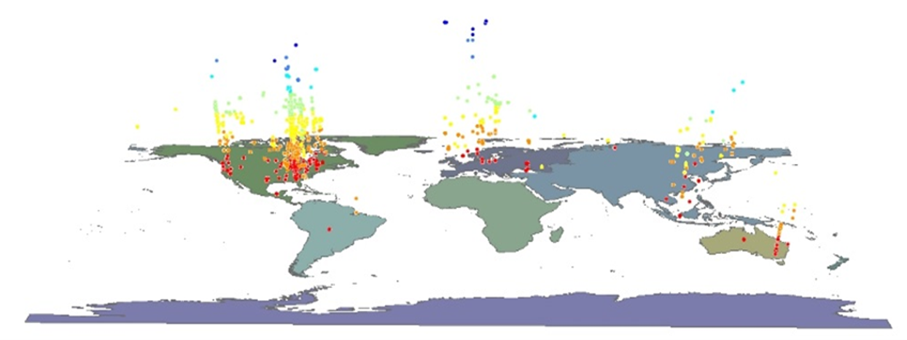

# IA 342: Visualization Methods, Technologies, and Tools for Intelligence Analysis

  James Madison University
  Intelligence Analysis
  Fall 2026

  

> *Use Business Intelligence and visualization to help people understand complex data.*

## Quick Links
- [Course Website](https://jmu-data.github.io/IA342/)
- [Syllabus](docs/syllabus/index.md)
- [Module 1](docs/modules/module-1/index.md)
- [Week 1 Assignment](docs/assignments/arcgis-access-check/index.md)
- [Module 2](docs/modules/module-2/index.md)
- [Lab 2](docs/assignments/lab-2/index.md)

## Course Overview

IA 342 is designed to bridge the gap between raw data and human decision-making. While computational tools and Artificial Intelligence can rapidly organize and analyze vast amounts of data, humans still bear the ultimate responsibility for intelligence judgments and actions. This course empowers students to use Business Intelligence (BI) and visualization techniques to help people perceive patterns, understand context, and make clear, evidence-based visual communications.

Throughout the semester, we focus on the theory of visual design and the practical application of industry-standard platforms, specifically ArcGIS and Tableau. We move from foundational spatial analysis to exploratory data visualization, and finally to the creation of interactive, professional-grade visual analytics dashboards.

## Course Roadmap / Major Modules

The course is structured to take students from raw data to actionable human understanding:

**Data** ➔ **Visual Design & Spatial Analysis** ➔ **ArcGIS** ➔ **Tableau & Visual Analytics** ➔ **Interactive Dashboards** ➔ **Human Understanding & Decision**

1. **Course Introduction:** The core philosophy of why visualization matters in the AI era.
2. **Spatial Intelligence (ArcGIS):** Map design, geographic contexts, and spatial visualization.
3. **Business Intelligence (Tableau):** Connecting data, building primary charts, and visual exploration.
4. **Visual Analytics & Dashboards:** Advanced calculations, interactivity, and dashboard design.
5. **Data Storytelling:** End-to-end projects culminating in comprehensive visual analytics applications.

## Official Course Information

IA 342 is a core component of the Intelligence Analysis curriculum at James Madison University.
- **Curriculum:** [JMU Intelligence Analysis Academic Curriculum](https://www.jmu.edu/cise/intelligence-analysis/academics/curriculum.shtml)
- **Term:** Fall 2026

## Instructor

**Dr. Xuebin Wei**  
*Associate Professor, James Madison University (Geography / Intelligence Analysis)*  
**Email:** [weixx@jmu.edu](mailto:weixx@jmu.edu)  
**Profile:** [Official JMU Faculty Profile](https://www.jmu.edu/cise/people/faculty/wei-xuebin.shtml)  

*Biography:* Dr. Wei's teaching and research focus on data science and artificial intelligence, cloud computing, GIS and geospatial analysis, and social data analytics. He is the co-author of *Social Data Analytics in the Cloud with AI*. 

## Repository / Reuse / Privacy Boundary

This repository (`JMU-Data/IA342`) serves as the canonical public source for course materials, built with a "source-first, web-published" approach via GitHub Pages. The materials here are designed for transparency and reuse. 

To protect student privacy and maintain operational security, this repository strictly contains public-facing content. All private grading, student submissions, personally identifiable information (PII), and Canvas LMS automation scripts are managed entirely outside this environment.
