# Introduction to Data Visualization

**IA 342 — Visualization Methods, Technologies, and Tools for Intelligence Analysis**

This lecture explains why visualization helps us understand data and why human perception matters when we design charts, maps, and other visual evidence.

<!-- visual: none -->

---

## 01 — Why Visualization?

Organizations can collect and store huge amounts of data. The challenge is not just getting data; it is turning data into something people can understand and use.

**Key question:** What can a chart or other visual show us that a table of numbers may hide?

---

## 01A — From Data Overload to Insight

Digital data can become overwhelming very quickly. Visualization helps turn that complexity into something we can look at and understand.

The main benefit is not just making data look cleaner. A useful visualization can make **comparisons, trends, patterns, and unusual values (anomalies)** easy to see.

### Short video — Why Data Visualization Matters

[Open the video on YouTube](https://www.youtube.com/watch?v=Xh3p4yKlEQs)

<!-- external-media: why-data-visualization-matters-video | type: video | usage: core | final-site: embed -->

---

## 02 — From Data to Decision

A simple way to think about the process is:

**Data → Information → Knowledge → Decision / Strategy**

- **Data:** basic facts, records, and observations.
- **Information:** data organized so that it starts to make sense.
- **Knowledge:** understanding built from information, experience, and context.
- **Decision / Strategy:** using that understanding to choose what to do.

Visualization helps move us from raw data toward evidence we can understand and use.

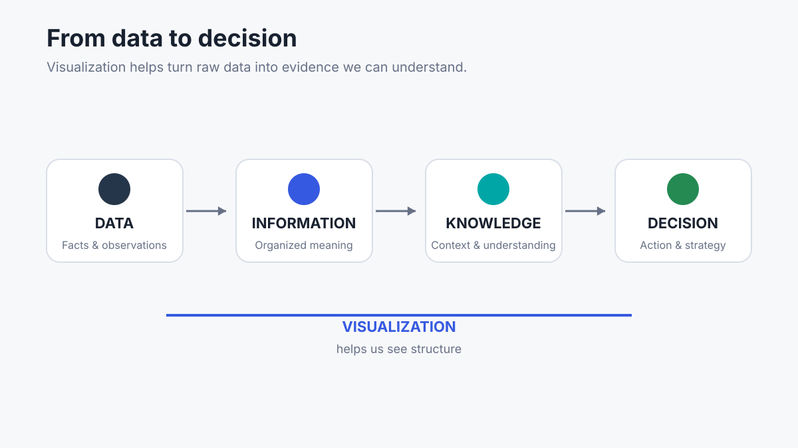

<!-- asset: data-to-decision | method: DRAW | status: ready -->

### Short video — From Data to Strategy

[Open the video on YouTube](https://youtu.be/eqcv8KF07nM)

<!-- external-media: from-data-to-strategy-video | type: video | usage: core | provider: youtube | video-id: eqcv8KF07nM | final-site: embed -->

---

## 03 — Numbers Can Look the Same

Summary statistics can make very different datasets look similar.

Consider four datasets with nearly identical:

- means,
- variances,
- correlations, and
- linear regression results.

If we only look at the statistics, we may think the datasets are similar.

<!-- asset: anscombe-summary | method: DRAW | status: ready -->

---

## 04 — But the Patterns Are Different

When we plot the same datasets, the differences become easy to see.

This is the lesson of **Anscombe's Quartet**: summary numbers are useful, but we still need to look at the data.

**Takeaway:** Before deciding what is important in a dataset, look at it visually.

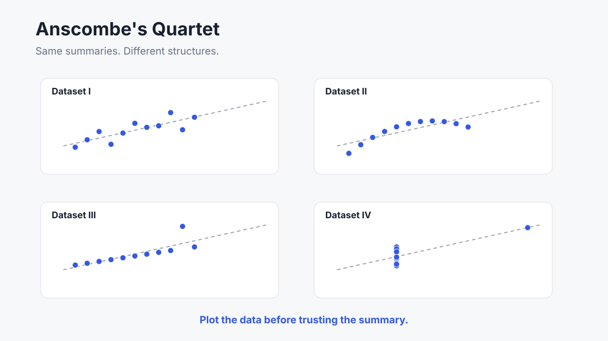

<!-- asset: anscombe-quartet | method: DRAW | status: ready -->

---

## 05 — Visualization Helps Us Analyze

Visualization is not just decoration, and it is not only for people who call themselves “visual learners.”

A good visualization can help analysts:

- see patterns,
- find unusual values,
- compare groups,
- see relationships,
- ask better questions, and
- explain findings clearly.

In IA 342, visualization is part of the analysis. It is not something we add only at the end to make the work look better.

<!-- asset: visualization-roles | method: DRAW | status: ready -->

---

## 06 — What the Eye Notices First

Some visual features are noticed almost immediately, before we focus on individual objects. These are called **preattentive attributes**.

Examples include:

- color,
- size,
- shape,
- orientation,
- position, and
- texture.

These features can quickly draw our attention to what matters.

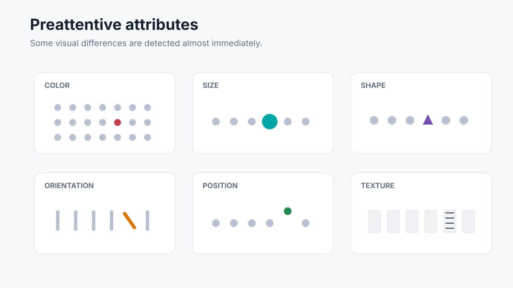

<!-- asset: preattentive-overview | method: DRAW | status: ready -->

---

## 07 — Find the 7s

First, try to count every **7** in a crowded field of numbers.

Then look at the same numbers again after all the 7s are highlighted.

The data did not change. Only the way the data are shown changed.

**Teaching point:** highlighting important items can make them much faster and easier to find.

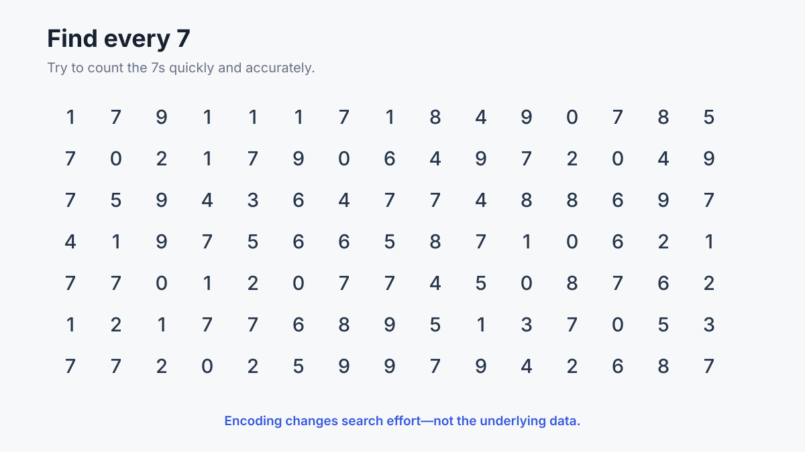

<!-- assets: digit-seven-plain, digit-seven-highlighted | method: DRAW | status: ready -->

---

## 08 — Color Is Powerful, but Context Matters

**Hue** means the type of color, such as red, blue, or green. It is useful for separating categories or drawing attention to something important.

**Lightness** can show order or numeric differences, such as low to high.

But color depends on context: the same color can look different when the background changes.

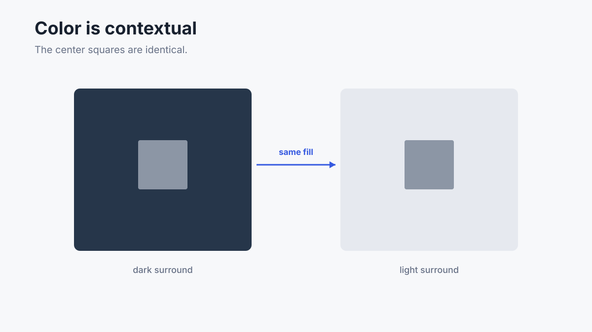

<!-- assets: color-hue-value, color-context | method: DRAW | status: ready -->

---

## 09 — Shape and Orientation

Shape and direction are useful for showing different categories or movement.

Examples:

- different symbols for different categories,
- an upward arrow for increase,
- a downward arrow for decrease.

They are less useful when we need an exact numeric comparison.

<!-- asset: shape-orientation | method: DRAW | status: ready -->

---

## 10 — Size Is Easy to Notice, Hard to Measure

Size can show differences, but people are not very good at judging exact amounts from area alone.

We can quickly see that one object is smaller than another, but it is harder to tell exactly how much smaller.

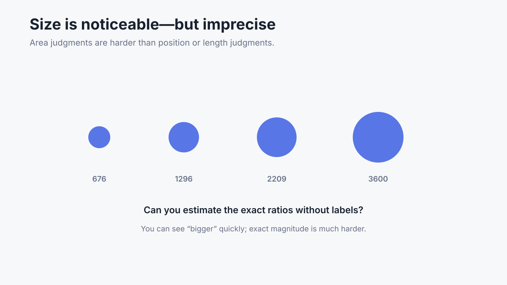

<!-- asset: size-comparison | method: DRAW | status: ready -->

---

## 11 — Position Gives More Accurate Comparisons

Position and length measured from the same starting line are usually easier to compare than area or decorative shapes.

Small differences in position are easier to judge than small differences in area.

**Design point:** choose the visual method that fits the question you want to answer.

<!-- asset: position-vs-size | method: DRAW | status: ready -->

---

## 12 — Order Changes the Question

A chart sorted alphabetically can make ranking questions harder than they need to be.

A chart ordered by value makes questions such as these much easier:

- What is the largest value?
- What is the smallest value?
- What are the top three?
- Where does a particular item rank?

**Takeaway:** sorting can help us answer questions; it is not just formatting.

<!-- asset: sorted-vs-unsorted-bars | method: DRAW | status: ready -->

---

## 12A — When Charts Mislead

A chart can use correct numbers and still give a misleading impression. Choices such as **axis scale, where the axis starts, context, and decoration** can change what people see first.

### Classroom activity 1 — Same data, different scale

The historical values below are the same in both charts: the top U.S. individual income tax rate was **35% in 2012** and **39.6% in 2013**. The only thing that changes is the y-axis.

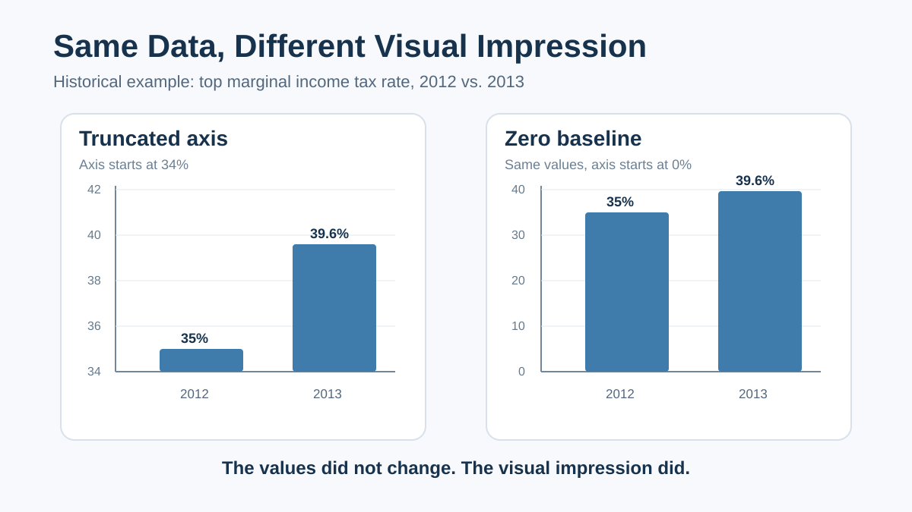

**Try it:** [Switch between the two axis scales](assets/truncated-axis-experiment.html)

Ask students:

- Which version makes the increase feel larger?
- Did the data change?
- What changed in the way the data are shown?
- Why can a bar chart be misleading when the axis starts above zero?

**Teaching point:** we read bar length as amount. If the axis starts close to the values instead of at zero, the difference can look much larger than it really is—even when the printed numbers are correct.

**Historical data source:** [IRS Statistics of Income Bulletin — highest rate 35% in 2012 and 39.6% in 2013](https://www.irs.gov/pub/irs-soi/15sprbul.pdf)

The old slide used a TV screenshot. This course version keeps the same teaching idea but uses official values and a new chart drawn for this course.

<!-- asset: truncated-axis-original | method: ORIGINAL_DRAW | status: ready -->
<!-- interaction: truncated-axis-toggle | type: click-toggle | prototype: assets/truncated-axis-experiment.html | final-site: interactive -->

### Classroom activity 2 — Pretty does not always mean useful

A graphic can look attractive and still tell us very little.

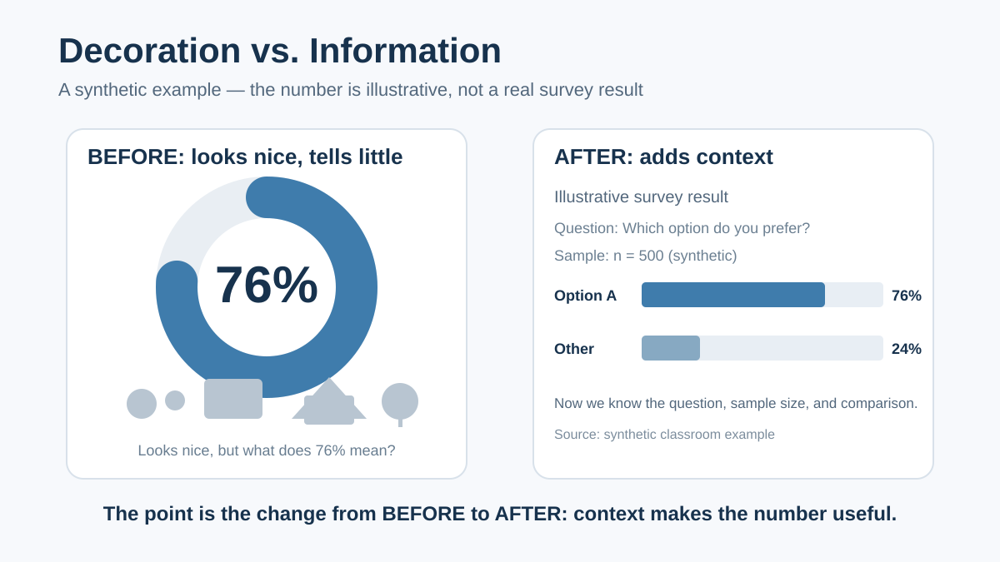

**Try it:** [Turn the decorative graphic into a more useful one](assets/decoration-vs-information-experiment.html)

The first version is intentionally weak: it looks nice, but it does not tell us enough. The second version is intentionally better because it adds the question, sample size, comparison, and source.

The **76%** in this activity is made up only for teaching. It is not a real statistic.

Ask students what is missing from the decorative version:

- What was the question?
- How many people or cases are in the total sample?
- What is the comparison?
- When and where was the information collected?
- What source should we trust?

**Teaching point:** looking good is not enough. A useful visualization should give enough context to understand, compare, and check the evidence.

**Optional reading:** [The Guardian — “16 useless infographics”](https://www.theguardian.com/news/datablog/gallery/2013/aug/01/16-useless-infographics). We do **not** copy or store the Guardian/World Bank artwork. The activity above is a new example created for this course.

<!-- asset: decoration-vs-information-original | method: ORIGINAL_DRAW | status: ready -->
<!-- interaction: decoration-vs-information-toggle | type: click-toggle | prototype: assets/decoration-vs-information-experiment.html | final-site: interactive -->
<!-- external-media: guardian-useless-infographics | type: reading | usage: optional | storage: external-only -->

---

## 13 — What Is Data Visualization?

For this course, think of data visualization as using charts, maps, and other visuals to make data easier to look at, understand, compare, and explain.

The goal is not to make a chart look impressive. The goal is to help people understand the data.

### External video — The Value of Data Visualization

This public video explains the same main idea: visualization should help people understand data, not just make it look attractive.

[Open the video on YouTube](https://www.youtube.com/watch?v=xekEXM0Vonc&t=1s)

<!-- external-media: value-of-data-visualization-video | type: video | usage: core | provider: youtube | video-id: xekEXM0Vonc | final-site: embed -->

---

## 14 — Why Visualization Matters for Intelligence Analysis

In IA 342, we move from raw data and analysis to human judgment.

Computers and AI can process, summarize, and combine large amounts of data, but people are still responsible for intelligence judgments and decisions.

Visualization helps make patterns, unusual results, context, and **uncertainty (how sure we are)** easier to see and discuss.

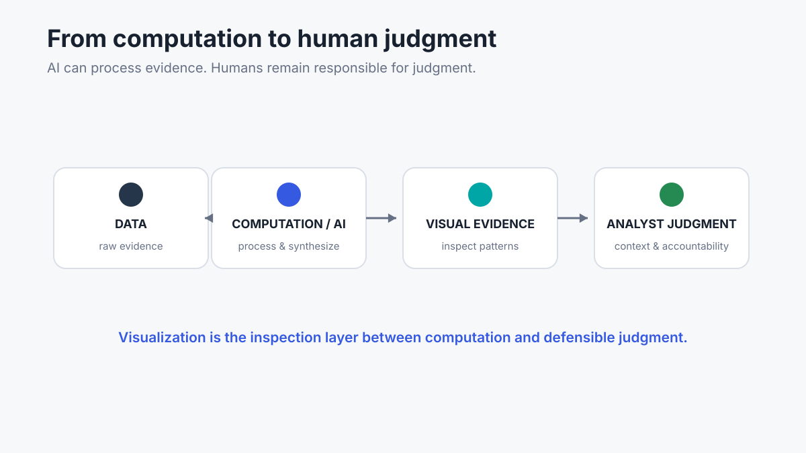

<!-- asset: ia-human-judgment-flow | method: DRAW | status: ready -->

---

## 15 — We Cannot Always Trust Our Eyes

Human vision is powerful, but our eyes do not work like a camera.

What we see is influenced by:

- expectations,
- context,
- prior experience, and
- the way visual information is arranged.

This means that visual design can help us understand—or it can mislead us.

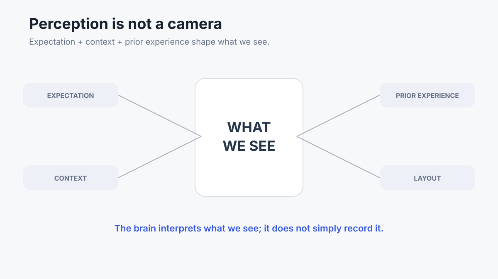

<!-- asset: perception-context | method: DRAW | status: ready -->

---

## 15A — Same Length, Different Look

Which center line looks longer?

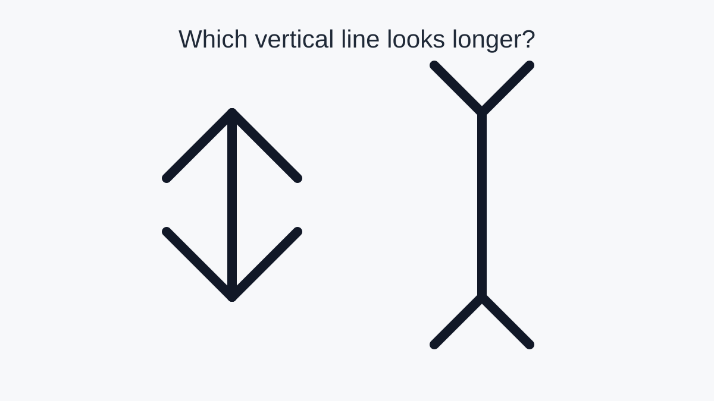

**Try it interactively:** [Open the Müller-Lyer reveal experiment](assets/muller-lyer-experiment.html)

<strong>Reveal the answer</strong>

The two center lines are **exactly the same length**. The arrowheads around them make one line look longer even though the lines are equal.

**Teaching point:** what we see is not always the same as what we measure. In charts and other graphics, surrounding shapes can change how big or long something looks.

**Historical note:** the Müller-Lyer illusion is a classic visual illusion. The graphic and interactive version above were redrawn for this course using simple geometry.

<!-- asset: muller-lyer-original | method: ORIGINAL_DRAW | status: ready -->
<!-- interaction: muller-lyer-reveal | type: click-reveal | prototype: assets/muller-lyer-experiment.html | final-site: interactive -->

---

## 16 — How Expectations Shape What We See

Richards J. Heuer explains several important ideas about perception in intelligence analysis:

- we often see what we expect to see,
- our first mental picture can form quickly and be hard to change,
- we often fit new information into what we already believe or expect, and
- unclear early information can shape how we understand later information.

**Analytical point:** visualization should help analysts check the evidence, not just confirm what they already expect.

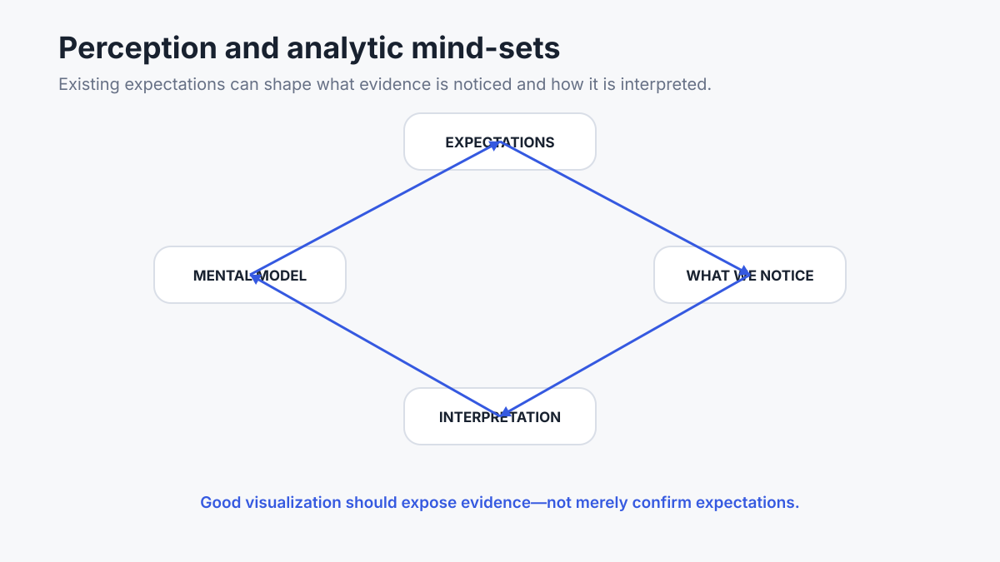

**Source / optional reading:** [Richards J. Heuer Jr., *Psychology of Intelligence Analysis* — CIA Center for the Study of Intelligence](https://www.cia.gov/resources/csi/books-monographs/psychology-of-intelligence-analysis-2/)

<!-- asset: perception-mindset-loop | method: DRAW | status: ready -->
<!-- external-media: heuer-psychology-intelligence-analysis | type: reading | usage: supplemental -->

---

## 16A — The Same Image Can Have Different Meanings

Look at each image before reading the explanation. What do you see first? Can you make yourself see the other image?

### Duck or rabbit?

[Source — Joseph Jastrow, *The Mind's Eye* (1899), public-domain scan on Wikimedia Commons](https://commons.wikimedia.org/wiki/File:Duck-Rabbit_illusion.jpg)

### Young woman or older woman?

[Source — W. E. Hill, *My Wife and My Mother-in-Law* (1915), Library of Congress / public-domain scan on Wikimedia Commons](https://commons.wikimedia.org/wiki/File:My_Wife_and_My_Mother-in-Law.jpg)

**Teaching point:** the picture does not change, but what we think it shows can change. Once we see one meaning, it may take effort to see another.

**Analytical connection:** analysts should test other possible explanations instead of assuming the first explanation is the only one.

<!-- external-media: duck-rabbit-jastrow | type: image | usage: core | license: public-domain-US -->
<!-- external-media: wife-mother-in-law-hill | type: image | usage: core | license: public-domain-US -->

---

## 17 — Context Changes What We See

A color can look different when the background around it changes.

Our brain judges a color in relation to the colors around it, not by itself.

**Design point:** background, contrast, and nearby marks can change what we see.

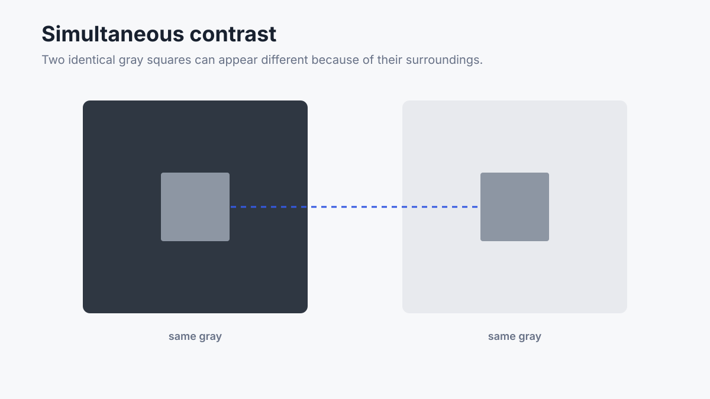

### Classroom activity — Is the gray really changing?

Ask students: Does the strip look like the same gray from left to right?

**Try it:** [Remove the background](assets/simultaneous-contrast-experiment.html)

<strong>Reveal the explanation</strong>

The strip is the **same gray all the way across**. When we remove the different backgrounds, that becomes easier to see. The strip did not change; the **background changed what we saw**.

This activity was redrawn for this course. It demonstrates the same visual principle without copying the old slide artwork.

### Optional video — Beau Lotto: Optical illusions show how we see

[Open the official TED talk](https://www.ted.com/talks/beau_lotto_optical_illusions_show_how_we_see)

**Optional famous case — The Dress:** we do not store the original viral photo in the course repository. For source information and discussion, use the [Wikimedia Commons category and individually licensed versions](https://commons.wikimedia.org/wiki/Category:The_dress).

<!-- asset: simultaneous-contrast | method: DRAW | status: ready -->
<!-- asset: simultaneous-contrast-original | method: ORIGINAL_DRAW | status: ready -->
<!-- interaction: simultaneous-contrast-reveal | type: click-toggle | prototype: assets/simultaneous-contrast-experiment.html | final-site: interactive -->
<!-- external-media: beau-lotto-optical-illusions-ted | type: video | usage: optional | final-site: embed -->

---

## 17A — Afterimage Experiment: What Your Eyes Keep Seeing

This experiment shows that our eyes and brain do more than simply copy what is in front of us. After staring at one point for a while, we may keep seeing an **afterimage** even after the original picture disappears.

**Try the timed version:** [Open the afterimage experiment](assets/afterimage-experiment.html)

**Step 1 — Stare at the dot**

Look only at the **red dot on the nose** for about **15 seconds**. Try not to move your eyes around the face.

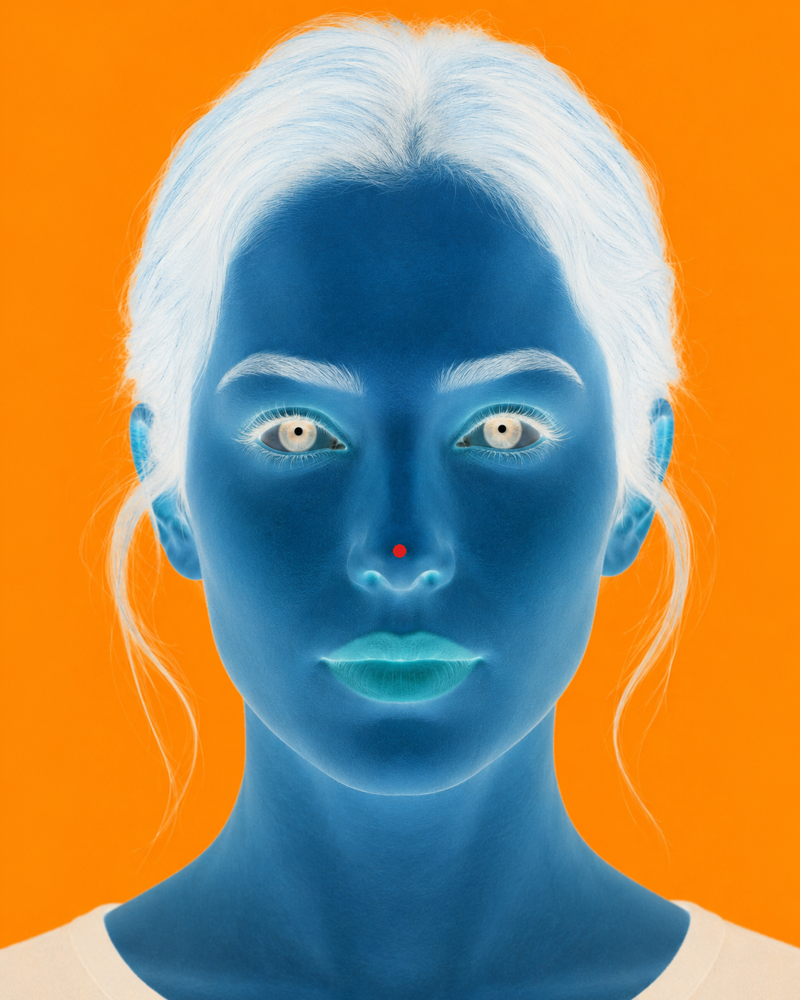

<strong>Step 2 — After 15 seconds, open the blank fixation screen</strong>

Keep looking at the dot. For a few seconds, you may still see a more natural-looking face even though the screen no longer shows a face.

**Teaching point:** after staring at an image, your eyes and brain can briefly keep part of that image. What you see is not always exactly what is on the screen.

**Final web behavior:** AntiGravity should make this a timed activity. A **Start experiment** button shows the negative portrait for 15 seconds, then automatically switches to the blank screen for 8 seconds. The dot stays in the same place so the viewer does not need to move their eyes.

<!-- assets: afterimage-negative-portrait, afterimage-blank-fixation | method: ORIGINAL_EXPERIMENT | status: ready -->
<!-- interaction: afterimage-face | type: timed-two-state | stare-seconds: 15 | blank-seconds: 8 | final-site: auto-switch -->

---

## 18 — Perspective Changes How Big Things Look

Objects can look larger or smaller because of depth and perspective even when they are actually the same size.

The same idea matters in maps, charts, and dashboards: context can change how large something looks.

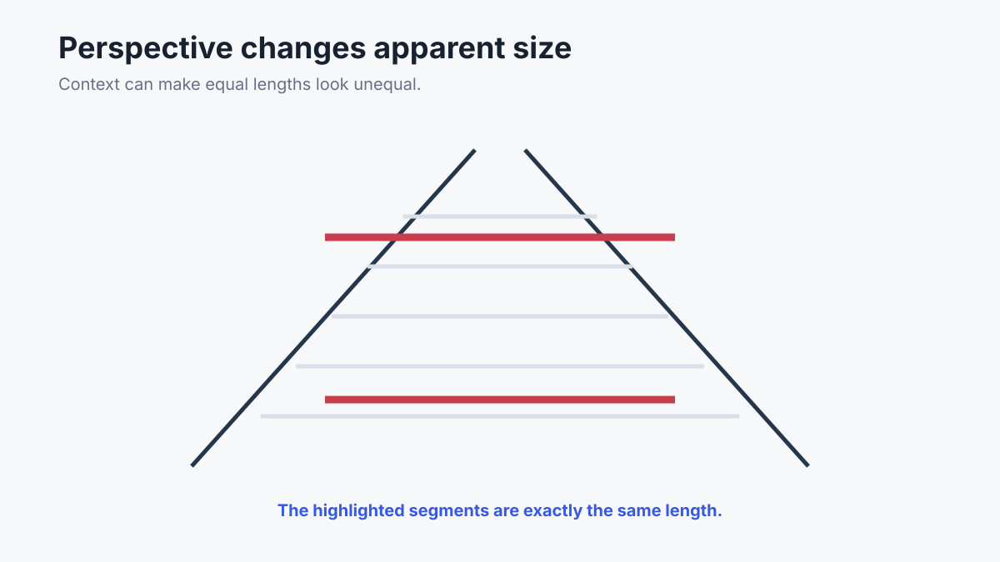

### Legacy / real-world examples

**Railroad-track perspective photo**

[Source and attribution — Wikimedia Commons](https://commons.wikimedia.org/wiki/File:Lotus_Illinois_railroad_tracks.jpg)

**Forced-perspective Washington Monument photo — CC0 replacement**

[Source — WordPress Photo Directory](https://wordpress.org/photos/photo/96968997de/)

<!-- asset: perspective-lines | method: DRAW | status: ready -->
<!-- external-media: lotus-illinois-railroad-tracks | type: image | usage: optional -->
---

## 19 — Visual Noise Can Create False Patterns

Too many repeated lines and grids can create distracting optical effects.

In charts, dark or crowded gridlines can make the data harder to see.

**Design point:** gridlines and other guides should support the data, not compete with it.

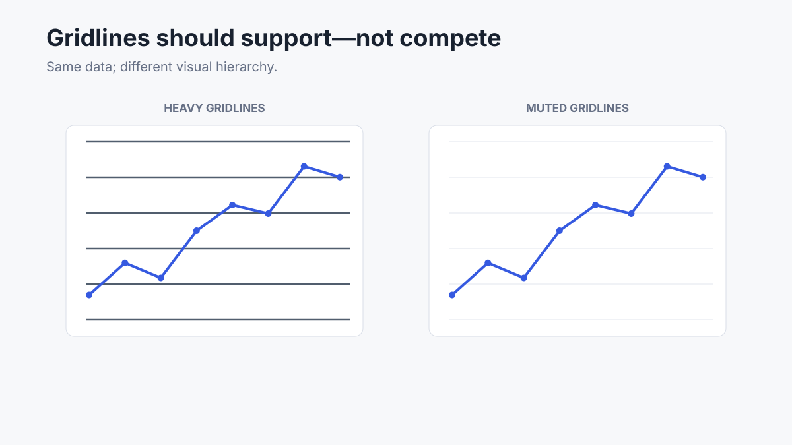

**Open-source historical example — Hermann grid**

[Source — Wikimedia Commons, CC0](https://commons.wikimedia.org/wiki/File:Hermann_grid_illusion.svg)

<!-- assets: moire-grid, muted-gridlines | method: DRAW | status: ready -->
---

## 20 — Gestalt: Our Brain Completes Shapes

People often see a complete shape even when part of it is missing.

This is called **closure**. Our brain fills in missing parts to create a whole shape.

In a visualization, people do not look at every mark separately; they naturally look for a pattern or whole.

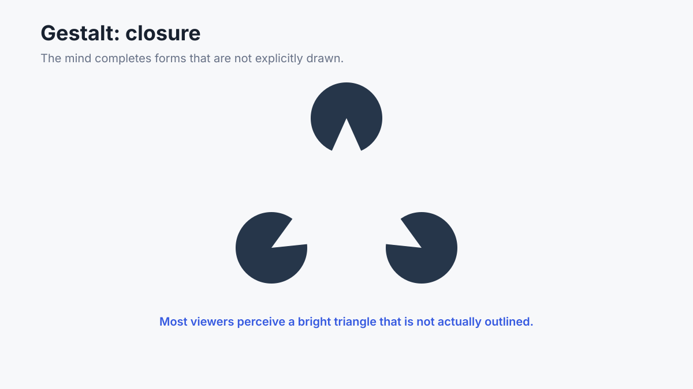

**Classic example — Kanizsa triangle**

[Source — Wikimedia Commons](https://commons.wikimedia.org/wiki/File:Kanizsa_triangle.svg)

<!-- asset: gestalt-closure | method: DRAW | status: ready -->
---

## 21 — Gestalt: Things Close Together Look Grouped

Objects placed close together often look like they belong to the same group.

Color, spacing, and position can create groups even when we do not draw a box around them.

**Design point:** layout itself can show relationships.

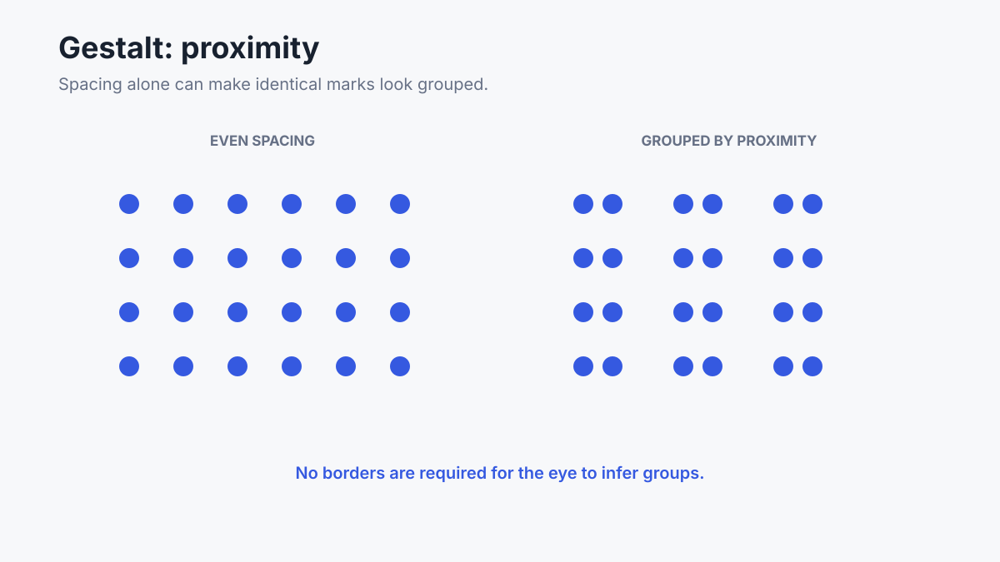

<!-- asset: gestalt-proximity | method: DRAW | status: ready -->

---

## 22 — Week 2 Takeaways

1. Visualization is part of analysis, not just decoration.
2. Summary numbers alone can hide important patterns.
3. Some ways of showing data are easier to read and compare than others.
4. What we see depends on context, and our eyes can be misled.
5. Good visual design helps analysts understand the evidence and make clear, well-supported judgments.

**Next:** Apply these ideas to spatial intelligence using **ArcGIS Business Analyst**.

<!-- asset: week2-bridge-to-spatial | method: DRAW | status: ready -->
