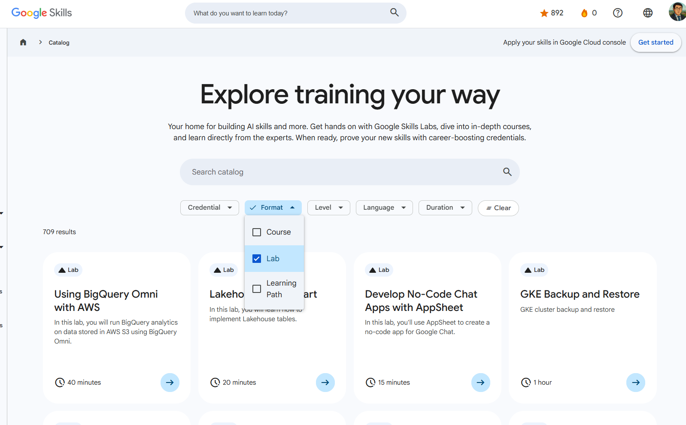
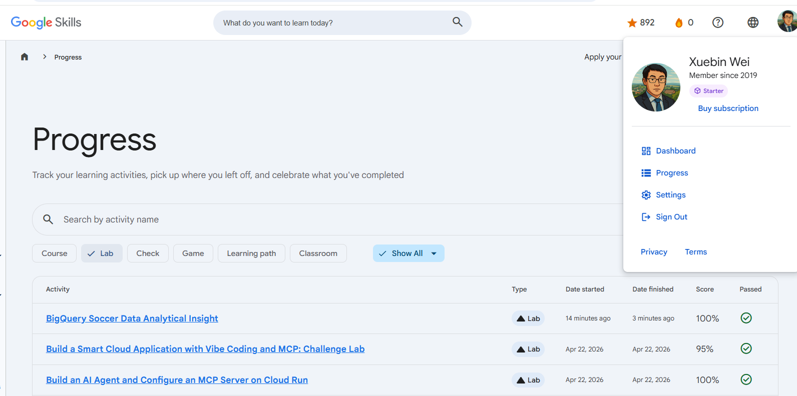

# Google Skills — Hands-on Lab Assignment

**IA342 · Fall 2026 · 100 Canvas points · Google AI Skills (10% of your final course grade)**

**Deadline: Saturday, December 12, 2026, at 11:59 PM Eastern Time.** All qualifying Labs must be **completed and passed**, and your evidence screenshot must be **uploaded to Canvas**, before this deadline. **No late submissions are accepted.**

## Assignment

Complete up to **three or more distinct hands-on Labs** in [Google Skills](https://www.skills.google/). You may choose eligible Labs available in your assigned program. Complete **three distinct passed Labs for 100/100 Canvas points**; one or two passed Labs earn partial credit.

**Only activities whose Format/Type is Lab count.** Courses, Learning Paths, Checks, Games, and other formats do **not** count. If a Course includes one or more Labs, only the **individual Labs recorded as passed** may count. Repeating the same Lab does not count as a second Lab.

## Step 1 — Sign in with your enrolled JMU Google account and use shared credits

1. Sign in to [Google Skills](https://www.skills.google/) using the **Google account you registered with your JMU email address**. It must be **the same Google/Gmail sign-in account that the instructor enrolled in the course program and shared credits**. **Do not switch to a different personal Gmail account** for these Labs.
2. The instructor has already added your course account to the **class's shared pool of 5,000 Google Skills credits**. This is a **shared class pool, not 5,000 credits per student**. **Make sure you use the course-provided credits** when launching Labs; do not purchase credits or pay for a personal subscription for this assignment.
3. Open **Programs** in Google Skills and find the program shared with you by the instructor. Select eligible Labs from that program. If your account does not show the assigned program or shared credits, **contact the instructor before starting** rather than using a different account or paying yourself.
4. You can also browse **Catalog → Format → Lab** to identify hands-on Labs. Make sure **Lab is the only selected format**; **Course** and **Learning Path** must be unchecked. The selected activity must still be available through your enrolled account and course credits.
5. Start and finish each chosen Lab, and verify that it shows **Passed**.

**Example 1 — Catalog: select Lab as the only eligible format.**

**Not every completed Lab awards a Certificate or Skill Badge.** Neither a Certificate nor a Skill Badge is required for this assignment. The **Passed** result for an individual hands-on Lab is the required proof.

## Step 2 — Verify your completed Labs

1. In Google Skills, click your profile picture (top right), then select **Progress**.
2. Select **Lab** in the activity filters if necessary.
3. For each Lab you want to count, verify the activity **name**, **Type: Lab**, **Date finished**, and **Passed** checkmark.
4. Open the profile menu so your **full name** is visible at the same time as your completed Lab rows.

**You do not need a 100% score.** A result such as **95% with the green Passed checkmark** qualifies.

**Example 2 — Progress: the account name and three distinct passed Labs are visible.**

These are instructor examples only. **Your screenshot must show your own account name and your own passed Labs.**

## Step 3 — Upload ONE screenshot to Canvas

Before the deadline, upload **one PNG or JPG screenshot** to this Canvas assignment, with all of the following visible **in the same screenshot**:

- **Your full name** in the open Google Skills profile menu.
- **One, two, or three distinct completed Lab names** (three are sufficient for full credit).
- **Type: Lab** and the **Passed checkmark** for each counted Lab.
- The **Date finished** column to verify completion before the deadline.

You may adjust browser zoom so the relevant rows and your name fit on one screenshot while remaining readable. **Only one screenshot is required.** Do not submit a Certificate, a link, or a written report instead. Upload the image to **Canvas**.

## Grading — 100 Canvas points (10% course weight)

| Distinct hands-on Labs marked Passed | Canvas points |
|---|---:|
| 0 | 0 / 100 |
| 1 | 30 / 100 |
| 2 | 60 / 100 |
| **3 or more** | **100 / 100** |

**The assignment itself is scored out of 100 points in Canvas. The Google AI Skills assignment category is weighted at 10% of the final course grade.** These Canvas points are not percentages of the entire course grade.

Only distinct Labs showing **Type: Lab** and **Passed** before the deadline count. Any Lab completed after the deadline, unpassed activity, non-Lab format, or unverifiable Lab does not count. If the required identity or completion details are missing from the screenshot, credit for affected Labs cannot be verified.

**Complete both requirements by December 12, 2026, at 11:59 PM ET:** (1) finish and pass the qualifying Labs; (2) upload your one screenshot to Canvas. Late submissions or late Lab completions are not accepted.

[Return to the IA342 course home](../../)