---
layout: default
title: "Lab 2: ArcGIS Business Analyst I — Data, Sites, and Reports - IA 342"
---
# Lab 2 — ArcGIS Business Analyst I

## Data, Sites, and Reports

This is the first of three connected ArcGIS Business Analyst labs.

- **Week 2:** prepare data and create a report,
- **Week 3:** create maps and a StoryMap, and
- **Week 4:** run spatial analysis and build a dashboard.

You will use the **same Business Analyst project** for all three labs.

## Final product

Submit **one PDF report**.

## Learning goals

By the end of this lab, you should be able to:

- create a Business Analyst project,
- define a JMU site with drive-time areas,
- run a standard report,
- download and geocode outside data,
- set up custom data,
- build a reusable custom report template,
- add a chart using Business Analyst variables, and
- run the template for JMU and export the final PDF.

## Data

You will use:

1. built-in U.S. data in ArcGIS Business Analyst, and
2. the **latest downloadable Gun Violence Archive (GVA) incident records**.

For this lab, use the archive download as provided by GVA. The current download is limited to the **latest 2,000 records**.

Do **not** filter the file to a specific year.

Data source:

[Gun Violence Archive](https://www.gunviolencearchive.org/)

Navigation used in class:

**All Reports → Archive → Download**

The downloaded file includes location information that Business Analyst can geocode and fields such as:

- **Victims Killed**
- **Victims Injured**

## Before you begin

- Sign in with the ArcGIS account provided for this course.
- Watch the credit estimate before you run a credit-consuming tool.
- Do not repeat a geocoding step unless you have a reason.
- Use the naming rules exactly so your work is easy to find and grade.

---

# Session 1 — Create the Project, JMU Site, and Standard Report

## Step 1 — Create the project

1. Open **ArcGIS Business Analyst Web App**.
2. Create a new project named:

`firstname_lastname_arcgis`

3. Open the **Maps** tab.

You will reuse this project in Weeks 3 and 4.

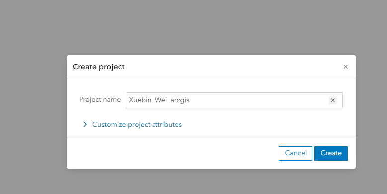

## Step 2 — Create the JMU site

1. Choose **Define areas → Find location**.
2. Search for:

`James Madison University, Harrisonburg, VA`

3. Use the drive-time option shown in class.
4. Keep the three drive-time areas created for the JMU site:

- **5 minutes**
- **10 minutes**
- **15 minutes**

Do not replace them with a single 10-minute area.

Save the site as **JMU** or keep the default **James Madison University** site name.

These three drive-time areas will be used together when you run the reports.

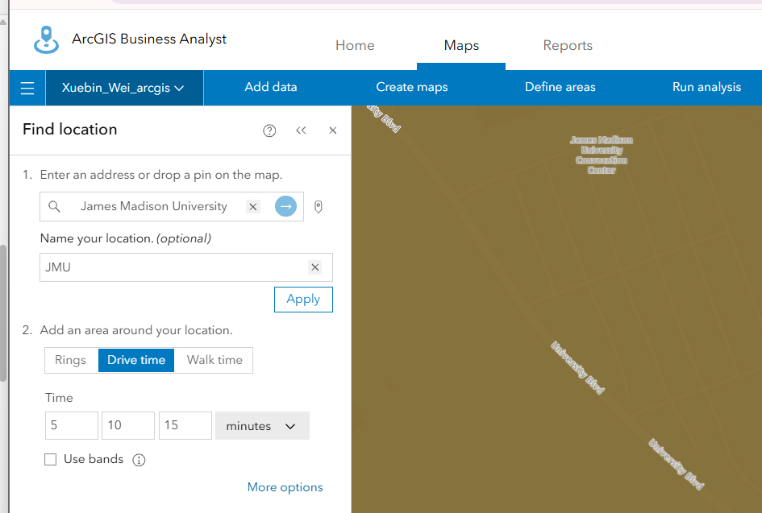

## Step 3 — Run the Community Profile report

1. Open the **Reports** tab.
2. Choose **Run reports**.
3. Add the JMU site.
4. Choose **Community Profile**.
5. Confirm that the selected site includes the **5-, 10-, and 15-minute** drive-time areas.
6. Check the credit estimate.
7. Run the report and open the PDF.

The report should show the three drive-time areas as separate columns.

This first report is for practice. You do **not** submit it.

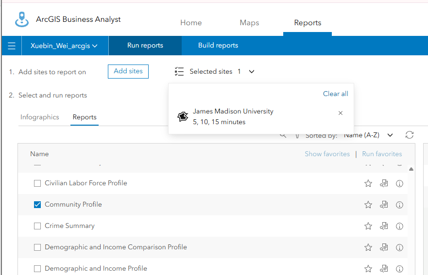

---

# Session 2 — Import GVA Data and Build a Custom Report

## Step 4 — Download the GVA archive data

1. Open the **Gun Violence Archive** website.
2. Go to:

**All Reports → Archive**

3. Download the available archive file.
4. Use the file as downloaded.

The current archive download is limited to the **latest 2,000 records**.

Do not try to filter the file to 2025 or another specific year for this lab.

Before importing, identify the columns that contain:

- location information,
- **Victims Killed**, and
- **Victims Injured**.

## Step 5 — Import and geocode the records

1. Return to **ArcGIS Business Analyst**.
2. Choose **Maps → Add data → Import file**.
3. Upload the GVA archive file.
4. Choose **Point locations**.
5. Match the location fields to the correct ArcGIS fields.
6. Review the estimated credit cost before continuing.
7. Run the location matching/geocoding.
8. Use a simple point symbol.
9. Save the imported layer as:

`lastname_gva`

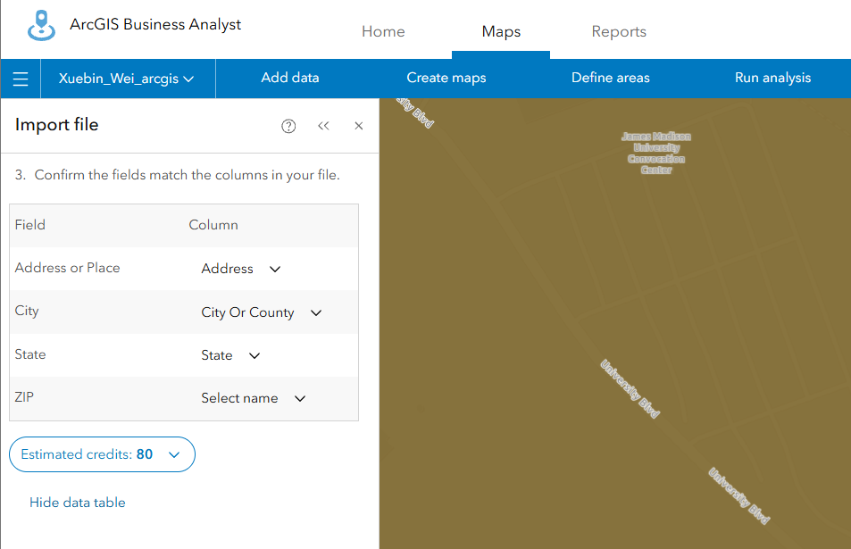

## Step 6 — Check the geocoded map

After the import is complete:

1. Zoom out and confirm that the records are distributed across reasonable U.S. locations.
2. Zoom back to **Harrisonburg / JMU**.
3. Look at the GVA points inside or near the JMU drive-time areas.

No written response is required for this step. The goal is simply to confirm that the geocoding worked and to see what the downloaded data contain around JMU.

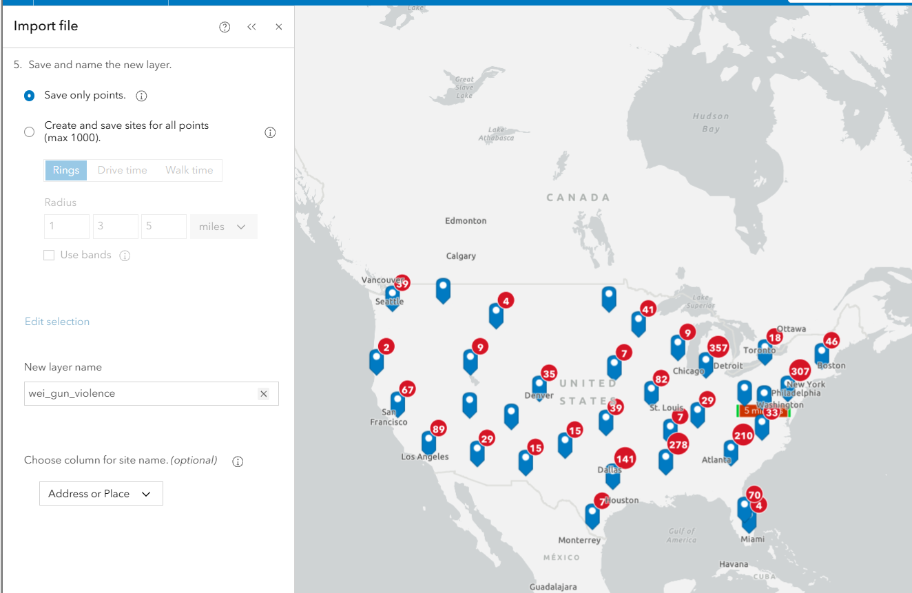

## Step 7 — Set up GVA as custom data

1. Choose **Maps → Add data → Custom data setup**.
2. Select the imported `lastname_gva` layer.
3. Create a custom category for the GVA data.
4. Add these two fields:

- **Victims Killed**
- **Victims Injured**

5. Confirm that both are numeric variables.
6. Use an appropriate summary method such as **Sum** for these count fields.
7. Finish and save the custom data setup.

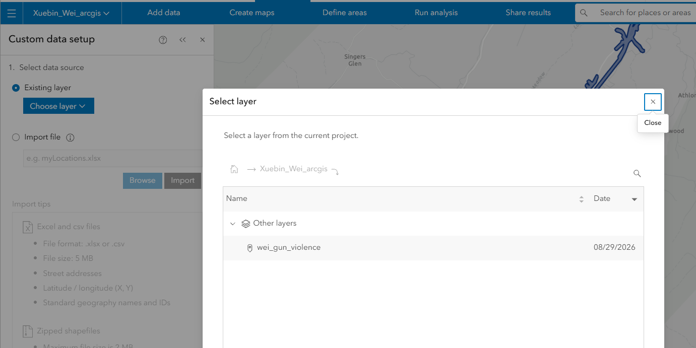

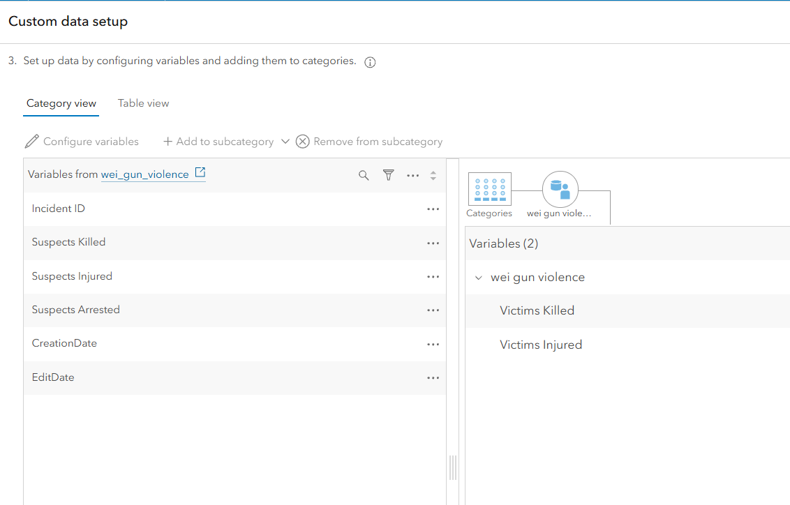

## Step 8 — Build a reusable custom report template

A report template is **not tied to JMU**. Once you save the template, it can be run for other sites.

For this lab, you will build the template first and then run it for the JMU site.

1. Open **Reports → Build reports**.
2. Start with a **blank report template**.
3. Find your custom GVA category.
4. Add:

- **Victims Killed**
- **Victims Injured**

5. Add these variables to the report.

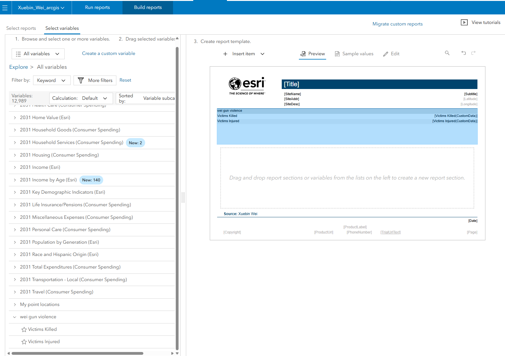

## Step 9 — Add a chart to the template

1. Insert a **Chart** section.
2. Search the standard Business Analyst variables.
3. Add **at least two crime index variables** to the chart.

Recommended example:

- **Total Crime Index**
- **Personal Crime Index**
- **Property Crime Index**

Using all three is recommended, but **at least two indexes are required**.

4. Use a simple vertical bar chart.
5. Preview the chart and make sure the variables are readable.

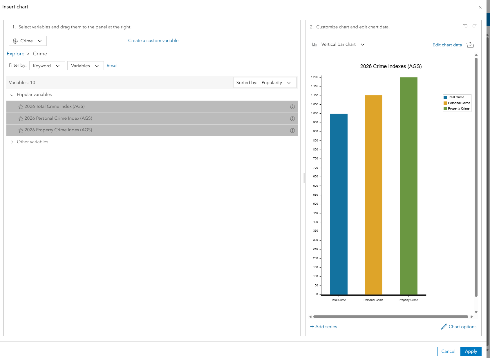

## Step 10 — Save the report template

After the variables and chart are complete:

1. Save the report template.
2. Enter a clear template name, such as:

`lastname_firstname_lab2_gva`

3. Save the template.

The template name is entered at the **end** of the template-building process.

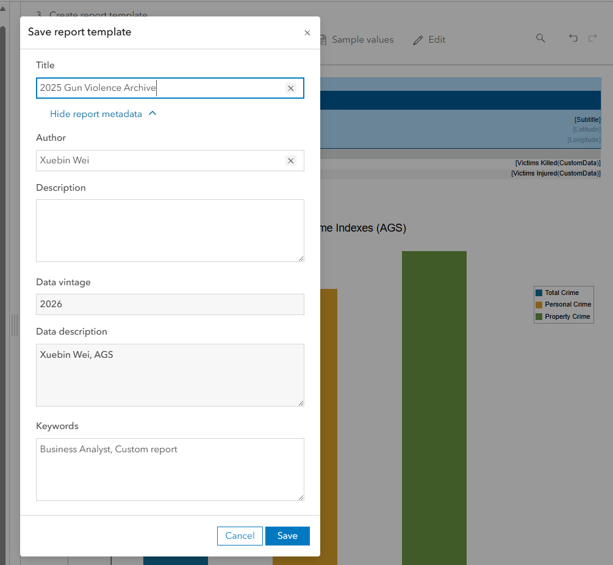

## Step 11 — Run the custom report for JMU

1. Return to **Reports → Run reports**.
2. Select your custom report template.
3. Add the **James Madison University** site.
4. Make sure the site still includes all three drive-time areas:

- 5 minutes
- 10 minutes
- 15 minutes

5. Run the report as a PDF.

Because the JMU site has three drive-time areas, the custom report should contain results for all three areas.

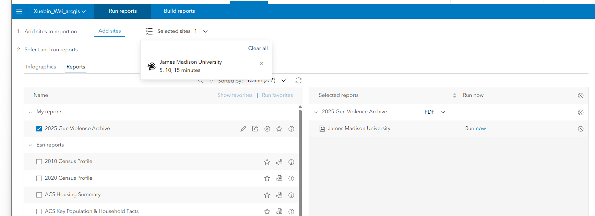

## Step 12 — Export the final PDF

Save the final report as:

`lastname_firstname_lab2_report.pdf`

Your PDF should include:

- the JMU site,
- **5-, 10-, and 15-minute drive-time results**,
- **Victims Killed**,
- **Victims Injured**, and
- a chart with **at least two crime index variables**.

The chart should appear for the drive-time areas generated by the report template.

---

# Submission

Submit **one PDF file** to Canvas:

`lastname_firstname_lab2_report.pdf`

Do not submit screenshots, the standard Community Profile PDF, or a Business Analyst project URL.

---

# Grading rubric — 100 points

Submit one readable PDF. If the submitted file cannot be opened or is not a PDF, it is not a valid submission and the rubric cannot be applied until a valid file is submitted.

| Requirement | Points |
|---|---:|
| **JMU study area:** the report is run for James Madison University and includes the **5-, 10-, and 15-minute drive-time areas** | 20 |
| **Custom GVA results:** **Victims Killed** and **Victims Injured** are included for the JMU drive-time areas | 40 |
| **Crime index charts:** a readable chart with **at least two crime index variables** is included for the JMU drive-time areas | 40 |
| **Total** | **100** |

Partial credit within each category is based on how much of the required content is present and correct.

## Official references

- [Gun Violence Archive](https://www.gunviolencearchive.org/)
- [Set up custom data in Business Analyst](https://doc.arcgis.com/en/business-analyst/web/custom-data-setup.htm)
- [Build a report template](https://doc.arcgis.com/en/business-analyst/web/building-reports.htm)
---
[Return to Module 2](../../modules/module-2/index.md) | [Return to Course Home](../../index.md)
