<style>
.lab-shot { margin: 18px 0 28px; }
.lab-shot img {
  display: block;
  max-width: 100%;
  height: auto;
  max-height: 860px;
  object-fit: contain;
  object-position: left;
  border: 1px solid #d0d7de;
  border-radius: 6px;
  box-shadow: 0 2px 6px rgba(0,0,0,0.04);
}
</style>

# Lab 6 — Clean Data in Tableau Flow

**IA342 · Dr. Wei**  
**Deadline:** the date and time announced for Lab 6. Publish your work in **`fall2026`** before the deadline. **There is no Canvas submission.**

## Objectives

Become familiar with Tableau Flow, and learn how to clean and visualize house-price data in Tableau.

## Required published items

| Session | Item type | Published name |
|---|---|---|
| Monday | **Diamonds Flow** | `firstname_lastname_lab6_diamonds_flow` |
| Monday | **Diamonds Data Source** | `firstname_lastname_lab6_diamonds_clean` |
| Wednesday | **House Flow** | `firstname_lastname_lab6_house` |
| Wednesday | **House Data Source** | `firstname_lastname_lab6_house` |
| Wednesday | **House Workbook** | `firstname_lastname_lab6_house` |

**Five published items: two Flows, two Data Sources, and one Workbook.** The house Workbook contains **three Worksheets and one Dashboard**; they are not additional standalone submissions.

Use **your own name**, **Lab 6**, and the **`fall2026`** project for publishing. Follow the names above rather than copying a demonstration name or project shown in a screenshot.

## Monday — In-class Diamonds exercise

Complete the [in-class exercise](../../modules/module-6/#slide-48) in the lecture. Keep both the published **Flow** and the clean **Data Source** generated by running it. No Diamonds Workbook is required.

Inputs on GitHub: [Batch A — 10 rows](https://github.com/JMU-Data/IA342/blob/a35a141a1a319de5ae4f19383c947cbfa1d1f581/docs/assets/week-6/data/diamonds_batch_a.csv) · [Batch B — 12 rows](https://github.com/JMU-Data/IA342/blob/a35a141a1a319de5ae4f19383c947cbfa1d1f581/docs/assets/week-6/data/diamonds_batch_b.csv). Use **Download raw file** on the file page.

Check the Diamonds output: **22 input rows → 20 after duplicate removal → 18 after missing-price removal → 17 after the weight filter**. The final counts are **GIA 6, IGI 5, HRD 6**. Keep IDs **7, 154, and 155**.

## Wednesday — Clean and visualize house data

**Data:** [Download the House Price Excel file](https://github.com/xbwei/machine_learning_in_rapidminer/blob/master/house_price_full.xlsx). On GitHub, use **Download raw file**.

### 1. Create a new flow

Create a **new Flow** in the **`fall2026`** course project in Tableau Cloud. Do not overwrite the Diamonds flow.

<figure class="lab-shot">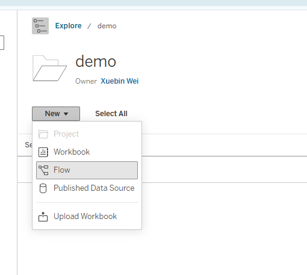</figure>

### 2. Connect to the house data

Click **Connect to Data** and upload the House Price Excel file. Select the **house_url** table.

<figure class="lab-shot">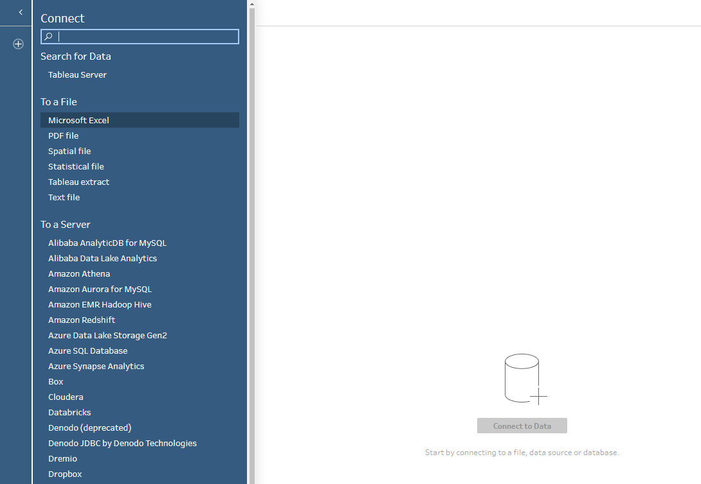</figure>

### 3. Keep the required fields

In **Field List**, remove the other fields and retain only **ID, price, bedroom, bathroom, house_type, status, lot_size, built_in, zip, and area**.

<figure class="lab-shot">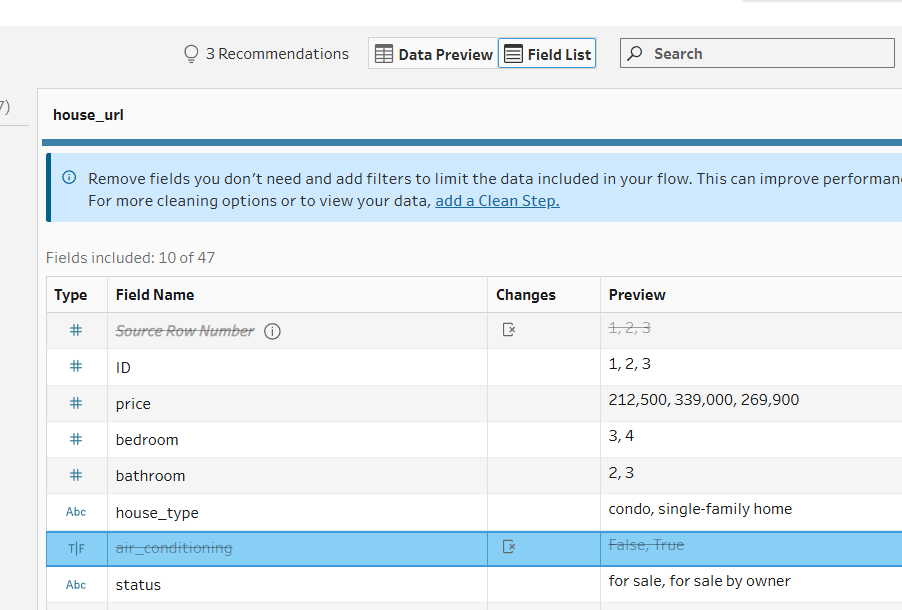</figure>

<figure class="lab-shot">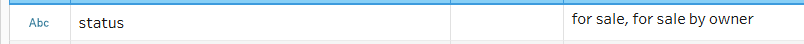</figure>

<figure class="lab-shot">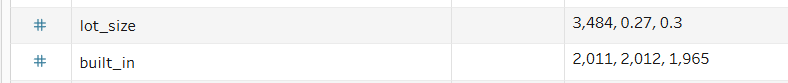</figure>

<figure class="lab-shot">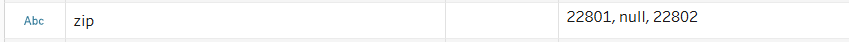</figure>

<figure class="lab-shot">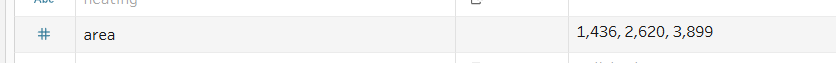</figure>

### 4. Add a Clean step

Add a **Clean** step after the input.

<figure class="lab-shot">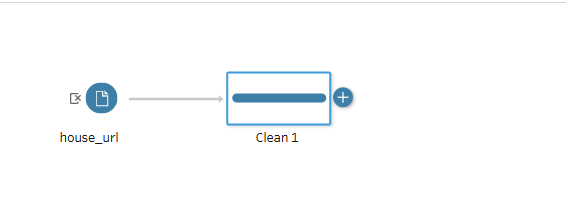</figure>

### 5. Set ID to String

In the Clean step, change the data type of **ID** to **String**.

<figure class="lab-shot">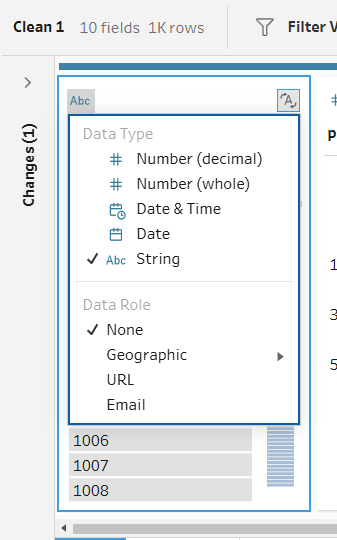</figure>

### 6. Set built_in to Date

Change the data type of **built_in** to **Date**.

<figure class="lab-shot">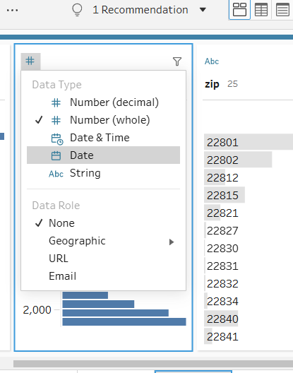</figure>

### 7. Set the ZIP Code role

For **zip**, select **Geographic → ZIP Code/Postcode**. Keep the postal-code values as text; ZIP Code is a geographic role, not a quantity.

<figure class="lab-shot">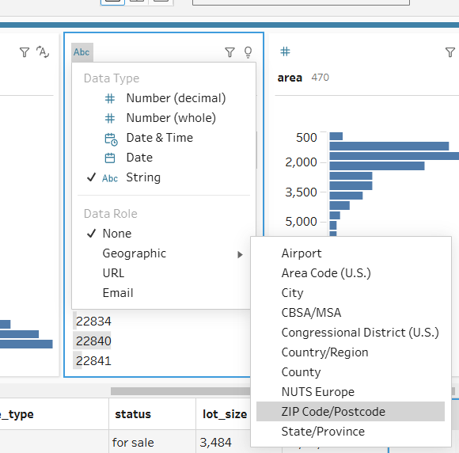</figure>

### 8. Group status values

Click the three dots in the **status** field and choose **Group Values → Pronunciation**. Review the suggested groups.

<figure class="lab-shot">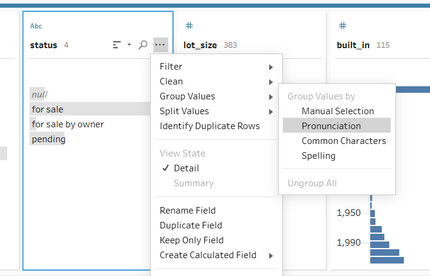</figure>

### 9. Remove null values

Select **null** in the **area** field and choose **Exclude**. Repeat for the other retained fields until no null values remain.

<figure class="lab-shot">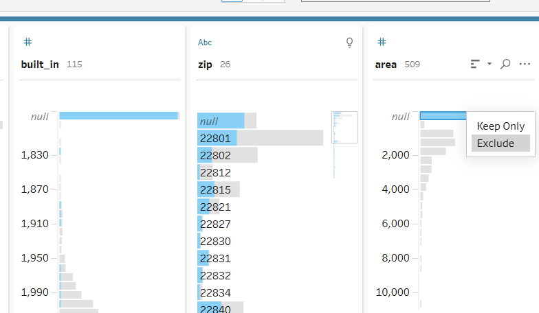</figure>

### 10. Calculate unit price

Create a calculated field named **unit price**, using:

```text
[price] / [area]
```

<figure class="lab-shot">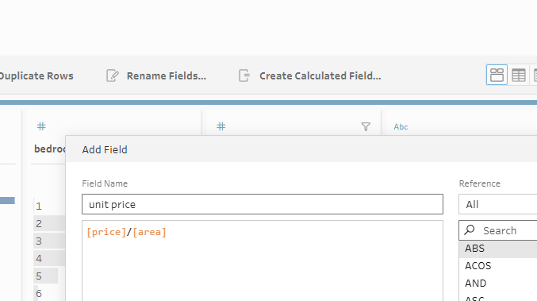</figure>

### 11. Calculate lot size in square feet

Create a second calculated field named **lot size sq**, using:

```text
IF [lot_size] < 10 THEN [lot_size] * 43560
ELSE [lot_size]
END
```

For this exercise, the formula treats values below 10 as acres and the remaining values as square feet. This is a dataset-specific assumption, not a general way to identify units.

<figure class="lab-shot">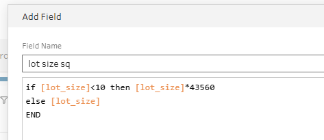</figure>

### 12. Add the output Data Source

Add an **Output** step. Set **Save output to** to **Published data source**, select **`fall2026`**, and name the Data Source **`firstname_lastname_lab6_house`**.

<figure class="lab-shot"></figure>

### 13. Publish the Flow

Publish your **Flow** in **`fall2026`** as **`firstname_lastname_lab6_house`**. The Flow and its Data Source are different item types and may use the same name.

<figure class="lab-shot">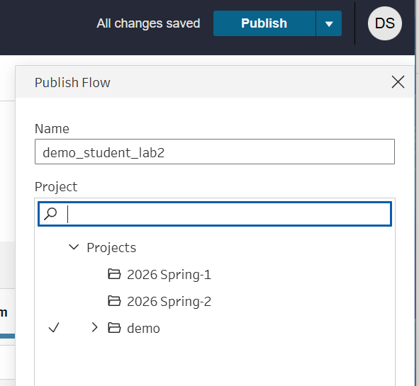</figure>

### 14. Run the Flow and create a Workbook

**Run** the Flow. When the generated **Data Source** appears in the course project, select it and choose **New Workbook**. Build the Workbook from **your own Flow’s output**, not directly from the raw Excel file.

<figure class="lab-shot">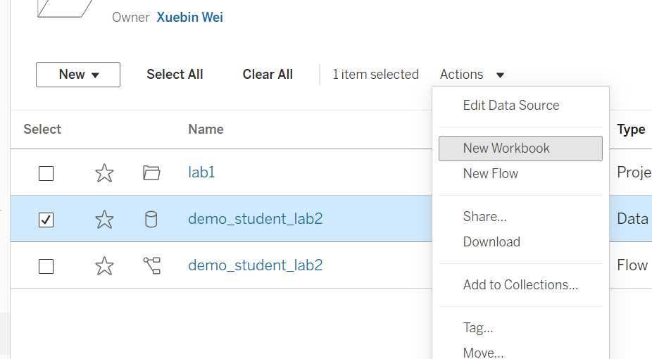</figure>

### 15. Create the year-built line chart

Drag **built_in** to **Columns** and **Migrated Data (Count)** to **Rows**. In **Show Me**, select the **continuous line chart**.

<figure class="lab-shot">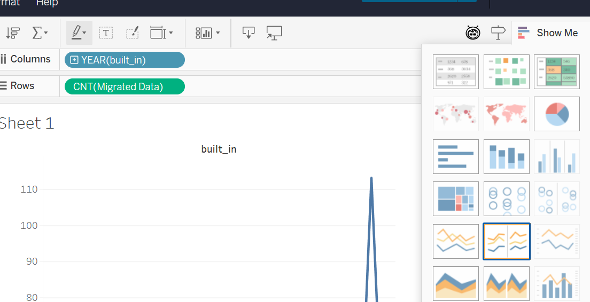</figure>

### 16. Show the last 30 years

Drag **built_in** to **Filters**. Select **Relative dates**, choose **Years**, and set **Last 30 years**.

<figure class="lab-shot">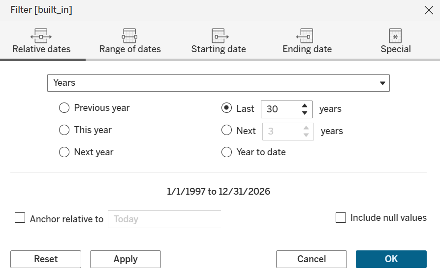</figure>

### 17. Create the lot-size bar chart

Create a **second Worksheet** showing **average lot size in square feet for each house type**. Use **house_type** and **AVG(lot size sq)**.

<figure class="lab-shot">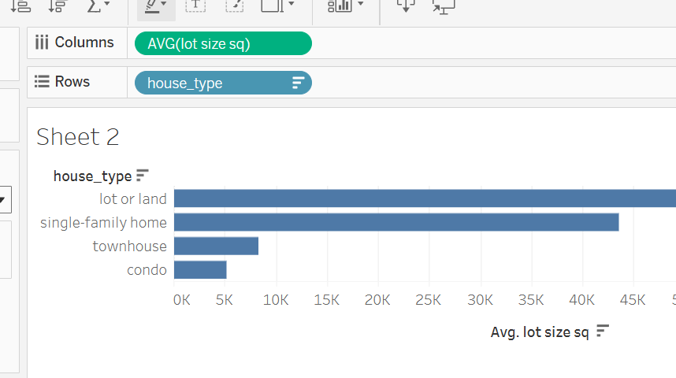</figure>

### 18. Create the unit-price symbol map

Create a **third Worksheet**. Select **zip** and **unit price**, then choose **Symbol Map** in **Show Me**. Change the aggregation to **AVG(unit price)**.

<figure class="lab-shot">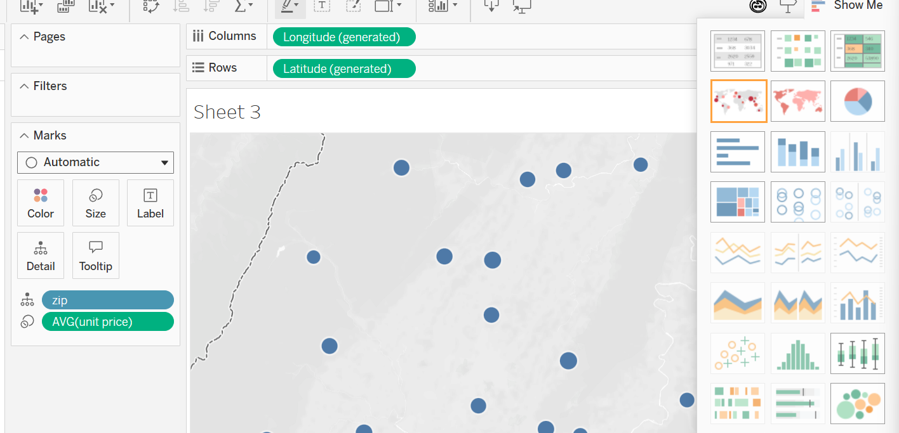</figure>

### 19. Change the background map

In the **Map** menu, change **Background Maps** to **Streets**.

<figure class="lab-shot">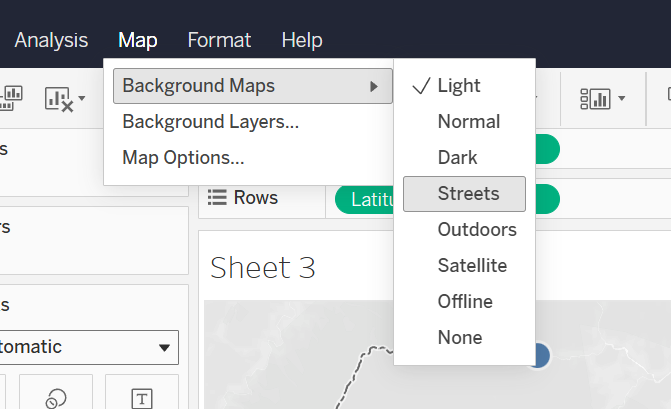</figure>

### 20. Build the Dashboard

Create a **Dashboard**, add all **three Worksheets**, and enable the **bar chart as a filter**.

<figure class="lab-shot">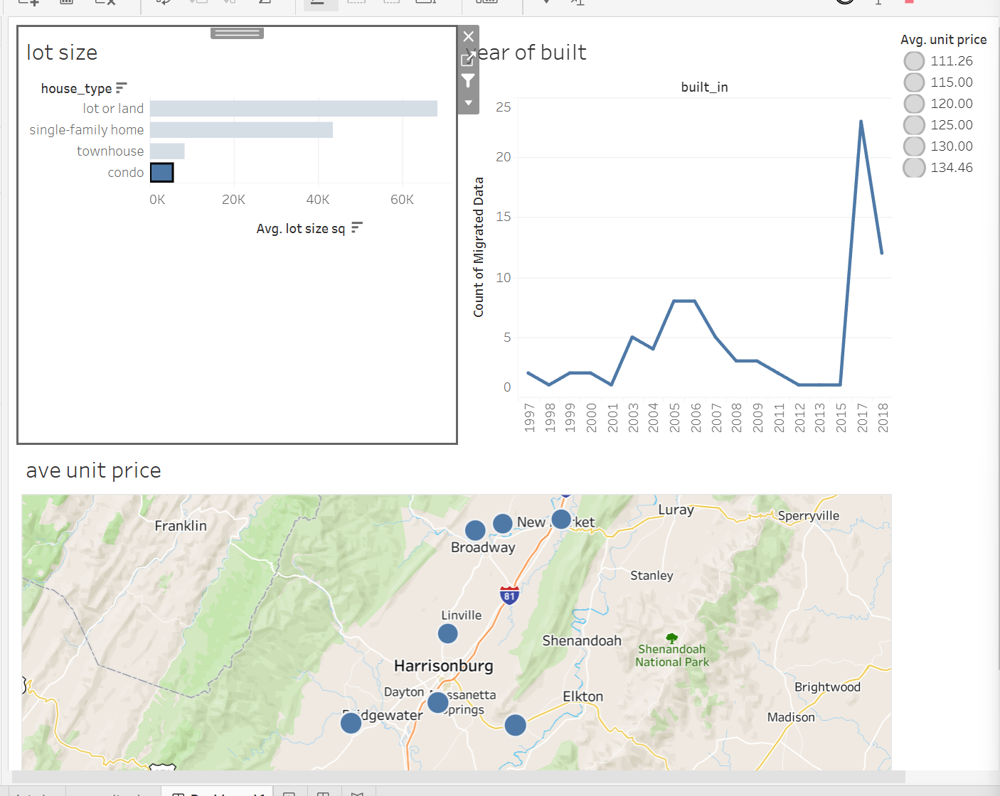</figure>

### 21. Publish the Workbook

Publish the **Workbook** in **`fall2026`** as **`firstname_lastname_lab6_house`**. Include the **three Worksheets and the Dashboard**.

**Use `lab6` in the name—not `lab5`.**

<figure class="lab-shot"></figure>

## Submission

Publish **both Flows, both Data Sources, and the house Workbook** in **`fall2026`** before the deadline. A saved draft is not a published Flow; running the Flow generates its output Data Source.

The house Workbook must connect to your **house Flow’s published Data Source**, and it must contain the line chart, bar chart, symbol map, and Dashboard described above.

Your final submission time is determined by the **Last Modified** time on Tableau Cloud. If it is after the lab deadline, late penalties apply according to the course syllabus. **There is nothing to upload or submit on Canvas.**

## Rubric — 100 points

| Required item | Points | Full-credit requirements |
|---|---:|---|
| **Diamonds Flow** | **20** | Published and runnable, with both inputs and the lecture’s cleaning operations. |
| **Diamonds Data Source** | **10** | Published output of the Diamonds Flow; contains the required 17 records and calculated fields. |
| **House Flow** | **30** | Published and runnable; retains the ten required fields, applies the specified types/roles, grouping and null removal, and creates **unit price** and **lot size sq**. |
| **House Data Source** | **10** | Published output generated by the House Flow; available in `fall2026` with the required fields and both calculations. |
| **House Workbook** | **30** | Uses the student’s House Data Source; includes all three specified Worksheets and a Dashboard with the bar chart enabled as a filter. |
| **Total** | **100** | **2 Flows + 2 Data Sources + 1 Workbook** |

Each criterion has **PASS = full points** and **MISSING = 0**. The instructor may enter an intermediate score when an item is present but incomplete. Late penalties are applied according to the syllabus.

---

[Return to Course Home](../../) | [Go to Module 6 Lecture](../../modules/module-6/)
