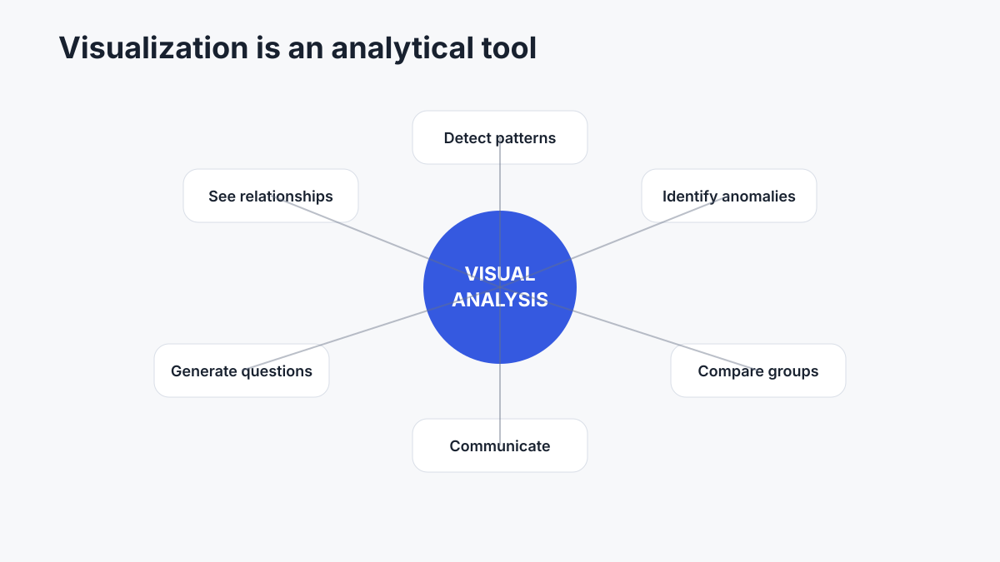
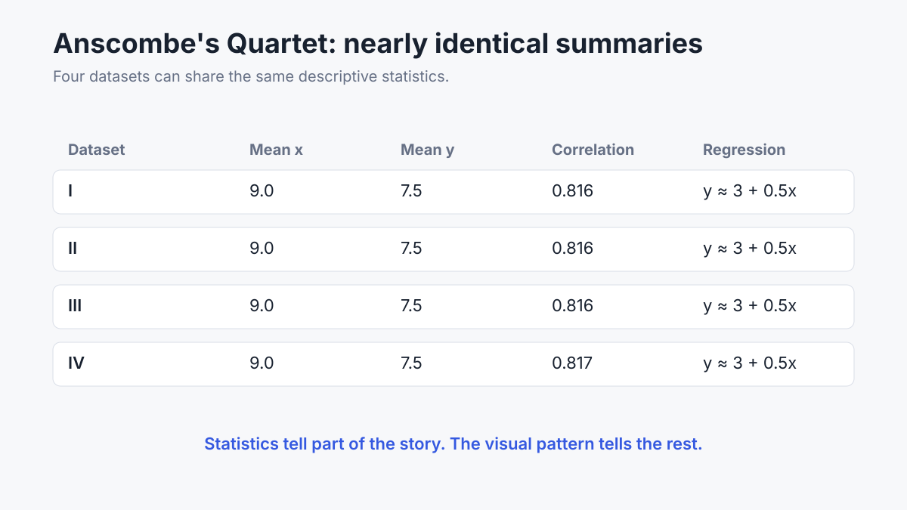
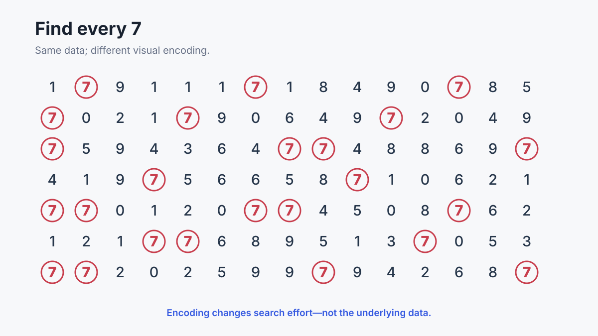
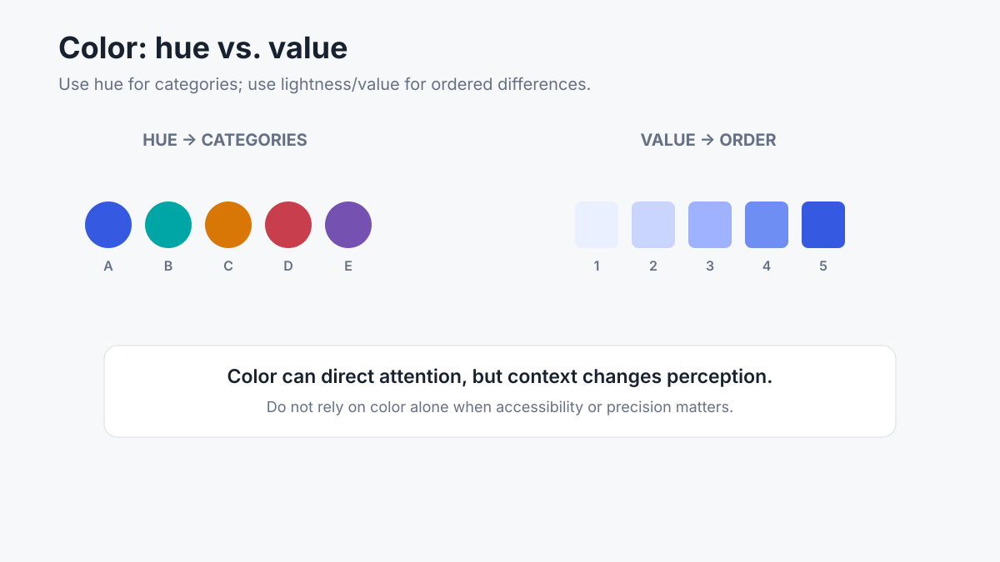
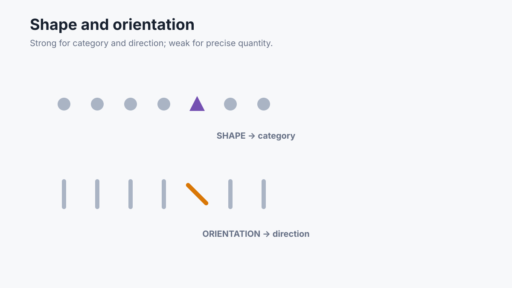
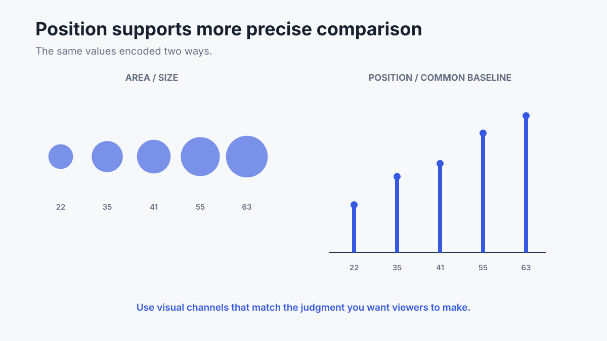
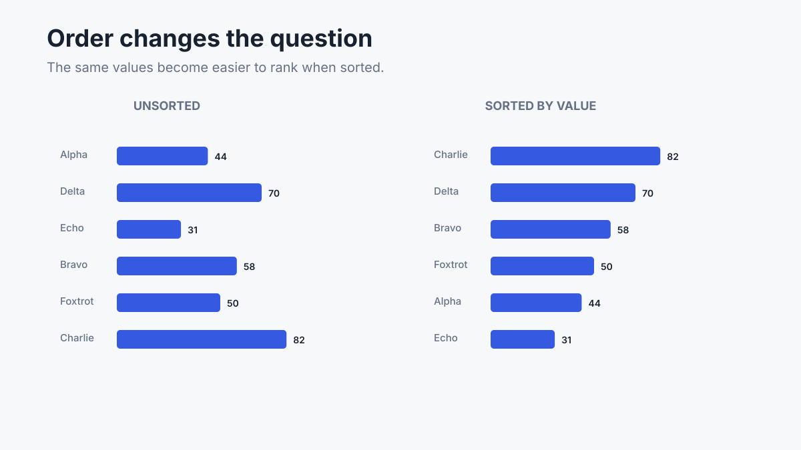
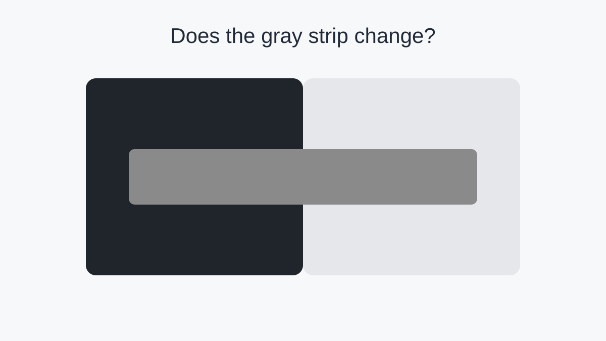
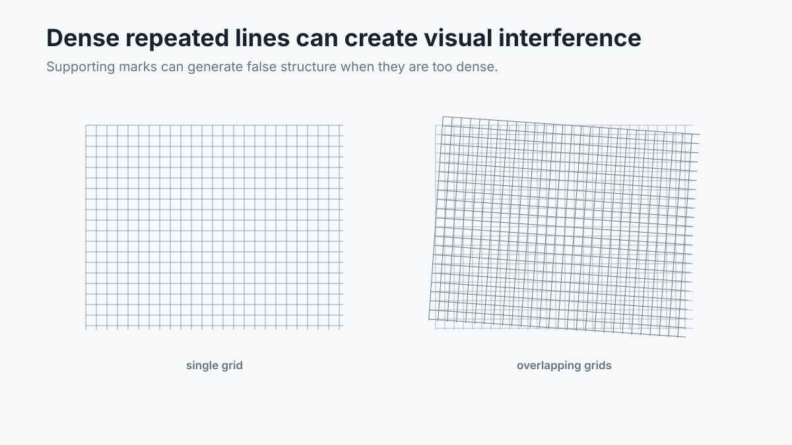
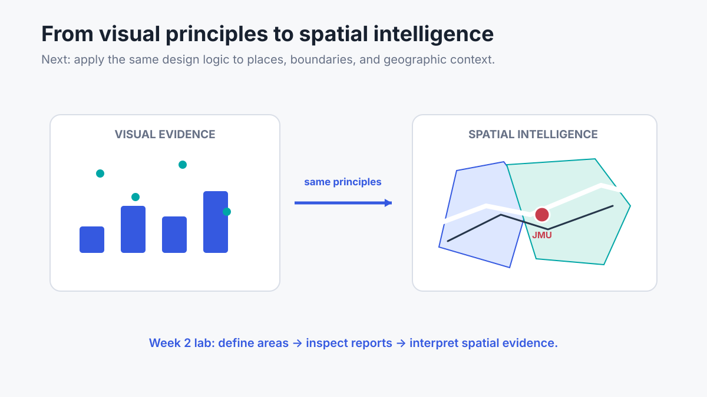

  

    

      📊 IA 342 Week 2 Lecture
      |
      Slide 1 of 50
    

    

      <button class="deck-btn" id="prevBtn" onclick="changeSlide(-1)" title="Previous (← / PageUp)">◀ Prev</button>
      <button class="deck-btn" id="nextBtn" onclick="changeSlide(1)" title="Next (→ / Space / PageDown)">Next ▶</button>
      <button class="deck-btn" onclick="toggleFullScreen()" title="Fullscreen Mode">⛶ Fullscreen</button>
    

  

  

    

  

  

    <!-- SLIDE 1: Introduction to Data Visualization -->
    

      

  <h1 class="slide-main-title">Introduction to Data Visualization</h1>
  
Visualization Methods, Technologies, and Tools for Intelligence Analysis

  

    
This lecture explains <strong>why visualization helps us understand complex data</strong> and why <strong>human perception</strong> matters when we design charts, maps, and other visual evidence.

  

  

    <button class="deck-btn-primary" onclick="changeSlide(1)">Start Presentation ▶</button>
  

    

    <!-- SLIDE 2: 01 — Why Visualization? -->
    

      Foundations
      <h2>01 — Why Visualization?</h2>
      

  
Organizations can collect and store massive volumes of data.

  
The core analytical challenge is not merely acquiring data; it is <strong>turning raw data into something human analysts can perceive, evaluate, and act upon</strong>.

  

    <strong>Fundamental Question:</strong> What can a chart or visual pattern reveal that a table of summary numbers hides?
  

    

    <!-- SLIDE 3: 01 — Core Roles of Visualization in Analysis -->
    

      Analytical Framework
      <h2>01 — Core Roles of Visualization in Analysis</h2>
      

  

Visualization is an active thinking tool for exploration, verification, and high-impact communication.

    

    <!-- SLIDE 4: 01A — From Data Overload to Insight -->
    

      Core Concept
      <h2>01A — From Data Overload to Insight</h2>
      

  
Digital datasets can become cognitively overwhelming very quickly.

  
Visualization transforms high-dimensional complexity into spatial representations that leverage human visual intelligence.

  
The primary benefit is not cosmetic: effective visualizations make <strong>comparisons, trajectories, clusters, and anomalies</strong> immediately salient.

    

    <!-- SLIDE 5: 01A — Briefing: Why Data Visualization Matters -->
    

      Video Briefing
      <h2>01A — Briefing: Why Data Visualization Matters</h2>
      

  <iframe src="https://www.youtube-nocookie.com/embed/Xh3p4yKlEQs" title="Why Data Visualization Matters" allow="accelerometer; autoplay; clipboard-write; encrypted-media; gyroscope; picture-in-picture" allowfullscreen></iframe>

  Video 1 · <em>Why Data Visualization Matters — From Data Overload to Insight</em>
  · <a href="https://www.youtube.com/watch?v=Xh3p4yKlEQs" target="_blank">Open on YouTube ↗</a>

    

    <!-- SLIDE 6: 02 — From Data to Decision -->
    

      Analytical Pipeline
      <h2>02 — From Data to Decision</h2>
      

  
A foundational framework for intelligence analysis:

  <ul style="font-size: 1.15rem; line-height: 1.8;">
    <li><strong>Data:</strong> Raw observations, sensor feeds, and unorganized records.</li>
    <li><strong>Information:</strong> Structured data organized into meaningful contexts.</li>
    <li><strong>Knowledge:</strong> Synthesized understanding built from context, experience, and patterns.</li>
    <li><strong>Decision / Strategy:</strong> Actionable intelligence applied to operational choices.</li>
  </ul>

    

    <!-- SLIDE 7: 02 — The Data to Decision Transformation Flow -->
    

      Analytical Pipeline
      <h2>02 — The Data to Decision Transformation Flow</h2>
      

  

Visualization accelerates the cognitive movement from raw facts to actionable strategy.

    

    <!-- SLIDE 8: 02 — Briefing: From Data to Strategy -->
    

      Video Briefing
      <h2>02 — Briefing: From Data to Strategy</h2>
      

  <iframe src="https://www.youtube-nocookie.com/embed/eqcv8KF07nM" title="From Data to Strategy" allow="accelerometer; autoplay; clipboard-write; encrypted-media; gyroscope; picture-in-picture" allowfullscreen></iframe>

  Video 2 · <em>From Data to Strategy — How Raw Data Becomes Action</em>
  · <a href="https://youtu.be/eqcv8KF07nM" target="_blank">Open on YouTube ↗</a>

    

    <!-- SLIDE 9: 03 — Anscombe's Quartet: Numbers Can Deceive -->
    

      Statistical Foundations
      <h2>03 — Anscombe's Quartet: Numbers Can Deceive</h2>
      

  
Summary statistics can make fundamentally distinct datasets look completely identical.

  
Consider four datasets (I, II, III, IV) with identical:

  <ul style="font-size: 1.1rem; line-height: 1.7;">
    <li>Means: \( \bar{x} = 9.0, \bar{y} = 7.5 \)</li>
    <li>Sample Variances: \( s_x^2 = 11.0, s_y^2 = 4.12 \)</li>
    <li>Correlation Coefficient: \( r = 0.816 \)</li>
    <li>Linear Regression Fit: \( y \approx 3.0 + 0.5x \) (\( R^2 = 0.67 \))</li>
  </ul>
  

    If we rely strictly on numerical summaries, we would conclude these datasets describe identical phenomena.
  

    

    <!-- SLIDE 10: 03 — Identical Summary Statistics Table -->
    

      Statistical Foundations
      <h2>03 — Identical Summary Statistics Table</h2>
      

  

Every standard statistical summary metric is identical across all four datasets.

    

    <!-- SLIDE 11: 04 — But the Visual Patterns Are Completely Different -->
    

      Statistical Foundations
      <h2>04 — But the Visual Patterns Are Completely Different</h2>
      

  
When the four datasets are plotted on scatter plots, their true distributions emerge:

  <ul style="font-size: 1.1rem; line-height: 1.8;">
    <li><strong>Dataset I:</strong> Clean, standard linear relationship with expected variance.</li>
    <li><strong>Dataset II:</strong> Clear non-linear, quadratic curve (linear model is invalid).</li>
    <li><strong>Dataset III:</strong> Perfect linear correlation distorted by a single high outlier.</li>
    <li><strong>Dataset IV:</strong> Completely vertical cluster where one outlier controls the entire slope.</li>
  </ul>
  

    <strong>Key Rule:</strong> Never accept summary metrics without first inspecting the visual distribution.
  

    

    <!-- SLIDE 12: 04 — Anscombe's Quartet: Scatter Plots -->
    

      Statistical Foundations
      <h2>04 — Anscombe's Quartet: Scatter Plots</h2>
      

  

Francis Anscombe (1973): Graphs are essential to both data analysis and quality assurance.

    

    <!-- SLIDE 13: 05 — Visualization Is Part of Analysis -->
    

      Analytical Methodology
      <h2>05 — Visualization Is Part of Analysis</h2>
      

  
Visualization is not just a presentation wrapper applied at the end of a project.

  
It is an active investigative instrument throughout the analytical cycle:

  <ul style="font-size: 1.1rem; line-height: 1.8;">
    <li><strong>Exploration:</strong> Discovering hidden relationships and unexpected trends.</li>
    <li><strong>Verification:</strong> Stress-testing analytical models and detecting anomalies.</li>
    <li><strong>Hypothesis Generation:</strong> Prompting sharper questions for deeper research.</li>
    <li><strong>Defensible Communication:</strong> Conveying evidence with transparency and rigor.</li>
  </ul>

    

    <!-- SLIDE 14: 06 — What the Eye Notices First: Preattentive Processing -->
    

      Visual Perception
      <h2>06 — What the Eye Notices First: Preattentive Processing</h2>
      

  
Human vision processes specific visual features <strong>preattentively</strong>—in under 250 milliseconds, before conscious visual search begins.

  
Core preattentive dimensions include:

  <ul style="font-size: 1.1rem; line-height: 1.7;">
    <li><strong>Color:</strong> Hue (qualitative category) and Lightness/Value (quantitative intensity).</li>
    <li><strong>Form:</strong> Size, Length, Width, Shape, Orientation, Curvature.</li>
    <li><strong>Spatial Position:</strong> 2D coordinate location and spatial grouping.</li>
    <li><strong>Motion:</strong> Direction and flicker.</li>
  </ul>
  

    Preattentive design directs the viewer's cognitive attention to the most critical analytical signals first.
  

    

    <!-- SLIDE 15: 06 — Preattentive Visual Attributes Overview -->
    

      Visual Perception
      <h2>06 — Preattentive Visual Attributes Overview</h2>
      

  

Leveraging preattentive attributes enables viewers to parse complex displays effortlessly.

    

    <!-- SLIDE 16: 07 — Experiment: Find the 7s (Step 1 — Serial Search) -->
    

      Classroom Experiment
      <h2>07 — Experiment: Find the 7s (Step 1 — Serial Search)</h2>
      

  

<strong>Classroom Task:</strong> Try to count every <strong>7</strong> in this grid. Notice the slow, sequential search required.

    

    <!-- SLIDE 17: 07 — Experiment: Find the 7s (Step 2 — Preattentive Pop-Out) -->
    

      Classroom Experiment
      <h2>07 — Experiment: Find the 7s (Step 2 — Preattentive Pop-Out)</h2>
      

  

  <strong>Lesson:</strong> The underlying data did not change. Only visual encoding changed. Preattentive pop-out converts a high-effort cognitive task into instantaneous recognition.

    

    <!-- SLIDE 18: 08 — Visual Encoding: Color Hue vs. Color Value -->
    

      Visual Encoding
      <h2>08 — Visual Encoding: Color Hue vs. Color Value</h2>
      

  

<strong>Hue</strong> encodes qualitative categories. <strong>Lightness / Value</strong> encodes quantitative order and magnitude.

    

    <!-- SLIDE 19: 08 — Visual Encoding: Color Perception Depends on Context -->
    

      Visual Encoding
      <h2>08 — Visual Encoding: Color Perception Depends on Context</h2>
      

  

Surrounding background shades alter how human vision interprets foreground data marks.

    

    <!-- SLIDE 20: 09 — Visual Encoding: Shape and Orientation -->
    

      Visual Encoding
      <h2>09 — Visual Encoding: Shape and Orientation</h2>
      

  

Effective for category distinction and direction of change; ineffective for precise quantitative comparison.

    

    <!-- SLIDE 21: 10 — Visual Encoding: Size Is Noticeable, but Hard to Measure -->
    

      Visual Encoding
      <h2>10 — Visual Encoding: Size Is Noticeable, but Hard to Measure</h2>
      

  

Human vision easily recognizes ordinal size differences, but consistently misjudges exact 2D area proportions.

    

    <!-- SLIDE 22: 11 — Position Gives the Most Accurate Comparisons -->
    

      Visual Encoding Hierarchy
      <h2>11 — Position Gives the Most Accurate Comparisons</h2>
      

  

Cleveland & McGill (1984): <strong>Position on a common scale</strong> is the most accurate visual encoding channel.

    

    <!-- SLIDE 23: 12 — Chart Design: Order Changes the Question -->
    

      Chart Design
      <h2>12 — Chart Design: Order Changes the Question</h2>
      

  

Sorting by value instantly answers rank, top performers, and spread without forcing serial lookup.

    

    <!-- SLIDE 24: 12A — When Charts Mislead: Truncated Axis Scales -->
    

      Design Ethics & Integrity
      <h2>12A — When Charts Mislead: Truncated Axis Scales</h2>
      

  

  Historical top U.S. tax rate: <strong>35% in 2012</strong> vs. <strong>39.6% in 2013</strong> (IRS Bulletin). Truncating the y-axis baseline distorts perceived growth by making a 13% increase look like a 400% jump.

    

    <!-- SLIDE 25: 12A — Interactive: Truncated Axis Experiment -->
    

      Interactive Activity 1
      <h2>12A — Interactive: Truncated Axis Experiment</h2>
      

  <iframe src="../../assets/week-2/truncated-axis-experiment.html" title="Truncated Axis Interactive Experiment"></iframe>

    

    <!-- SLIDE 26: 12A — When Charts Mislead: Pretty vs. Useful Graphics -->
    

      Design Ethics & Integrity
      <h2>12A — When Charts Mislead: Pretty vs. Useful Graphics</h2>
      

  

  An infographic can be visually striking while concealing critical context: What was the question? What is the sample size (N)? What is the comparison benchmark? Who collected the data?

    

    <!-- SLIDE 27: 12A — Interactive: Decoration vs. Informative Visuals -->
    

      Interactive Activity 2
      <h2>12A — Interactive: Decoration vs. Informative Visuals</h2>
      

  <iframe src="../../assets/week-2/decoration-vs-information-experiment.html" title="Decoration vs Information Interactive Experiment"></iframe>

    

    <!-- SLIDE 28: 13 — What Is Data Visualization? -->
    

      Course Core Philosophy
      <h2>13 — What Is Data Visualization?</h2>
      

  
In this course, data visualization is defined as: <strong>the disciplined visual representation of data to amplify human cognition, pattern discovery, contextual comparison, and rigorous communication</strong>.

  
The goal is never aesthetic decoration or visual complexity for its own sake.

  

    The ultimate benchmark of an analytical visualization is: <strong>Does it empower the user to understand evidence accurately and make sound judgments?</strong>
  

    

    <!-- SLIDE 29: 13 — Briefing: The Value of Data Visualization -->
    

      Video Briefing
      <h2>13 — Briefing: The Value of Data Visualization</h2>
      

  <iframe src="https://www.youtube-nocookie.com/embed/xekEXM0Vonc" title="The Value of Data Visualization" allow="accelerometer; autoplay; clipboard-write; encrypted-media; gyroscope; picture-in-picture" allowfullscreen></iframe>

  Video 3 · <em>The Value of Data Visualization — Understanding Complex Evidence</em>
  · <a href="https://www.youtube.com/watch?v=xekEXM0Vonc&t=1s" target="_blank">Open on YouTube ↗</a>

    

    <!-- SLIDE 30: 14 — Visualization & Human Judgment in Intelligence -->
    

      Intelligence Analysis Focus
      <h2>14 — Visualization & Human Judgment in Intelligence</h2>
      

  
In intelligence analysis, computers, algorithms, and AI models process vast raw inputs at superhuman speed.

  
However, <strong>human analysts bear the ultimate responsibility for intelligence judgments, probability assessments, and strategic recommendations</strong>.

  
Visualization is the essential cognitive interface that translates computational outputs into transparent visual evidence for rigorous human deliberation.

    

    <!-- SLIDE 31: 14 — The Intelligence Analysis Cognitive Flow -->
    

      Intelligence Analysis Focus
      <h2>14 — The Intelligence Analysis Cognitive Flow</h2>
      

  

Visual evidence bridges algorithmic processing and defensible human decision-making.

    

    <!-- SLIDE 32: 15 — Human Perception: We Cannot Always Trust Our Eyes -->
    

      Perception & Psychology
      <h2>15 — Human Perception: We Cannot Always Trust Our Eyes</h2>
      

  

  Human vision is not an objective camera sensor. What we perceive is actively synthesized by cognitive expectations, surrounding context, past experience, and spatial arrangement.

    

    <!-- SLIDE 33: 15A — Perceptual Distortion: The Müller-Lyer Illusion -->
    

      Perceptual Illusions
      <h2>15A — Perceptual Distortion: The Müller-Lyer Illusion</h2>
      

  

<strong>Classroom Question:</strong> Which center vertical segment appears longer? (Both center lines are mathematically identical in length).

    

    <!-- SLIDE 34: 15A — Interactive: Müller-Lyer Alignment & Reveal -->
    

      Interactive Activity 3
      <h2>15A — Interactive: Müller-Lyer Alignment & Reveal</h2>
      

  <iframe src="../../assets/week-2/muller-lyer-experiment.html" title="Muller-Lyer Interactive Reveal Experiment"></iframe>

    

    <!-- SLIDE 35: 16 — How Expectations Shape Perception (Richards J. Heuer Jr.) -->
    

      Psychology of Intelligence
      <h2>16 — How Expectations Shape Perception (Richards J. Heuer Jr.)</h2>
      

  

  Richards J. Heuer Jr. (<em>Psychology of Intelligence Analysis</em>): Mind-sets form rapidly and resist change. Visualization must be used to test alternative hypotheses—never to confirm preconceived conclusions.

    

    <!-- SLIDE 36: 16A — Ambiguous Figures: Duck or Rabbit? -->
    

      Cognitive Ambiguity
      <h2>16A — Ambiguous Figures: Duck or Rabbit?</h2>
      

  

  Joseph Jastrow (1899): The sensory stimulus remains 100% constant, yet cognitive interpretation shifts. Once an analyst sees one interpretation, conscious effort is required to perceive alternatives.

    

    <!-- SLIDE 37: 16A — Ambiguous Figures: Young Woman or Older Woman? -->
    

      Cognitive Ambiguity
      <h2>16A — Ambiguous Figures: Young Woman or Older Woman?</h2>
      

  

  W. E. Hill (1915): Perception is an active cognitive construction. Analysts must remain vigilant against prematurely settling on a single interpretation of ambiguous signals.

    

    <!-- SLIDE 38: 17 — Context Changes What We See: Simultaneous Contrast -->
    

      Perceptual Contrast
      <h2>17 — Context Changes What We See: Simultaneous Contrast</h2>
      

  

The human visual system computes lightness and color relative to adjacent surrounding fields, not in absolute values.

    

    <!-- SLIDE 39: 17 — Interactive: Simultaneous Contrast Experiment -->
    

      Interactive Activity 4
      <h2>17 — Interactive: Simultaneous Contrast Experiment</h2>
      

  <iframe src="../../assets/week-2/simultaneous-contrast-experiment.html" title="Redesigned Simultaneous Contrast Interactive Experiment"></iframe>

    

    <!-- SLIDE 40: 17 — Briefing: Beau Lotto — Optical Illusions Show How We See -->
    

      Video Briefing
      <h2>17 — Briefing: Beau Lotto — Optical Illusions Show How We See</h2>
      

  <iframe src="https://www.youtube-nocookie.com/embed/mf5otGNbkuc" title="Beau Lotto TED Talk" allow="accelerometer; autoplay; clipboard-write; encrypted-media; gyroscope; picture-in-picture" allowfullscreen></iframe>

  Video 4 · <em>Beau Lotto: Optical illusions show how we see (TED)</em>
  · <a href="https://www.ted.com/talks/beau_lotto_optical_illusions_show_how_we_see" target="_blank">Open TED Talk ↗</a>

    

    <!-- SLIDE 41: 17A — Afterimage Experiment: What Your Eyes Keep Seeing -->
    

      Neural Adaptation
      <h2>17A — Afterimage Experiment: What Your Eyes Keep Seeing</h2>
      

  
When you fixate on a high-contrast image for several seconds, retinal photoreceptors undergo neural adaptation (fatigue).

  
When the image switches to a neutral blank field, you temporarily perceive a complementary <strong>photonegative afterimage</strong>.

  

    <strong>Classroom Experiment Protocol:</strong>
    <ol style="margin-top: 0.5rem; line-height: 1.7;">
      <li>Stare fixedly at the red dot on the nose for 15 seconds without moving your eyes.</li>
      <li>When the screen switches to white, keep looking at the center dot.</li>
    </ol>
  

    

    <!-- SLIDE 42: 17A — Interactive: Timed Afterimage Experiment -->
    

      Interactive Activity 5
      <h2>17A — Interactive: Timed Afterimage Experiment</h2>
      

  <iframe src="../../assets/week-2/afterimage-experiment.html" title="Timed Afterimage Adaptation Experiment"></iframe>

    

    <!-- SLIDE 43: 18 — Perspective Changes How Big Things Look -->
    

      Spatial Perception
      <h2>18 — Perspective Changes How Big Things Look</h2>
      

  

Linear perspective cues (Ponzo Illusion) force the brain to rescale identical 2D marks based on implied 3D depth.

    

    <!-- SLIDE 44: 18 — Real-World Perspective & Depth Distortions -->
    

      Spatial Perception
      <h2>18 — Real-World Perspective & Depth Distortions</h2>
      

  

    
    Converging Lines Imply Depth (Ponzo Cue)
  

  

    
    Forced Perspective Scale Manipulation
  

    

    <!-- SLIDE 45: 19 — Visual Noise Can Create False Patterns -->
    

      Design Integrity
      <h2>19 — Visual Noise Can Create False Patterns</h2>
      

  

    
    Moiré Vibration & Optical Interference
  

  

    
    Hermann Grid: Ghost Gray Spots at Intersections
  

    

    <!-- SLIDE 46: 19 — Chart Gridlines: Supporting vs. Competing Lines -->
    

      Design Integrity
      <h2>19 — Chart Gridlines: Supporting vs. Competing Lines</h2>
      

  

  Edward Tufte: Maximize the data-to-ink ratio. Supporting gridlines must remain visually subordinate so they do not compete with primary data marks.

    

    <!-- SLIDE 47: 20 — Gestalt Principles: Closure -->
    

      Gestalt Psychology
      <h2>20 — Gestalt Principles: Closure</h2>
      

  

    
    Closure: Brain Fills In Missing Boundaries
  

  

    
    Kanizsa Triangle: Illusory Contour Boundaries
  

    

    <!-- SLIDE 48: 21 — Gestalt Principles: Proximity & Grouping -->
    

      Gestalt Psychology
      <h2>21 — Gestalt Principles: Proximity & Grouping</h2>
      

  

Visual proximity establishes intuitive relationships without requiring heavy bounding borders or boxes.

    

    <!-- SLIDE 49: 22 — Week 2 Takeaways & Core Principles -->
    

      Lecture Summary
      <h2>22 — Week 2 Takeaways & Core Principles</h2>
      

  <ol style="font-size: 1.15rem; line-height: 1.85; padding-left: 1.6rem;">
    <li><strong>Visualization is an active analytical tool</strong>, not cosmetic decoration.</li>
    <li><strong>Summary metrics alone hide critical patterns</strong> (Anscombe's Quartet).</li>
    <li><strong>Position on an aligned common scale</strong> provides the highest precision for quantitative comparison.</li>
    <li><strong>Human perception is context-dependent</strong> and subject to optical distortions and cognitive biases.</li>
    <li><strong>Disciplined visual design</strong> enables intelligence analysts to communicate evidence with clarity, rigor, and integrity.</li>
  </ol>

    

    <!-- SLIDE 50: 22 — Applying Principles to Spatial Intelligence -->
    

      Next Steps · Lab 2
      <h2>22 — Applying Principles to Spatial Intelligence</h2>
      

  

  <a href="../../assignments/lab-2/" class="deck-btn-lab">
    Proceed to Lab 2: ArcGIS Business Analyst I ▶
  </a>

    

  

---
[Return to Course Home](../../) | [Go to Lab 2](../../assignments/lab-2/)
