

  

    

      IA 342 Week 5 Lecture
      |
      Slide 1 of 75
    

    

      <button class="deck-btn" id="prevBtn" onclick="changeSlide(-1)" title="Previous (&larr; / PageUp)">&#9664; Prev</button>
      <button class="deck-btn" id="nextBtn" onclick="changeSlide(1)" title="Next (&rarr; / Space / PageDown)">Next &#9654;</button>
      <button class="deck-btn" onclick="toggleFullScreen()" title="Fullscreen Mode">&#9974; Fullscreen</button>
    

  

  

    

  

  

    <!-- SLIDE 1: Title Screen -->
    

      

        Lecture 05 &middot; Types of Graphs &amp; Visual Analytics
        <h1 class="slide-main-title">Types of Graphs and Visual Analytics</h1>
        
Read and Choose Graphs &middot; Relationships &amp; Encodings &middot; Tableau Foundations

        <!-- Course Roadmap Progress Indicator -->
        

          

            Semester Course Roadmap
            Module 5 of 6
          

          

            1. Intro
            &rarr;
            2. Vis Foundations
            &rarr;
            3. Map Design &amp; Spatial
            &rarr;
            4. Color Theory
            &rarr;
            &#9654; 5. BI &amp; Tableau (Current)
            &rarr;
            6. Storytelling
          

        

        

          
<strong>IA 342 &mdash; Visualization Methods, Technologies, and Tools for Intelligence Analysis</strong>

          
Dr. Xuebin Wei &middot; IA342 &middot; Week 5 &middot; Fall 2026

          

            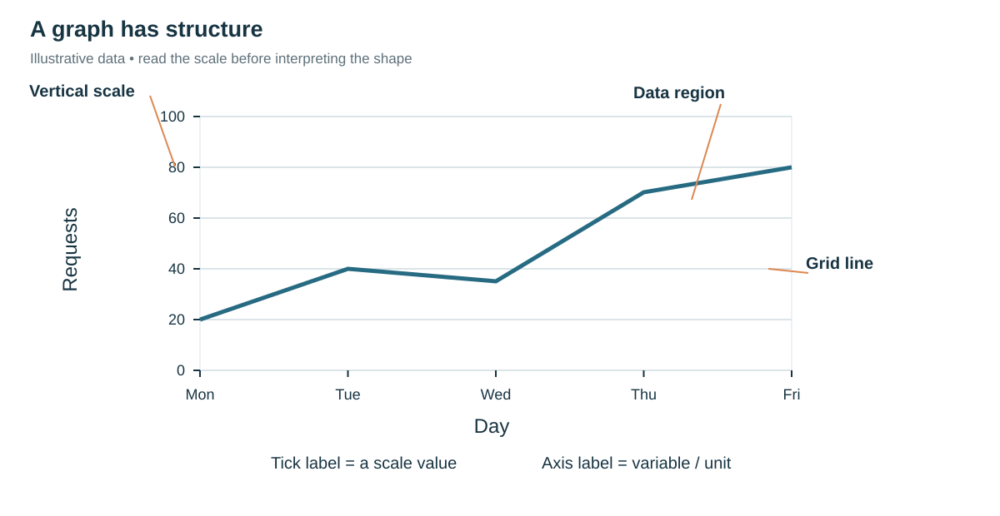
          

          

            <em>Connecting analytical questions to visual encodings, chart critique, and Tableau visual analytics foundations.</em>
          

          

            <button class="deck-btn-primary" onclick="changeSlide(1)">Start Lecture &#9654;</button>
          

        

      

    

    <!-- SLIDE 2: 01 — GIF — Clear Off the Table -->
    

      Read and choose a graph
      <h2>01 &mdash; GIF &mdash; Clear Off the Table</h2>

Watch how alignment, whitespace, borders and numeric precision change the readability of a table.

<strong>Discuss:</strong> Which changes help you find a value, and which help you compare values? The example uses invented wrestling statistics; it is a design demonstration, not a factual sports dataset.

  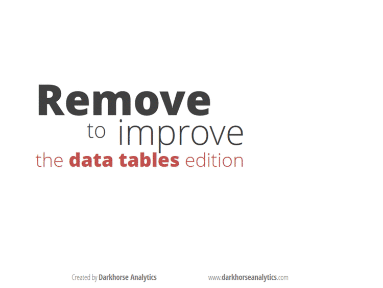

<em>Animation: Joey Cherdarchuk / Darkhorse, <a href="https://darkhorsevisualization.com/blog/clear-off-the-table">Clear Off the Table — Remove to Improve: The Data Tables Edition</a> (March 27, 2014).</em>

    

    <!-- SLIDE 3: 02 — Elements of a Graph: Axes and Units -->
    

      Read and choose a graph
      <h2>02 &mdash; Elements of a Graph: Axes and Units</h2>

Locate the <strong>data region</strong>, horizontal and vertical <strong>scales</strong>, <strong>tick marks</strong>, <strong>tick labels</strong>, <strong>axis labels</strong>, and <strong>grid lines</strong>.

A tick label states a value; an axis label identifies the variable and unit. Here, the x-axis orders days and the y-axis measures requests. Axis placement alone does not establish causation.

  

    

    <!-- SLIDE 4: 03 — Elements of a Graph: Marks and Context -->
    

      Read and choose a graph
      <h2>03 &mdash; Elements of a Graph: Marks and Context</h2>

Now identify the <strong>data paths</strong>, <strong>reference line</strong>, <strong>neatline/frame</strong>, <strong>legend</strong>, <strong>data labels</strong>, <strong>title</strong>, and <strong>data source</strong>.

A path needs an identifiable meaning. A reference line should be named: target, average, or benchmark. The title should be unambiguous, efficient, and economical.

<strong>Try it:</strong> Explain the constructed chart without seeing the underlying table. Which element tells you what 80 means? Which one tells you what 60 means?

  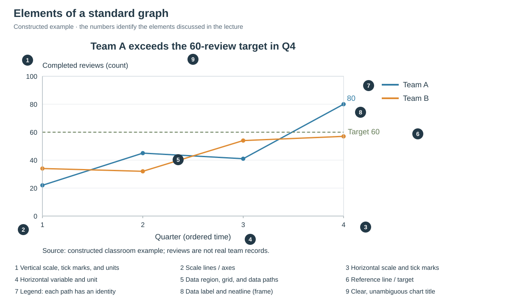

    

    <!-- SLIDE 5: 04 — Reading 1 — Match the Relationship to the Encoding -->
    

      Read and choose a graph
      <h2>04 &mdash; Reading 1 &mdash; Match the Relationship to the Encoding</h2>

Select a <strong>relationship</strong>, then try <strong>points, lines, bars, or boxes</strong>. The chart and explanation change together. Some choices are appropriate only for a particular task.

<strong>Try:</strong> Compare Ranking → Points with Ranking → Lines. Then compare Correlation → Points with Correlation → Bars. Why does “bars” mean a table lens in the second case, rather than a scatter plot?

  <iframe src="../../assets/week-5/relationship-encoding.html" title="Explore relationships and encodings from the Graph Selection Matrix" loading="lazy" onload="resizeIframe(this)" sandbox="allow-scripts allow-same-origin"></iframe>

  <a href="../../assets/week-5/relationship-encoding.html" target="_blank" rel="noopener">Open this activity on its own</a>

<em>Framework: Stephen Few, <a href="https://www.perceptualedge.com/articles/misc/Graph_Selection_Matrix.pdf">Graph Selection Matrix</a>, course edition ©2004–2012. The interactive examples are new classroom illustrations, not screenshots from the reading.</em>

    

    <!-- SLIDE 6: 05 — Reading 1 — Change the Question, Change the Chart -->
    

      Read and choose a graph
      <h2>05 &mdash; Reading 1 &mdash; Change the Question, Change the Chart</h2>

Use the <strong>same 308 diamond records</strong> to ask four different questions. Notice what one bar or point represents in each view.

<strong>Explain:</strong> Why does a category count need a different arrangement from a price distribution? Does a bar below the overall mean mean that a diamond has a negative price?

  <iframe src="../../assets/week-5/question-chart.html" title="Switch analytical questions using one Diamonds dataset" loading="lazy" onload="resizeIframe(this)" sandbox="allow-scripts allow-same-origin"></iframe>

  <a href="../../assets/week-5/question-chart.html" target="_blank" rel="noopener">Open this activity on its own</a>

<em>Relationship framework: Stephen Few, <a href="https://www.perceptualedge.com/articles/misc/Graph_Selection_Matrix.pdf">Graph Selection Matrix</a>. Data: <a href="https://github.com/xbwei/data-analysis-with-generative-ai/blob/main/diamonds.csv">course Diamonds dataset</a>. Questions and interactive views are course applications.</em>

    

    <!-- SLIDE 7: 06 — Logarithms — Start with Powers of Ten -->
    

      Read the scale
      <h2>06 &mdash; Logarithms &mdash; Start with Powers of Ten</h2>

A <strong>base-10 logarithm</strong> asks: <strong>“What power of 10 produces this number?”</strong> Start at 1 and multiply by 10 at each step.

For example, <strong>the base-10 logarithm of 100 is 2</strong>: the exponent tells us where 100 sits on this scale. The zero in <strong>100</strong> is an exponent; it does <strong>not</strong> make the result zero.

<strong>Arithmetic:</strong> equally spaced values might be <strong>0, 100, 200, 300</strong>—the same amount is added each time. <strong>Logarithmic:</strong> equally spaced values might be <strong>1, 10, 100, 1,000</strong>—the same factor is multiplied each time.

A standard log axis has <strong>no zero value</strong>. Its tick labels usually show the original values, not the log-scale positions. Next, use this idea to read the two original scale examples.

  <table style="width: 100%; border-collapse: collapse; font-size: 0.95rem; line-height: 1.5; border: 1px solid #d0d7de; border-radius: 6px;">
    <thead>
      <tr style="background-color: #f6f8fa; border-bottom: 2px solid #d0d7de;">
        <th style="padding: 0.75rem 1rem; text-align: left; font-weight: 600; color: #1f2328;">Power of ten</th>
        <th style="padding: 0.75rem 1rem; text-align: left; font-weight: 600; color: #1f2328;">Read it aloud</th>
        <th style="padding: 0.75rem 1rem; text-align: left; font-weight: 600; color: #1f2328;">Value</th>
        <th style="padding: 0.75rem 1rem; text-align: left; font-weight: 600; color: #1f2328;">Log-scale position</th>
      </tr>
    </thead>
    <tbody>
      <tr style="border-bottom: 1px solid #d0d7de;">
        <td style="padding: 0.75rem 1rem; color: #24292f; vertical-align: top;"><strong>100 = 1</strong></td>
        <td style="padding: 0.75rem 1rem; color: #24292f; vertical-align: top;">Ten to the power of zero equals one</td>
        <td style="padding: 0.75rem 1rem; color: #24292f; vertical-align: top;">1</td>
        <td style="padding: 0.75rem 1rem; color: #24292f; vertical-align: top;">0</td>
      </tr>
      <tr style="border-bottom: 1px solid #d0d7de;" style="background-color: #fafbfc;">
        <td style="padding: 0.75rem 1rem; color: #24292f; vertical-align: top;"><strong>101 = 10</strong></td>
        <td style="padding: 0.75rem 1rem; color: #24292f; vertical-align: top;">Ten to the power of one equals ten</td>
        <td style="padding: 0.75rem 1rem; color: #24292f; vertical-align: top;">10</td>
        <td style="padding: 0.75rem 1rem; color: #24292f; vertical-align: top;">1</td>
      </tr>
      <tr style="border-bottom: 1px solid #d0d7de;">
        <td style="padding: 0.75rem 1rem; color: #24292f; vertical-align: top;"><strong>102 = 100</strong></td>
        <td style="padding: 0.75rem 1rem; color: #24292f; vertical-align: top;">Ten squared equals one hundred</td>
        <td style="padding: 0.75rem 1rem; color: #24292f; vertical-align: top;">100</td>
        <td style="padding: 0.75rem 1rem; color: #24292f; vertical-align: top;">2</td>
      </tr>
      <tr style="border-bottom: 1px solid #d0d7de;" style="background-color: #fafbfc;">
        <td style="padding: 0.75rem 1rem; color: #24292f; vertical-align: top;"><strong>103 = 1,000</strong></td>
        <td style="padding: 0.75rem 1rem; color: #24292f; vertical-align: top;">Ten cubed equals one thousand</td>
        <td style="padding: 0.75rem 1rem; color: #24292f; vertical-align: top;">1,000</td>
        <td style="padding: 0.75rem 1rem; color: #24292f; vertical-align: top;">3</td>
      </tr>
    </tbody>
  </table>

    

    <!-- SLIDE 8: 07 — Arithmetic versus Semi-Log — What Makes a Straight Line? -->
    

      Read the scale
      <h2>07 &mdash; Arithmetic versus Semi-Log &mdash; What Makes a Straight Line?</h2>

<strong>Arithmetic:</strong> Equal <strong>absolute changes</strong> over equal x-intervals make a straight line. For example, adding the same number each year is a constant amount of change.

<strong>Semi-log:</strong> Equal <strong>proportional changes</strong> over equal x-intervals make a straight line. For example, increasing by the same percentage each year is a constant rate of growth.

Here, <strong>x stays arithmetic</strong> in both charts. Only the y-scale changes. Equal tick spacing does not make every dataset straight; the pattern of change must also be constant in the relevant sense.

<figure>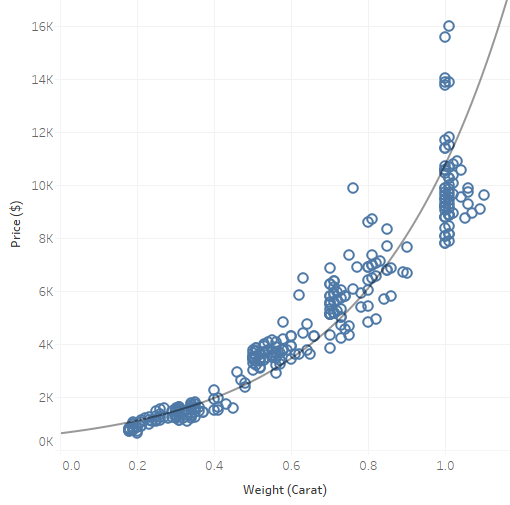<figcaption>Arithmetic: constant amount of change → straight line</figcaption></figure><figure>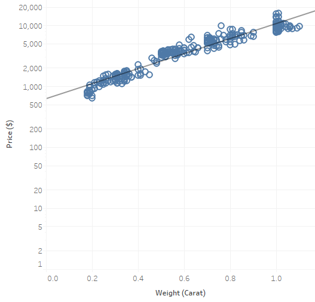<figcaption>Semi-log: constant proportional growth → straight line</figcaption></figure>

    

    <!-- SLIDE 9: 08 — Semi-Log versus Log-Log — Check Both Axes -->
    

      Read the scale
      <h2>08 &mdash; Semi-Log versus Log-Log &mdash; Check Both Axes</h2>

<strong>Semi-log:</strong> x uses equal differences; y uses equal ratios. A straight line shows the same proportional change in y for each equal step in x.

<strong>Log-log:</strong> both x and y use equal ratios. A straight line shows a consistent proportional relationship: multiplying x by a given factor corresponds to multiplying y by a consistent factor.

<strong>Read the horizontal labels first.</strong> In semi-log, the same horizontal distance means the same amount of x; in log-log, it means the same ratio of x. Neither transformed axis has an ordinary zero baseline.

<figure><figcaption>Semi-log: arithmetic x, logarithmic y</figcaption></figure><figure>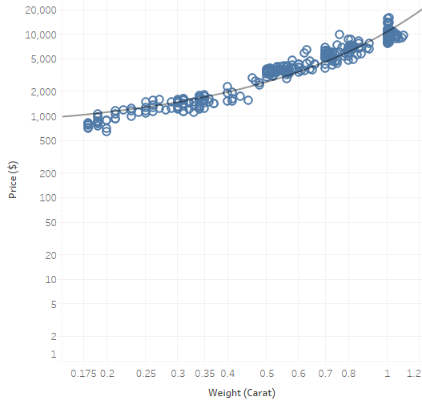<figcaption>Log-log: logarithmic x and y</figcaption></figure>

    

    <!-- SLIDE 10: 09 — Bar Chart — Compare Values by Length -->
    

      Compare categories: bars and their pitfalls
      <h2>09 &mdash; Bar Chart &mdash; Compare Values by Length</h2>

A bar starts at a baseline and uses <strong>length</strong> to represent a count, average, rate, or other stated value. Its width normally does not encode data.

Use a zero baseline for an ordinary magnitude bar chart. Sort when ranking is the task; retain chronological or other meaningful order when that matters.

<strong>Read:</strong> What is the measure? What is the unit? Which two values are easiest to compare?

  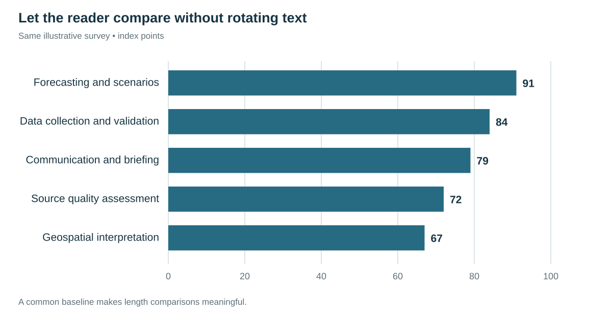

    

    <!-- SLIDE 11: 10 — Real Case — SAS Adds a Twisting 3D Baseline -->
    

      Compare categories: bars and their pitfalls
      <h2>10 &mdash; Real Case &mdash; SAS Adds a Twisting 3D Baseline</h2>

The perspective, curved baseline, and angled bars compete with the quantities. Which year-to-year comparison can you read confidently?

Depth does not encode a separate variable here. It makes a two-dimensional comparison harder.

  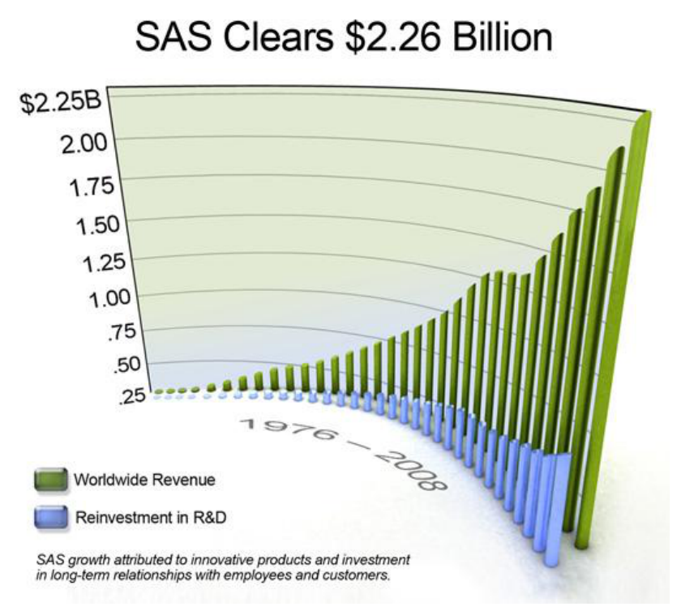

<em>Graphic publisher: SAS Institute, February 4, 2009 press release. <a href="https://www.perceptualedge.com/blog/?p=410">Public archived reproduction and contemporary critique</a>: Stephen Few, <i>Data Visualization and Dog Food</i> (2009).</em>

    

    <!-- SLIDE 12: 11 — Remove the 3D Effect: Restore a Flat Baseline -->
    

      Compare categories: bars and their pitfalls
      <h2>11 &mdash; Remove the 3D Effect: Restore a Flat Baseline</h2>

Use a flat baseline, readable units, and unambiguous positions. A revenue chart should make amounts and growth comparable, not require the reader to mentally undo perspective.

The example below uses <strong>illustrative company data</strong>, not a reconstructed SAS historical series.

  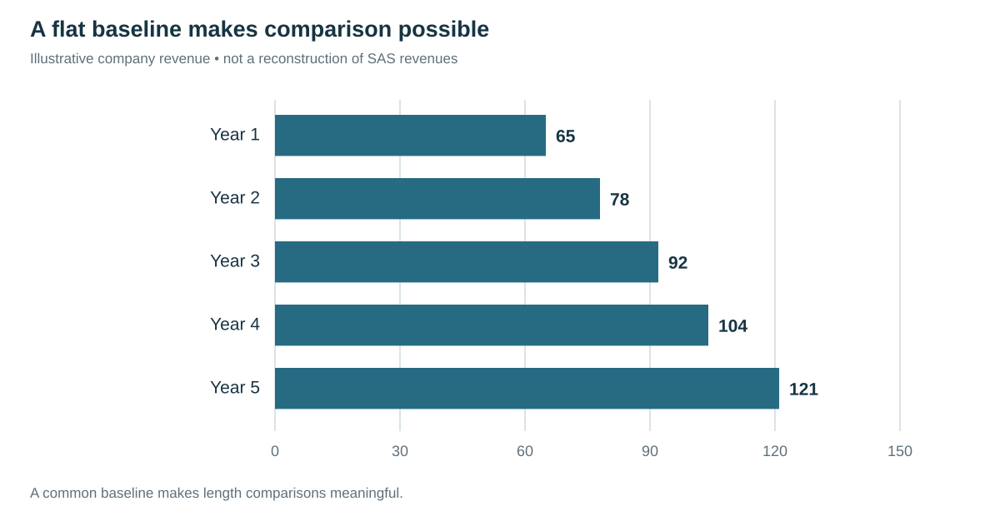

    

    <!-- SLIDE 13: 12 — Label Problem — Rotate the Chart, Not the Reader -->
    

      Compare categories: bars and their pitfalls
      <h2>12 &mdash; Label Problem &mdash; Rotate the Chart, Not the Reader</h2>

Long category names make rotated labels hard to scan and align with the corresponding bars.

<strong>Try it:</strong> Find the largest category, then read its full name. Is the effort coming from the data or from the layout?

  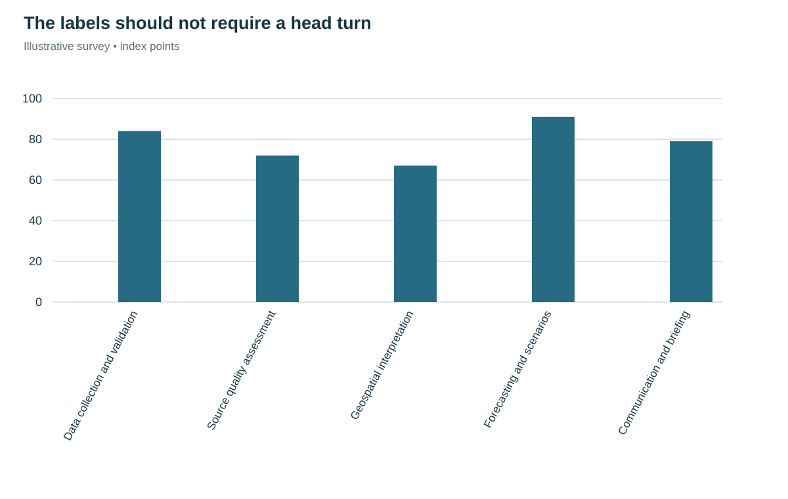

    

    <!-- SLIDE 14: 13 — Readable Labels — Keep the Values, Change the Orientation -->
    

      Compare categories: bars and their pitfalls
      <h2>13 &mdash; Readable Labels &mdash; Keep the Values, Change the Orientation</h2>

Keep the same category values. Use horizontal bars, horizontal text, meaningful order, and direct value labels.

The redesign reduces the work needed to identify and compare categories. It does not change the underlying data.

  

    

    <!-- SLIDE 15: 14 — Reading 2 — Watch a Chart Become Clearer -->
    

      Compare categories: bars and their pitfalls
      <h2>14 &mdash; Reading 2 &mdash; Watch a Chart Become Clearer</h2>

Follow a visual cleanup sequence: <strong>labels and order → reduce visual competition → restore useful context</strong>. The values stay fixed.

<strong>At each step:</strong> What became easier to compare? What information must not disappear? Keep units, a meaningful scale, and an identified reference even when removing decoration.

  <iframe src="../../assets/week-5/chart-cleanup.html" title="Step-by-step visual chart cleanup" loading="lazy" onload="resizeIframe(this)" sandbox="allow-scripts allow-same-origin"></iframe>

  <a href="../../assets/week-5/chart-cleanup.html" target="_blank" rel="noopener">Open this activity on its own</a>

<em>Principles adapted from Jeffrey A. Shaffer, <a href="https://dataplusscience.com/files/Shaffer%204C%20-%20Clean%20Examples.pdf">“Clean” Examples</a>. This interactive chart uses illustrative data; the next page retains the reading’s actual worked example.</em>

    

    <!-- SLIDE 16: 15 — Reading 2 — What the Finished Chart Still Contains -->
    

      Compare categories: bars and their pitfalls
      <h2>15 &mdash; Reading 2 &mdash; What the Finished Chart Still Contains</h2>

The final example does more than remove lines: it <strong>orders the bars</strong>, uses readable labels, states the <strong>unit</strong>, and adds a <strong>named target</strong> and a conclusion in the title. The source and date remain visible.

<strong>Read the claim:</strong> 23 − 16 = 7. The title’s claim can be checked against the displayed bar and target. “Clean” does not mean “no context.”

  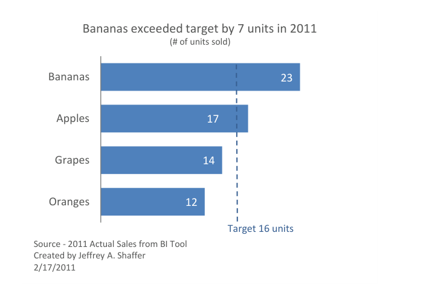

<em>Figure and worked teaching example: Jeffrey A. Shaffer, <a href="https://dataplusscience.com/files/Shaffer%204C%20-%20Clean%20Examples.pdf#page=4">“Clean” Examples, p. 4</a> (2011). Cropped to the final chart, retaining its attribution. This is the reading’s example, not newly collected fruit-sales data.</em>

    

    <!-- SLIDE 17: 16 — Interactive — A Truncated Baseline Changes the Impression -->
    

      Compare categories: bars and their pitfalls
      <h2>16 &mdash; Interactive &mdash; A Truncated Baseline Changes the Impression</h2>

The constructed values remain 94, 96, and 100. Change only the displayed bar baseline from zero to 90.

<strong>Ask:</strong> Which representation makes the difference appear larger? What proportion do the <em>drawn lengths</em> imply? Do the labels repair the first impression?

<a href="../../assets/week-5/bar-baseline.html" target="_blank" rel="noopener">Open this experiment by itself</a>.

  <iframe src="../../assets/week-5/bar-baseline.html" title="Interactive: Does 100 Look Six Units Larger Than 94?" loading="lazy" onload="resizeIframe(this)" sandbox="allow-scripts allow-same-origin"></iframe>

  <a href="../../assets/week-5/bar-baseline.html" target="_blank" rel="noopener">Open this activity on its own</a>

    

    <!-- SLIDE 18: 17 — Real Case — Grouped Bars Compare Category Sales -->
    

      Compare categories: bars and their pitfalls
      <h2>17 &mdash; Real Case &mdash; Grouped Bars Compare Category Sales</h2>

<strong>Did pharmacy sales grow?</strong> Use a grouped bar chart to compare the same category across years on a common zero-based scale.

The dark-blue <strong>Pharmacy</strong> bar rises from <strong>$11.015 billion to $11.388 billion</strong>: about <strong>3.4% growth</strong>. The legend identifies all five product categories, with the same colors on the following two slides.

<strong>Do not stop at the part.</strong> Has pharmacy also become a larger proportion of Kroger’s sales? The next two arrangements use these same data to answer different questions.

  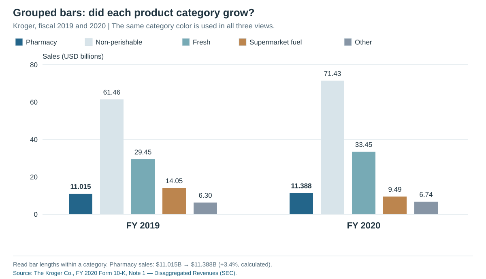

<em>Data: The Kroger Co., <a href="https://www.sec.gov/Archives/edgar/data/56873/000155837021003706/R10.htm">FY 2020 Form 10-K, Note 1 — Disaggregated Revenues</a>, fiscal 2019 and 2020. New plots of the reported data; displayed in USD billions rather than the filing’s USD millions.</em>

    

    <!-- SLIDE 19: 18 — Real Case — Stacked Bars Preserve Total Size -->
    

      Compare categories: bars and their pitfalls
      <h2>18 &mdash; Real Case &mdash; Stacked Bars Preserve Total Size</h2>

Stack the same five product categories within each year. The complete bar is <strong>total sales</strong>; its segments are the components.

Total sales rise from <strong>$122.286 billion to $132.498 billion</strong>, about <strong>8.4%</strong>—faster than the pharmacy component. The dark-blue pharmacy segment is larger in dollars, but that does not yet tell us its share.

Use <strong>ordinary stacked/component bars</strong> to show both the whole and its parts. Only the bottom segment shares the zero baseline; grouped bars can make an interior component easier to compare.

  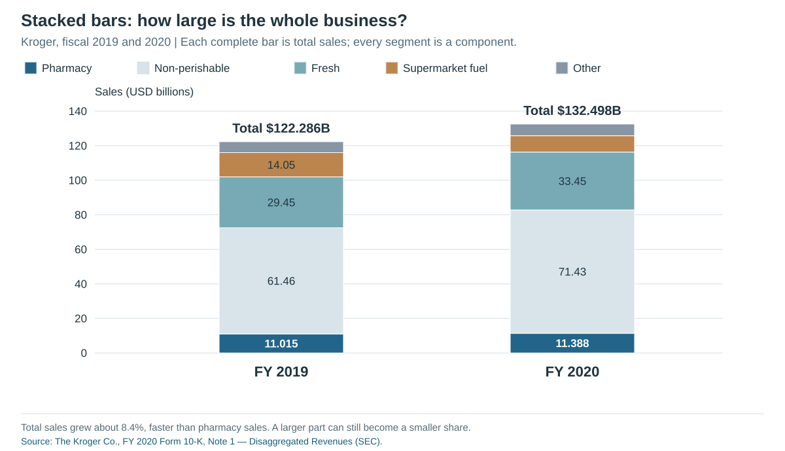

<em>Data: The Kroger Co., <a href="https://www.sec.gov/Archives/edgar/data/56873/000155837021003706/R10.htm">FY 2020 Form 10-K, Note 1 — Disaggregated Revenues</a>, fiscal 2019 and 2020. New plots of the reported data; displayed in USD billions rather than the filing’s USD millions.</em>

    

    <!-- SLIDE 20: 19 — Real Case — 100% Stacked Bars Reveal the Changing Mix -->
    

      Compare categories: bars and their pitfalls
      <h2>19 &mdash; Real Case &mdash; 100% Stacked Bars Reveal the Changing Mix</h2>

Now divide each component by <strong>that year’s total sales</strong>. Every full bar becomes 100%; the dollar totals remain visible below it.

<strong>Both are true: pharmacy sales increased, while pharmacy’s share fell from 9.0% to 8.6%.</strong> The whole grew faster than this part. These are proportions of <strong>Kroger’s own sales</strong>, not its share of the entire pharmacy market.

<strong>Choose by question:</strong> grouped bars compare category amounts; ordinary stacked bars retain total size; <strong>100% stacked (percentage component) bars</strong> compare the mix. Here, “component” describes parts of a whole; it does not automatically mean percentages.

  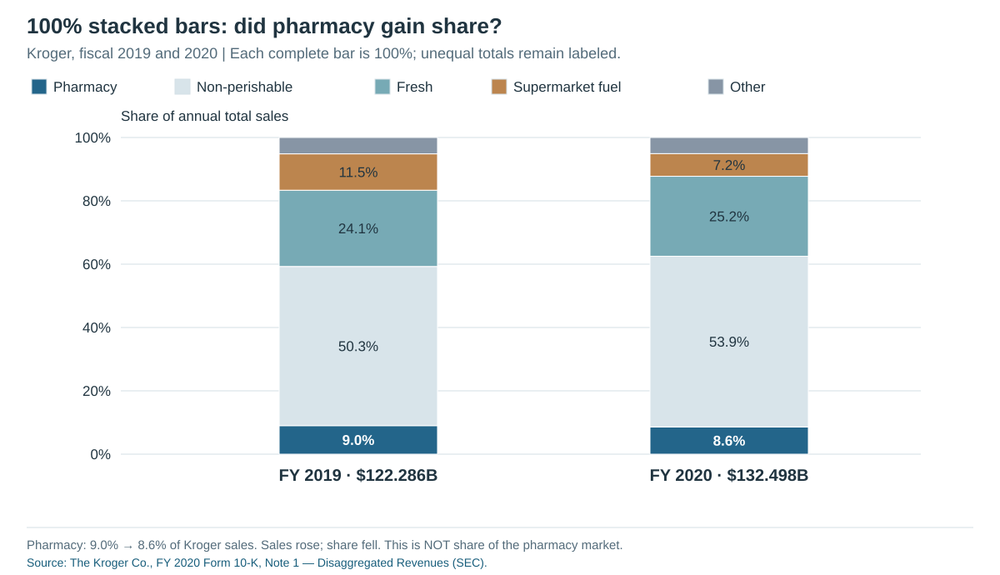

<em>Data: The Kroger Co., <a href="https://www.sec.gov/Archives/edgar/data/56873/000155837021003706/R10.htm">FY 2020 Form 10-K, Note 1 — Disaggregated Revenues</a>, fiscal 2019 and 2020. New plots of the reported data; displayed in USD billions rather than the filing’s USD millions.</em>

    

    <!-- SLIDE 21: 20 — Diverging Bar Chart — Deviation around a Reference -->
    

      Compare categories: bars and their pitfalls
      <h2>20 &mdash; Diverging Bar Chart &mdash; Deviation around a Reference</h2>

A diverging bar places values on either side of a meaningful midpoint: zero change, a benchmark, or a balanced response point.

Identify whether the measure is an absolute difference, a percent change, or a percentage-point difference. The sign and direction should be clear without color alone.

<strong>Read:</strong> Which area is furthest below the benchmark? Is a difference of −12 percentage points the same as −12 percent?

  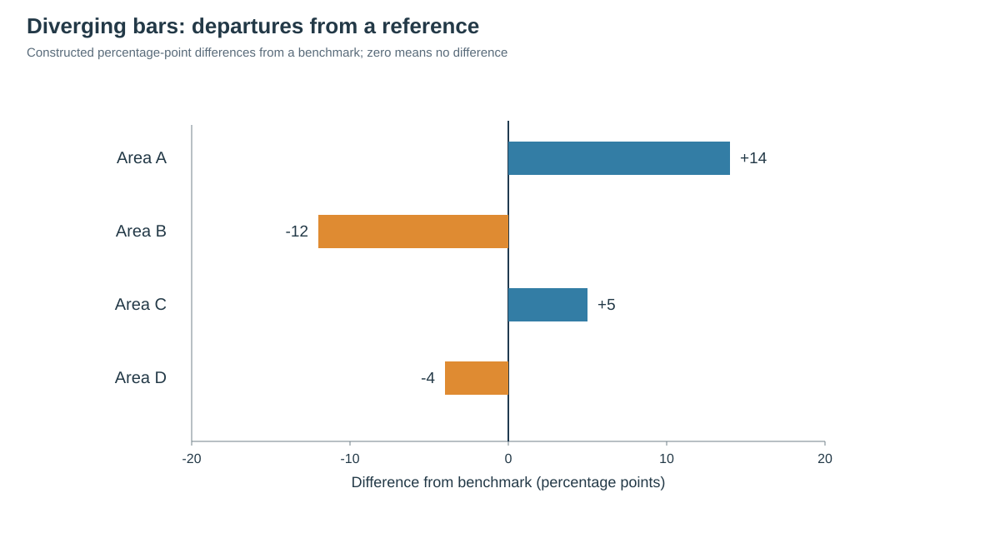

    

    <!-- SLIDE 22: 21 — Pareto Chart — Ranked Bars plus Cumulative Contribution -->
    

      Compare categories: bars and their pitfalls
      <h2>21 &mdash; Pareto Chart &mdash; Ranked Bars plus Cumulative Contribution</h2>

A Pareto chart combines descending category values with cumulative contribution. Read the bars and the cumulative line as different encodings, with explicit scales.

Synchronized and independent axes can change how tightly the bars and cumulative line appear related. Read both scales before comparing positions.

<strong>Here:</strong> the first two categories contribute 70% and the first three 85%. The cumulative line shows how quickly a small number of categories account for most of the total.

  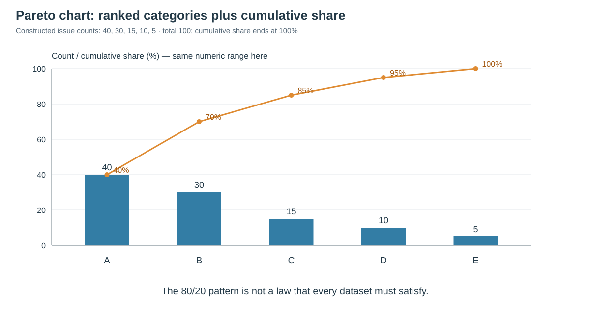

    

    <!-- SLIDE 23: 22 — Histogram — One Dataset, Different Bin Widths -->
    

      Distributions and paired measurements
      <h2>22 &mdash; Histogram &mdash; One Dataset, Different Bin Widths</h2>

A <strong>histogram</strong> counts observations within ordered numerical intervals. Here x is <strong>diamond PRICE</strong> and y is the <strong>number of records</strong> in each bin.

Change only the bin width. The 308 records stay the same; the apparent shape and tallest bin may change. Ask which peaks persist and whether an average hides the upper tail.

<strong>Bar chart versus histogram:</strong> category bars can be ranked; histogram bins must retain their numerical order. These examples use equal-width bins.

Additional reference: a histogram with a cumulative line

Bars give interval counts. A cumulative line answers how much lies at or below successive values. Read its separate scale.
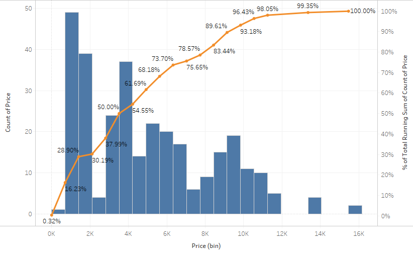

  <iframe src="../../assets/week-5/histogram-bins.html" title="Change the price histogram bin width" loading="lazy" onload="resizeIframe(this)" sandbox="allow-scripts allow-same-origin"></iframe>

  <a href="../../assets/week-5/histogram-bins.html" target="_blank" rel="noopener">Open this activity on its own</a>

    

    <!-- SLIDE 24: 23 — Box Plot — Compare the Middle, Spread and Tails -->
    

      Distributions and paired measurements
      <h2>23 &mdash; Box Plot &mdash; Compare the Middle, Spread and Tails</h2>

A box plot summarizes a distribution through position. The median identifies its middle, and the box spans Q1 to Q3—the middle half of the ordered values.

Several boxes make it possible to compare distributions without showing every mark. Check both location and spread; similar medians can conceal different variability.

<strong>Read the chart:</strong> Which group is higher? Which has the wider middle half? Neither question requires a zero baseline for the position scale.

  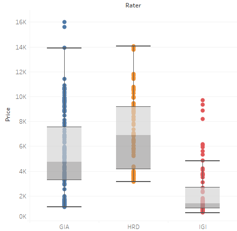

    

    <!-- SLIDE 25: 24 — Box Plot — What the Whiskers and Density Mean -->
    

      Distributions and paired measurements
      <h2>24 &mdash; Box Plot &mdash; What the Whiskers and Density Mean</h2>

A box summarizes the middle half of a distribution. <strong>IQR = Q3 − Q1</strong>. The density curve shows what a compact box can hide about shape.

The picture uses an idealized normal distribution. In the sample-based examples, whiskers end at the furthest observations within <strong>1.5 × IQR</strong> of a box edge; points beyond them are shown separately. A separately plotted point is not automatically an error.

  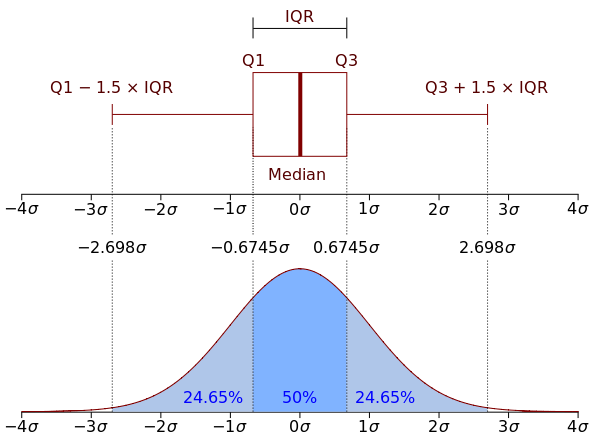

<em>Figure: Jhguch (original) and Chen-Pan Liao (vector redraw), <a href="https://commons.wikimedia.org/wiki/File:Boxplot_vs_PDF.svg">Boxplot vs PDF</a>, <a href="https://creativecommons.org/licenses/by-sa/2.5/">CC BY-SA 2.5</a>. Cropped to show the box and density panels.</em>

    

    <!-- SLIDE 26: 25 — Interactive — Reveal Records Behind the Boxes -->
    

      Distributions and paired measurements
      <h2>25 &mdash; Interactive &mdash; Reveal Records Behind the Boxes</h2>

Show and hide individual diamond records. Compare the median, the middle half, and the tails by clarity.

<strong>Ask:</strong> Which details become visible only when the observations are shown? Would your audience need a short “how to read this chart” explanation?

<a href="../../assets/week-5/boxplot-records.html" target="_blank" rel="noopener">Open this experiment by itself</a>.

  <iframe src="../../assets/week-5/boxplot-records.html" title="Interactive: Reveal the Records Behind the Boxes" loading="lazy" onload="resizeIframe(this)" sandbox="allow-scripts allow-same-origin"></iframe>

  <a href="../../assets/week-5/boxplot-records.html" target="_blank" rel="noopener">Open this activity on its own</a>

    

    <!-- SLIDE 27: 26 — Scatter Plot — Start with Two Numerical Variables -->
    

      Distributions and paired measurements
      <h2>26 &mdash; Scatter Plot &mdash; Start with Two Numerical Variables</h2>

Each dot pairs <strong>WEIGHT on the x-axis</strong> with <strong>PRICE on the y-axis</strong> for one diamond record. The markers have the same size.

Read direction, curvature, spread, clusters, and unusual observations. <strong>Two numerical variables are enough for a scatter plot.</strong> There is no required size, color, or shape variable.

<strong>Next:</strong> keep these two axes and add an optional visual channel. A visible association alone does not establish causation.

  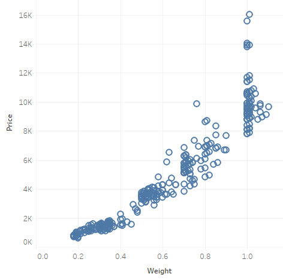

    

    <!-- SLIDE 28: 27 — Scatter Plot — Size Is an Optional Third Encoding -->
    

      Distributions and paired measurements
      <h2>27 &mdash; Scatter Plot &mdash; Size Is an Optional Third Encoding</h2>

This is the second original example. <strong>The axes are still WEIGHT and PRICE.</strong> Marker size now distinguishes <strong>CLARITY</strong>, as shown by the size legend.

<strong>Compare with the previous slide:</strong> what information was added, and what became harder to see when large circles overlap? Remove the size encoding and the two-variable scatter plot still works.

CLARITY is an ordered grade, not a quantity with meaningful ratios: a circle twice as large does <strong>not</strong> mean “twice as clear.” Size, color, or shape should be added only when the extra variable helps answer the question, and its meaning must be explained.

  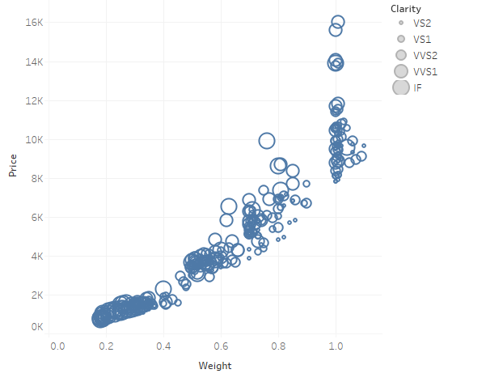

    

    <!-- SLIDE 29: 28 — Line Chart — Order and Elapsed Time Matter -->
    

      Read change through time
      <h2>28 &mdash; Line Chart &mdash; Order and Elapsed Time Matter</h2>

A line connects observations in a meaningful order. Its slope is interpretable only when horizontal spacing represents the intended intervals.

Use direct labels or a clear legend for multiple series. Do not imply observations between measured points that the data do not support.

<strong>Ask:</strong> What does a line segment mean between two consecutive weeks?

  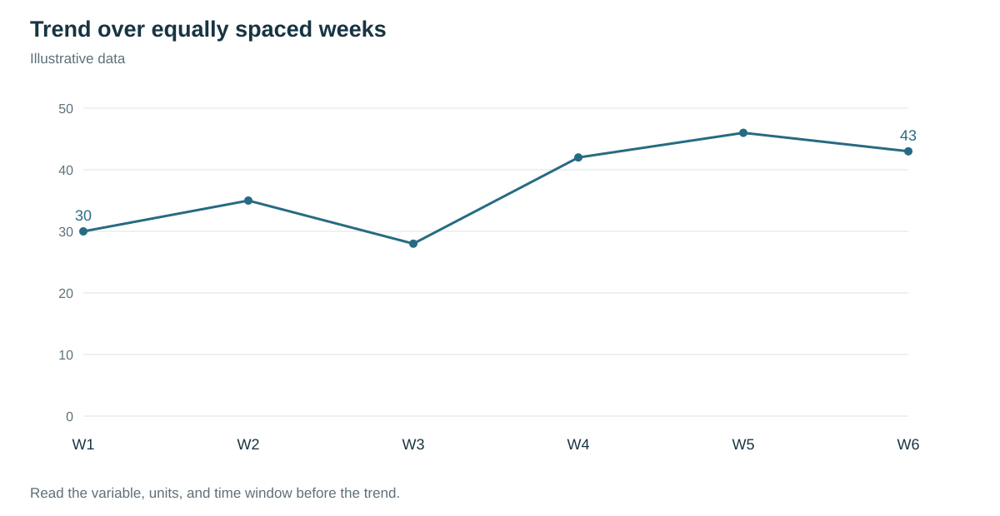

    

    <!-- SLIDE 30: 29 — Real Case — Fox News Compresses Unequal Time Intervals -->
    

      Read change through time
      <h2>29 &mdash; Real Case &mdash; Fox News Compresses Unequal Time Intervals</h2>

Compare the three time intervals: <strong>9 months, 6 months, and 15 months</strong>. They should not occupy similar horizontal distances on an elapsed-time axis.

The broadcast’s straight-looking path does not faithfully show these intervals. Inspect its numerical spacing as well as its labels. This is a historical design critique, not current labor-market analysis.

  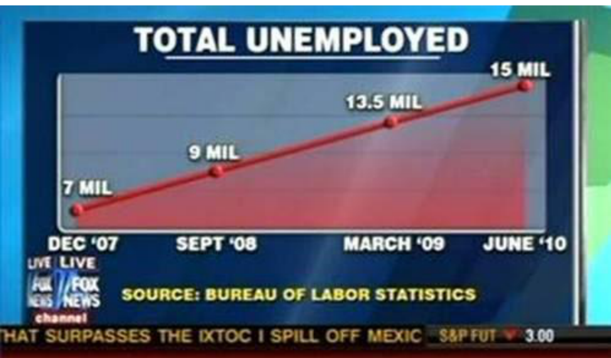

<em>Graphic publisher: Fox News, <i>America’s Newsroom</i>, June 30, 2010. <a href="https://www.mediamatters.org/fox-news/updated-worst-chart-ive-seen-all-day">Public archival capture</a>: Media Matters, Jocelyn Fong (see UPDATE2).</em>

    

    <!-- SLIDE 31: 30 — Redesign — Put the Four Observations at Their Dates -->
    

      Read change through time
      <h2>30 &mdash; Redesign &mdash; Put the Four Observations at Their Dates</h2>

Place the same four labeled observations at their actual dates and use a consistent vertical scale.

The two middle observations are much closer in time than the final pair. Connecting only these four points still omits what happened between them.

  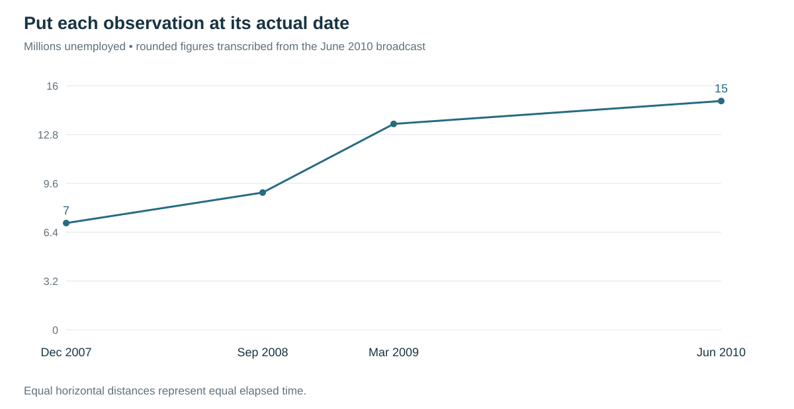

<em>Data: rounded numbers shown in the <a href="https://www.mediamatters.org/fox-news/updated-worst-chart-ive-seen-all-day">June 2010 Fox News graphic</a>. Newly plotted for the spacing comparison; not a newly verified or updated BLS series.</em>

    

    <!-- SLIDE 32: 31 — Interactive — Equal Labels Versus Elapsed Days -->
    

      Read change through time
      <h2>31 &mdash; Interactive &mdash; Equal Labels Versus Elapsed Days</h2>

These are <strong>constructed</strong> values observed on days 1, 2, 11, and 31—not reconstructed news data. Each observation increases by 10 units.

Switch the spacing and compare the slopes. A 10-unit change in one day is not the same rate as a 10-unit change over twenty days.

<a href="../../assets/week-5/time-spacing.html" target="_blank" rel="noopener">Open this experiment by itself</a>.

  <iframe src="../../assets/week-5/time-spacing.html" title="Interactive: Equal Labels Versus Elapsed Days" loading="lazy" onload="resizeIframe(this)" sandbox="allow-scripts allow-same-origin"></iframe>

  <a href="../../assets/week-5/time-spacing.html" target="_blank" rel="noopener">Open this activity on its own</a>

    

    <!-- SLIDE 33: 32 — Real Case — An 8.6% Label Plotted near 9.0% -->
    

      Read change through time
      <h2>32 &mdash; Real Case &mdash; An 8.6% Label Plotted near 9.0%</h2>

The last point is labeled <strong>8.6%</strong>, but appears near <strong>9.0%</strong> and above the earlier <strong>8.8%</strong> point.

<strong>Diagnose:</strong> Read the scale and point positions before accepting the apparent trend. Adding a correct text label does not repair an incorrectly positioned mark.

  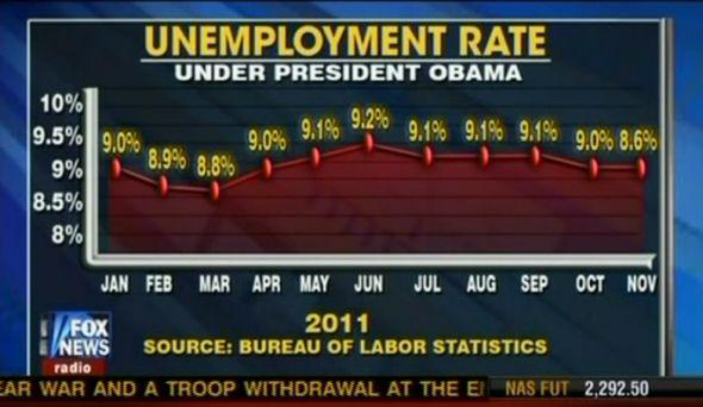

<em>Graphic publisher: Fox News, December 12, 2011. <a href="https://www.mediamatters.org/fox-news/today-dishonest-fox-news-charts">Public archival capture</a>: Media Matters, Zachary Pleat.</em>

    

    <!-- SLIDE 34: 33 — Redesign — Make the Point Positions Match the Labels -->
    

      Read change through time
      <h2>33 &mdash; Redesign &mdash; Make the Point Positions Match the Labels</h2>

Use one consistent scale and place every point at the value in its label. November now appears below March and October.

This redraw uses the broadcast’s displayed values to test its geometry, not a replacement official statistical series.

  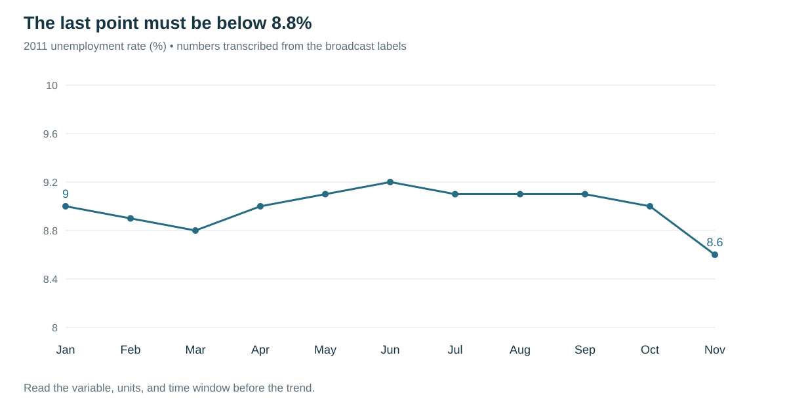

<em>Data: labels in the <a href="https://www.mediamatters.org/fox-news/today-dishonest-fox-news-charts">Fox News graphic of December 12, 2011</a>.</em>

    

    <!-- SLIDE 35: 34 — Category Dot Plot — One Summary per Category -->
    

      Specialized comparisons: dots, lollipops and slopes
      <h2>34 &mdash; Category Dot Plot &mdash; One Summary per Category</h2>

Each row is a team. Each dot locates <strong>one team’s percentage</strong> on a shared numerical scale. More dots are not required to make it a dot plot; the useful comparison is among the category values.

This introductory example starts at <strong>zero</strong>. Unlike a bar, a standalone dot encodes <strong>position</strong>, not length from a baseline. A clearly labeled nonzero range can be appropriate when the purpose is to compare small differences. The next page shows the effect explicitly.

  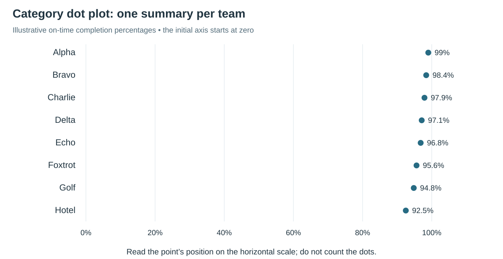

<em>Category dot plots and nonzero quantitative scales: Stephen Few, <a href="https://www.perceptualedge.com/articles/misc/Graph_Selection_Matrix.pdf">Graph Selection Matrix</a>, Ranking and Nominal Comparison rows. Values shown here are illustrative.</em>

    

    <!-- SLIDE 36: 35 — Bar versus Dot Plot — Compare the Same Data Side by Side -->
    

      Specialized comparisons: dots, lollipops and slopes
      <h2>35 &mdash; Bar versus Dot Plot &mdash; Compare the Same Data Side by Side</h2>

Both charts show the <strong>same teams, values, order, and units</strong>. Start with identical 0–100% axes. Then try the clearly labeled dot-only zoom.

<strong>Distinguish:</strong> A narrower dot-plot scale emphasizes small differences; it does not make those differences larger in the data. Do not use the same zoom to turn the bars into misleading truncated lengths.

  <iframe src="../../assets/week-5/bar-dot-comparison.html" title="Compare bar and dot encodings on identical data" loading="lazy" onload="resizeIframe(this)" sandbox="allow-scripts allow-same-origin"></iframe>

  <a href="../../assets/week-5/bar-dot-comparison.html" target="_blank" rel="noopener">Open this activity on its own</a>

    

    <!-- SLIDE 37: 36 — Lollipop Chart — A Dot with a Stem -->
    

      Specialized comparisons: dots, lollipops and slopes
      <h2>36 &mdash; Lollipop Chart &mdash; A Dot with a Stem</h2>

A lollipop combines a thin stem with a dot at its endpoint. It can reduce the visual mass of bars while retaining a clear ending position.

Read the <strong>center</strong> of the dot, not the outer edge. A large marker can make the endpoint appear to extend beyond a target.

Because the stem represents length, a lollipop does not automatically solve the baseline problem. When only position is needed, remove the stem and use a dot plot.

  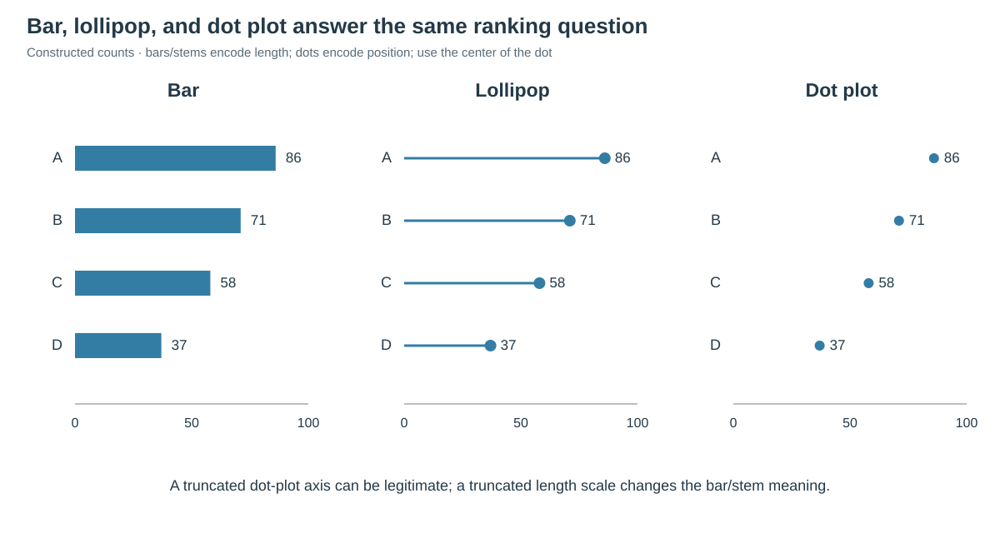

    

    <!-- SLIDE 38: 37 — Lollipop Pitfall — The Center Is the Value -->
    

      Specialized comparisons: dots, lollipops and slopes
      <h2>37 &mdash; Lollipop Pitfall &mdash; The Center Is the Value</h2>

The center of a lollipop endpoint encodes its value. A large marker can extend beyond a threshold even when its center does not.

Use modest, consistent marker sizes. Do not accidentally turn endpoint area into a second, unexplained quantity.

  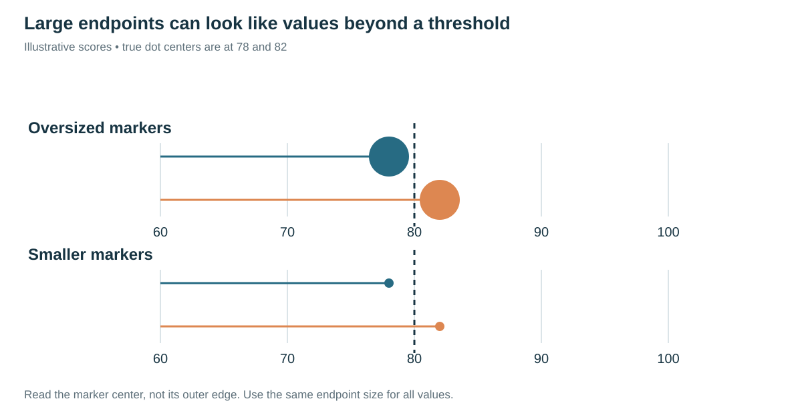

    

    <!-- SLIDE 39: 38 — Slopegraph / Slope Plot — Compare Two States -->
    

      Specialized comparisons: dots, lollipops and slopes
      <h2>38 &mdash; Slopegraph / Slope Plot &mdash; Compare Two States</h2>

A slopegraph uses position to compare values or ranks at two endpoints. Direction shows increase or decrease; endpoint positions reveal relative standing.

Direct labels often work better than a long legend. Keep scales consistent, and state whether values are counts, percentages, or ranks.

<strong>Caution:</strong> connecting two endpoints does not show what happened between them. Do not substitute a slopegraph when the intervening time pattern is essential.

  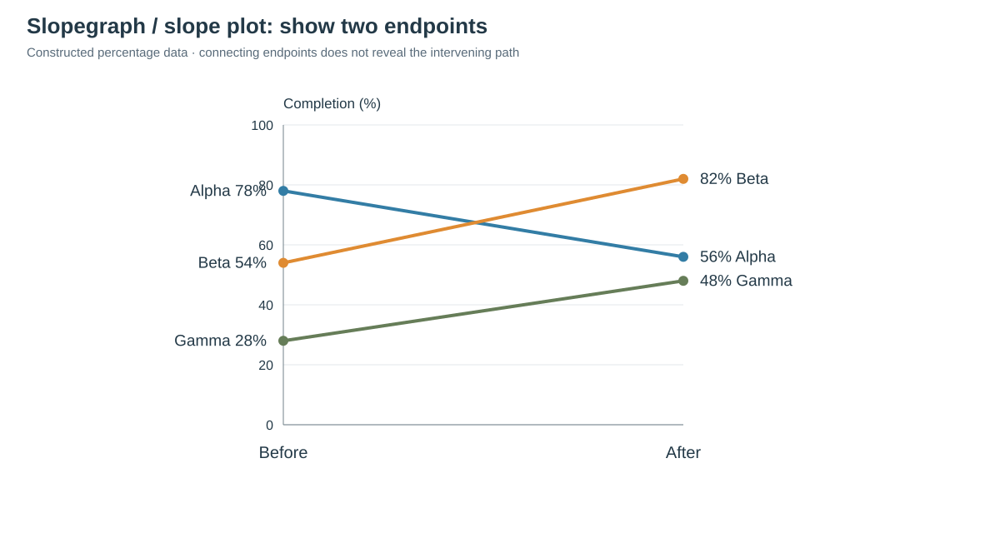

    

    <!-- SLIDE 40: 39 — Slope Plot — Forecast and Observed Values -->
    

      Specialized comparisons: dots, lollipops and slopes
      <h2>39 &mdash; Slope Plot &mdash; Forecast and Observed Values</h2>

A slope plot can compare two conditions, not only “before” and “after.” Here, the endpoints compare a forecast with its observed outcome, in the same units.

<strong>Read:</strong> Which estimate was too high? Which was too low? Crossing lines do not automatically make a graph wrong, but label collisions may make it unreadable.

  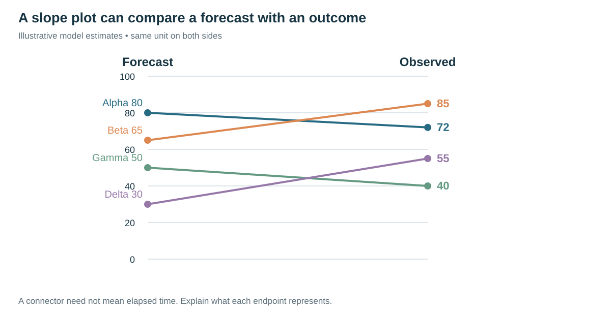

    

    <!-- SLIDE 41: 40 — Sparkline / Sparkbar — Trends in a Small Space -->
    

      Specialized comparisons: dots, lollipops and slopes
      <h2>40 &mdash; Sparkline / Sparkbar &mdash; Trends in a Small Space</h2>

A sparkline is a compact line graphic placed alongside text or a number; a sparkbar uses small bars. Their role is to add a pattern without consuming a large chart area.

Small trend graphics can sit beside a numerical value, a table row, or a short explanation. Surrounding words, dates, endpoints, or ranges supply essential context.

<strong>Read these constructed rows:</strong> which series is rising, which is falling, and which has the largest count? Do not compare heights across independently scaled rows.

  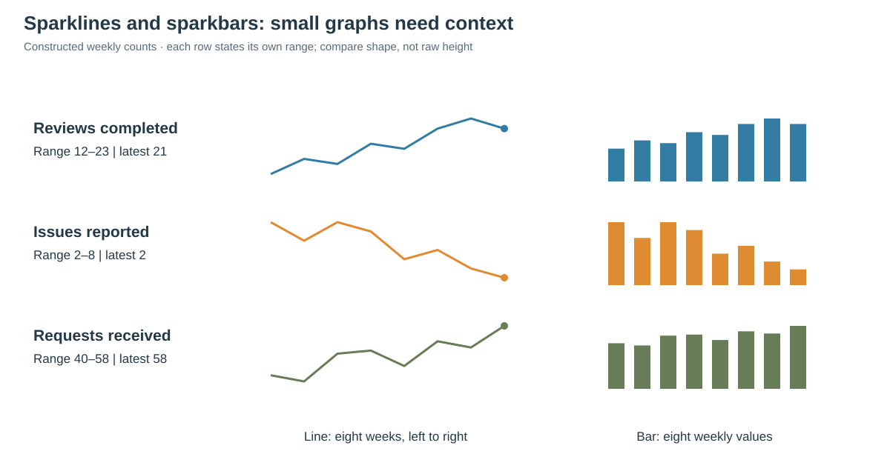

    

    <!-- SLIDE 42: 41 — Scale Experiment — One Shared Axis versus Two Axes -->
    

      Specialized comparisons: dots, lollipops and slopes
      <h2>41 &mdash; Scale Experiment &mdash; One Shared Axis versus Two Axes</h2>

This activity uses a <strong>bar series and a line series in the same chart</strong>, then changes only the axis design.

<a href="../../assets/week-5/shared-dual-axes.html" target="_blank" rel="noopener">Open the axis comparison on its own</a>.

<strong>Left:</strong> the bars (monthly requests) and line (success rate) are forced onto one shared y-axis. Because the units differ, the percentage line is compressed near the bottom.

<strong>Right:</strong> the bars use the <strong>left axis</strong> and the line uses the <strong>right axis</strong>. Both patterns become visible, but moving the right-axis maximum makes the line look steeper or flatter even though its values do not change.

<strong>Teaching point:</strong> a dual-axis chart can make unlike units readable together, but it can also manufacture a visual relationship. Read both axes before comparing slopes or heights.

  <iframe src="../../assets/week-5/shared-dual-axes.html" title="Compare a bar and line on one shared axis versus separate left and right axes" loading="lazy" onload="resizeIframe(this)" sandbox="allow-scripts allow-same-origin"></iframe>

  <a href="../../assets/week-5/shared-dual-axes.html" target="_blank" rel="noopener">Open this activity on its own</a>

    

    <!-- SLIDE 43: 42 — Pie Chart — Verify the Whole before Drawing Sectors -->
    

      Show parts of a whole and relative size
      <h2>42 &mdash; Pie Chart &mdash; Verify the Whole before Drawing Sectors</h2>

A pie uses sectors to represent parts of one whole. Before drawing it, ask whether categories are mutually exclusive, collectively meaningful, and sum to the stated whole.

Shaffer’s reading recommends bars for comparison and 100% stacked bars for part-to-whole, and advises against pie charts. For this lecture, compare that recommendation with the specific reading task: close values, many categories, and precise ranking are especially difficult in a pie.

Compare the same illustrative proportions as a simple pie and a bar chart.

  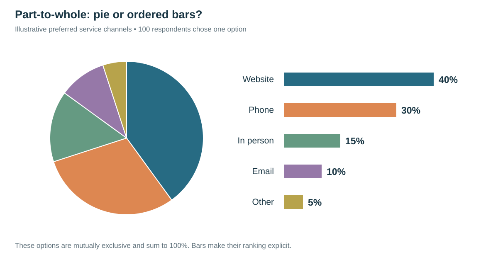

    

    <!-- SLIDE 44: 43 — Real Case — A Broadcast Pie Adds to 193% -->
    

      Show parts of a whole and relative size
      <h2>43 &mdash; Real Case &mdash; A Broadcast Pie Adds to 193%</h2>

<strong>Diagnose the chart, not the politics:</strong> 70 + 63 + 60 = 193. These are separate favorable ratings, not mutually exclusive pieces of one vote. A person can hold a favorable opinion of more than one person.

The original graphic also labels the results as “backing” candidates. That is not the same question as favorability.

  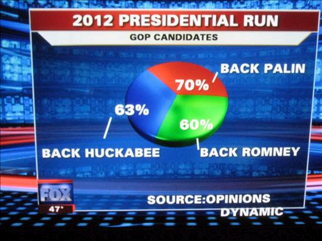

<em>Graphic publisher: Fox Chicago, November 2009. Public archival reproduction: <a href="https://flowingdata.com/2009/11/26/fox-news-makes-the-best-pie-chart-ever/">Nathan Yau / FlowingData</a>; contemporary report and poll explanation: <a href="https://archive.thinkprogress.org/foxs-fuzzy-math-193-percent-of-the-public-support-palin-huckabee-and-romney-6b5293868b6f/">Ben Armbruster / ThinkProgress</a>. Historical chart critique, not current polling.</em>

    

    <!-- SLIDE 45: 44 — Redesign — Keep Each Rating’s Denominator -->
    

      Show parts of a whole and relative size
      <h2>44 &mdash; Redesign &mdash; Keep Each Rating’s Denominator</h2>

Use separate bars and name the measure <strong>favorable opinion</strong>. The total across bars need not be 100% because the groups overlap.

Do not divide each number by 193 just to make a pie fit: that would change the meaning from percentage of respondents to share of all favorable responses to these three names.

  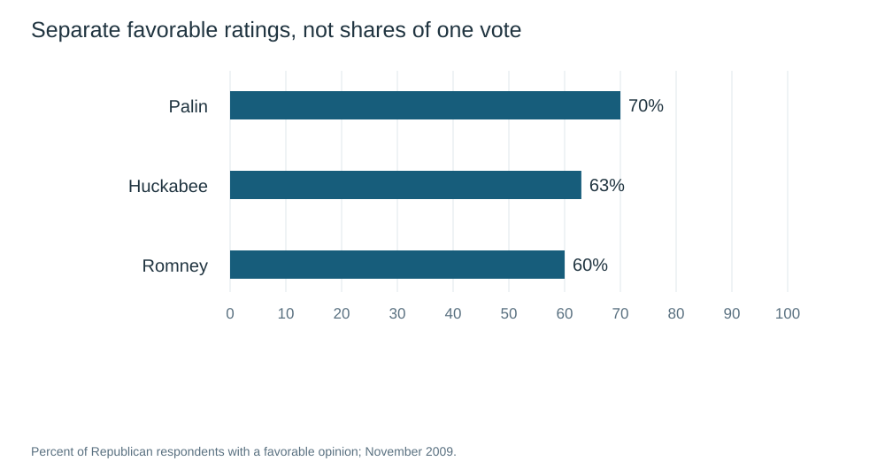

<em>Data: the displayed percentages and survey interpretation in the <a href="https://archive.thinkprogress.org/foxs-fuzzy-math-193-percent-of-the-public-support-palin-huckabee-and-romney-6b5293868b6f/">November 2009 report</a>. New teaching redraw; the original survey microdata were not obtained.</em>

    

    <!-- SLIDE 46: 45 — Real Case — A Pie Distorted beyond Recognition -->
    

      Show parts of a whole and relative size
      <h2>45 &mdash; Real Case &mdash; A Pie Distorted beyond Recognition</h2>

The labels report 42%, 29%, 19%, 8%, and 2%. Before reading those numbers, can you judge the ranking or estimate the differences from the shapes?

Perspective, texture, and decorative ovals compete with the sectors. Having correct numeric labels does not make distorted visual geometry useful.

  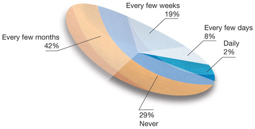

<em>Graphic publisher identified as Razorfish, reporting frequency of sharing recommendations online. Public reproduction and contemporaneous analysis: Robert Kosara, <a href="https://eagereyes.org/blog/2010/march-chart-madness#the-worst-pie-chart-ever">“The Worst Pie Chart Ever,” March Chart Madness</a> (2010), tracing the find to Glen Turpin. The underlying survey was not independently verified.</em>

    

    <!-- SLIDE 47: 46 — Redesign — Let the Same Labels Become Comparable Lengths -->
    

      Show parts of a whole and relative size
      <h2>46 &mdash; Redesign &mdash; Let the Same Labels Become Comparable Lengths</h2>

The bars use the <strong>same displayed percentages</strong>. Ranking and differences are now visible on one baseline.

<strong>Task change:</strong> ranking is easier here, while the pie’s intended part-to-whole framing is less visually prominent. Choose the encoding for the question, not only for appearance.

  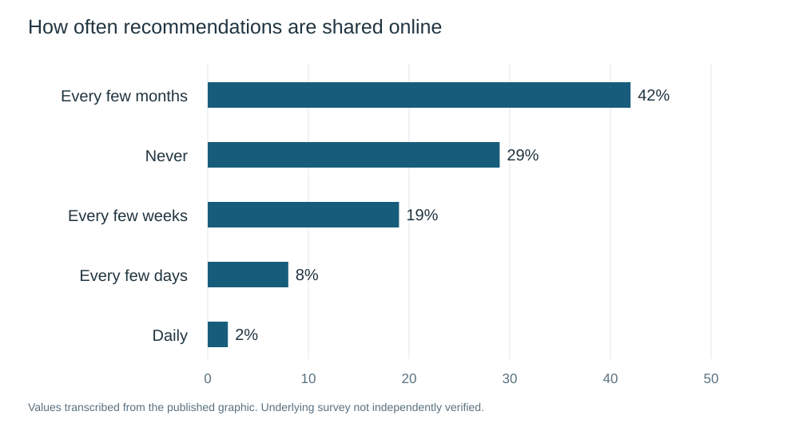

<em>Data transcribed from the graphic reproduced in <a href="https://eagereyes.org/blog/2010/march-chart-madness">Kosara’s 2010 critique</a>. New teaching redraw, not a new survey.</em>

    

    <!-- SLIDE 48: 47 — Many Categories — Small Pie Sectors Are Hard to Rank -->
    

      Show parts of a whole and relative size
      <h2>47 &mdash; Many Categories &mdash; Small Pie Sectors Are Hard to Rank</h2>

A crowded pie makes ranking and small differences difficult to judge. Moving the values to a legend adds repeated visual searching.

<strong>Ask:</strong> Can you reliably rank the middle-sized suppliers without reading every percentage?

  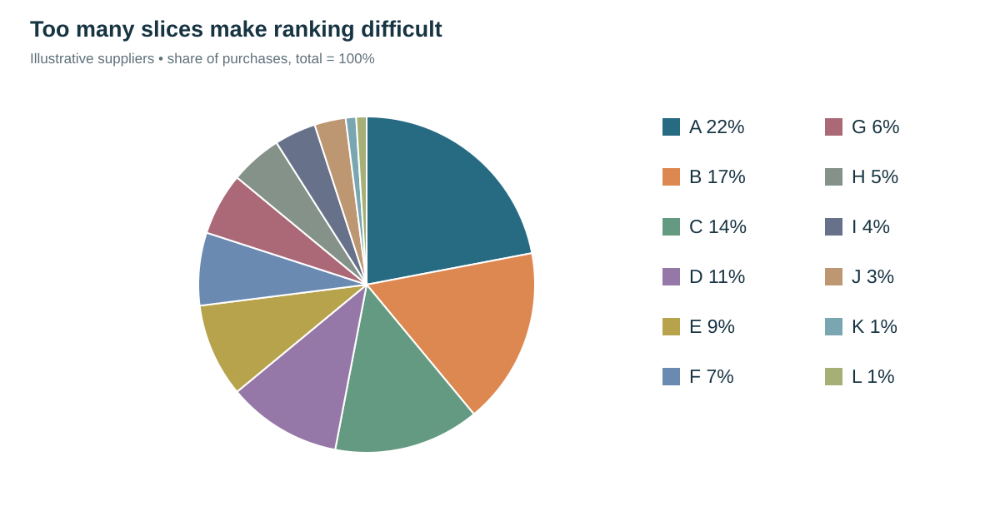

    

    <!-- SLIDE 49: 48 — Use Ranked Bars when the Question Is Ranking -->
    

      Show parts of a whole and relative size
      <h2>48 &mdash; Use Ranked Bars when the Question Is Ranking</h2>

The same shares are aligned to one scale and ordered from largest to smallest.

Pie charts can work for a few clearly different parts of a meaningful whole. Use bars when precise comparisons, many categories, or ranking are central to the question.

  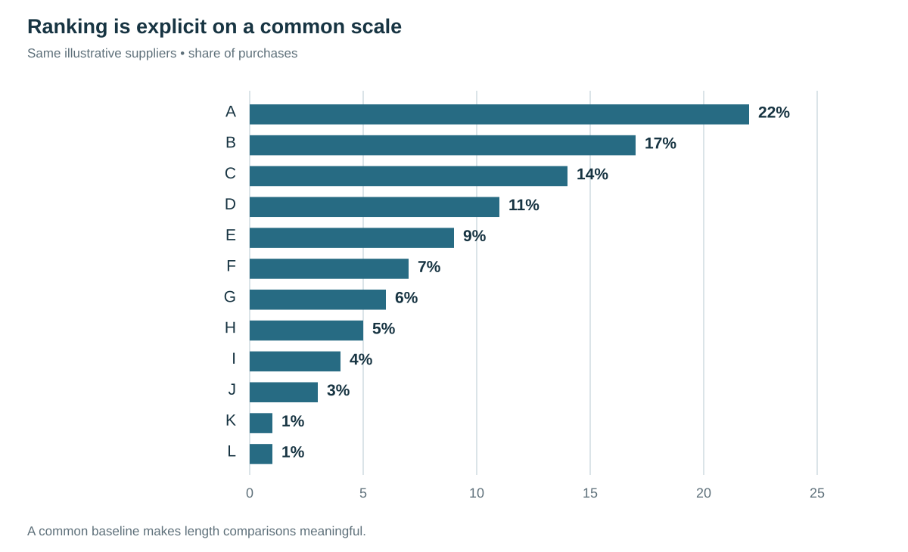

    

    <!-- SLIDE 50: 49 — GIF — Salvaging the Pie -->
    

      Show parts of a whole and relative size
      <h2>49 &mdash; GIF &mdash; Salvaging the Pie</h2>

Watch the changes to depth, labels, color, and chart type. Identify the point at which the comparison becomes easier.

A clean design is not simply a less decorated design: the encoding itself may need to change.

  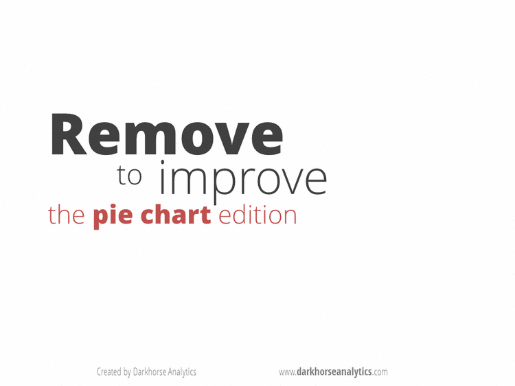

<em>Animation: Joey Cherdarchuk / Darkhorse, <a href="https://darkhorsevisualization.com/blog/salvaging-the-pie">Salvaging the Pie</a> (2014).</em>

    

    <!-- SLIDE 51: 50 — Treemap — Nested Areas for Hierarchy and Composition -->
    

      Show parts of a whole and relative size
      <h2>50 &mdash; Treemap &mdash; Nested Areas for Hierarchy and Composition</h2>

A treemap partitions area into nested rectangles. Area represents magnitude; containment represents hierarchical membership.

Read the constructed example: East contains three categories totaling 60, West two totaling 40. Identify the largest region, then its largest component.

<strong>Tradeoff:</strong> treemaps show a large hierarchy compactly, but close rectangle areas are harder to compare than positions on a common scale.

  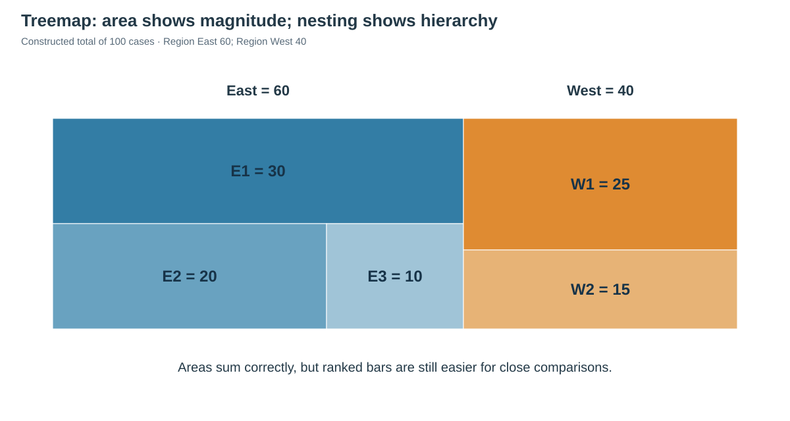

    

    <!-- SLIDE 52: 51 — Interactive — Guess the Bubble Area Ratio -->
    

      Show parts of a whole and relative size
      <h2>51 &mdash; Interactive &mdash; Guess the Bubble Area Ratio</h2>

<strong>First guess, then measure.</strong> Is circle B twice as large, four times as large, or something else? Enter an area estimate for each pair.

For bubbles to encode a quantity correctly, <strong>area</strong> must be proportional to that quantity: radius is proportional to its square root. Position in a packed-bubble layout may have no numerical meaning.

  <iframe src="../../assets/week-5/bubble-area-game.html" title="Guess the area ratio and reveal the correct value" loading="lazy" onload="resizeIframe(this)" sandbox="allow-scripts allow-same-origin"></iframe>

  <a href="../../assets/week-5/bubble-area-game.html" target="_blank" rel="noopener">Open this activity on its own</a>

    

    <!-- SLIDE 53: 52 — Donut and Concentric Displays — What Is Being Compared? -->
    

      Show parts of a whole and relative size
      <h2>52 &mdash; Donut and Concentric Displays &mdash; What Is Being Compared?</h2>

This example includes concentric circles and donuts. Both require care about what is being compared: radius, area, arc, or a proportion of a whole.

A donut is still a sector-based part-to-whole chart. The hole can hold a useful summary, but it does not cure many categories or close-value comparisons.

For concentric rings, the same angle spans different arc lengths at different radii. A reader should not be asked to compare those lengths as if the radii were equal.

  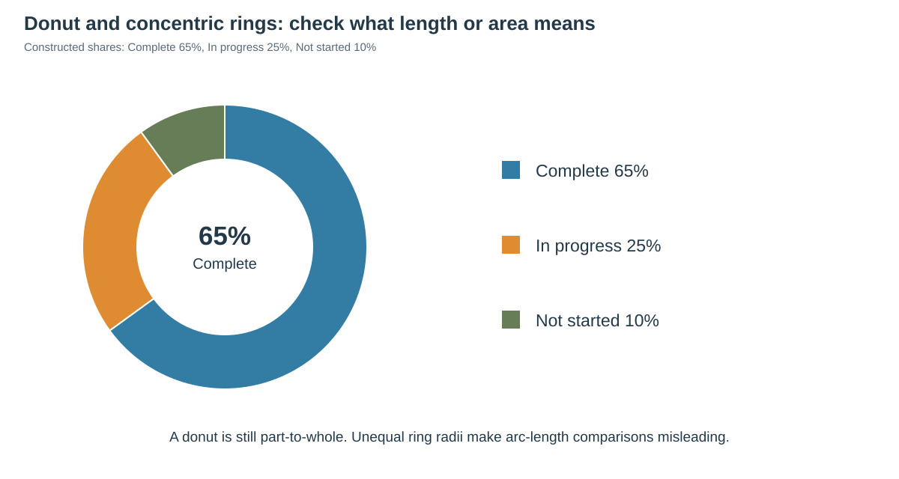

    

    <!-- SLIDE 54: 53 — Bullet Graph — Actual, Target and Qualitative Ranges -->
    

      Targets, schedules and other chart forms
      <h2>53 &mdash; Bullet Graph &mdash; Actual, Target and Qualitative Ranges</h2>

A bullet graph combines an actual value, a comparison or target marker, and contextual ranges on a compact scale.

<strong>Read:</strong> Which mark shows actual performance? Which shows the target? What do the background bands mean? They must be defined, not merely colored.

  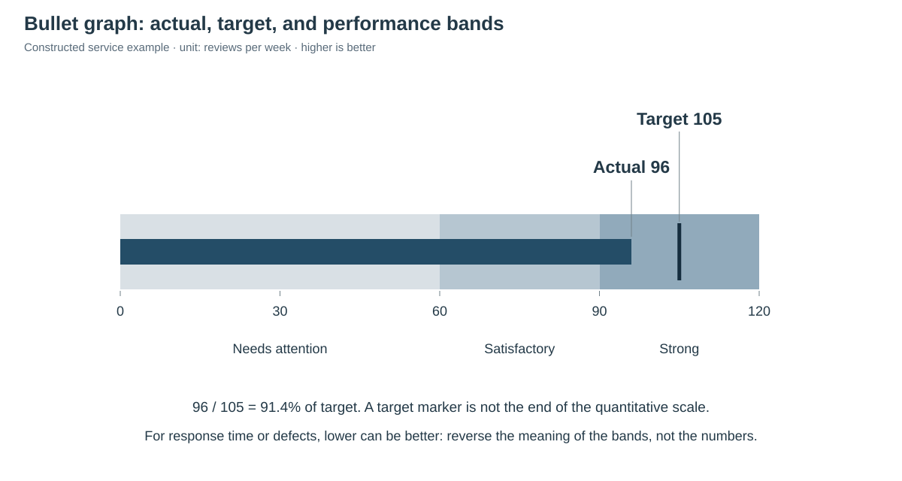

<em>Concept reference: Stephen Few, <a href="https://www.perceptualedge.com/articles/misc/Bullet_Graph_Design_Spec.pdf">Bullet Graph Design Specification</a>.</em>

    

    <!-- SLIDE 55: 54 — Bullet Graph — Read Whether Lower Is Better -->
    

      Targets, schedules and other chart forms
      <h2>54 &mdash; Bullet Graph &mdash; Read Whether Lower Is Better</h2>

For response time, a shorter wait is desirable. Here, the target is <strong>10 minutes or less</strong>.

Interpret the actual bar and background ranges according to the meaning of the measure. Do not reuse “high = good” colors or labels without checking their logic.

  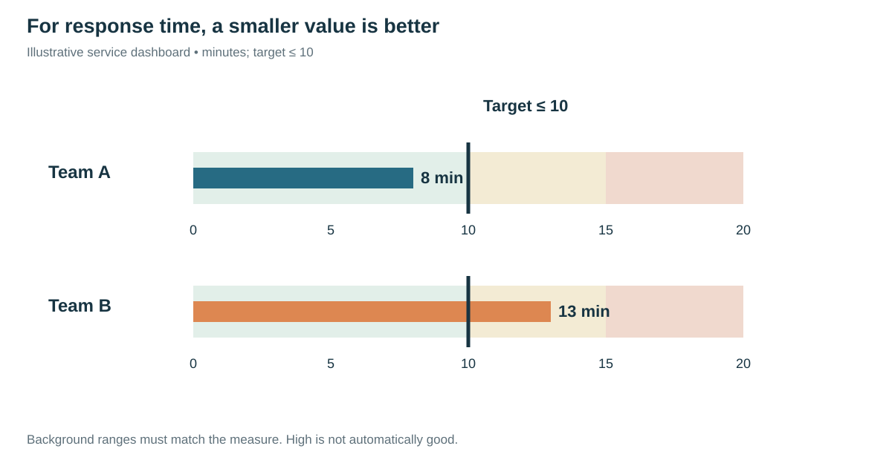

    

    <!-- SLIDE 56: 55 — Before Normalizing — Name the Denominator -->
    

      Targets, schedules and other chart forms
      <h2>55 &mdash; Before Normalizing &mdash; Name the Denominator</h2>

Return to the pharmacy example: <strong>pharmacy sales divided by total sales</strong> gives the product category’s share of the business. A higher numerator does not guarantee a higher fraction.

For a part-to-whole question, use <strong>the whole</strong> as the denominator. For a target question, use <strong>the target</strong>. These produce different percentages and answer different questions; do not call both simply “performance.”

  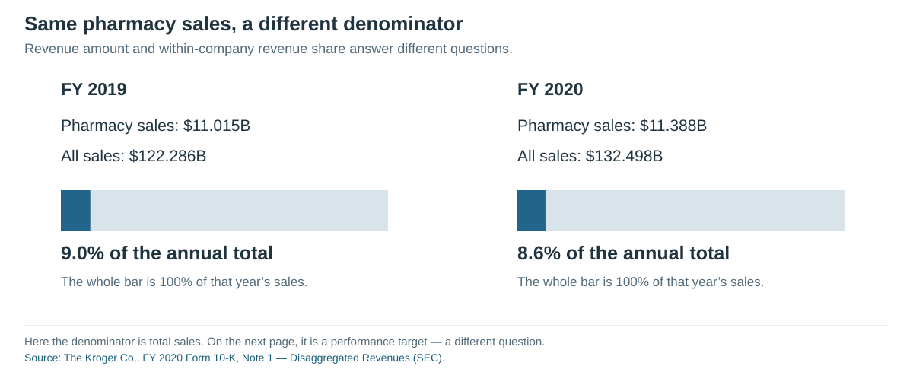

<em>Data: The Kroger Co., <a href="https://www.sec.gov/Archives/edgar/data/56873/000155837021003706/R10.htm">FY 2020 Form 10-K, Note 1 — Disaggregated Revenues</a>, fiscal 2019 and 2020. New plots of the reported data; displayed in USD billions rather than the filing’s USD millions.</em>

    

    <!-- SLIDE 57: 56 — Target Comparison — Normalize Only for the Stated Question -->
    

      Targets, schedules and other chart forms
      <h2>56 &mdash; Target Comparison &mdash; Normalize Only for the Stated Question</h2>

The denominator is now a <strong>target</strong>, rather than the total number of stores. We are asking a different question: how much of the target has each group achieved?

A common raw scale may make the smallest organization’s performance nearly invisible. Separate scales show local variation but weaken direct magnitude comparison.

Normalize actual values to each group’s target when performance against target is the question. Keep raw values available so that normalization does not erase scale.

<strong>Read the constructed example:</strong> A has the largest output, while B is the only group above target. Those statements are compatible.

  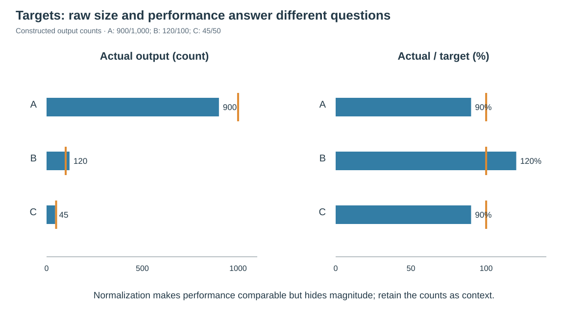

    

    <!-- SLIDE 58: 57 — Gantt Chart — Start, Finish and Overlap -->
    

      Targets, schedules and other chart forms
      <h2>57 &mdash; Gantt Chart &mdash; Start, Finish and Overlap</h2>

A Gantt chart uses start position and bar length to show an interval or duration. Tasks can overlap; that overlap can be part of the analysis.

Read the constructed schedule: collection and cleaning overlap, but analysis begins later. The bar is not a magnitude from zero—it extends from a start to an end on a time axis.

<strong>Boundary:</strong> this is a lecture example, not an additional required Tableau worksheet.

  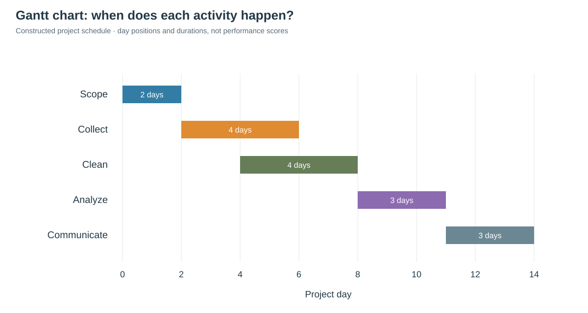

    

    <!-- SLIDE 59: 58 — Waterfall Chart — Additions and Deductions -->
    

      Targets, schedules and other chart forms
      <h2>58 &mdash; Waterfall Chart &mdash; Additions and Deductions</h2>

A waterfall explains how successive positive and negative contributions connect a starting total to an ending total. The intermediate bars float between running totals.

Read each delta, check its sign, and verify the final arithmetic. Clearly distinguish starting/ending totals from contributions.

<strong>Ask:</strong> Which contribution changes the total most? Would stacked bars communicate the same sequence correctly?

  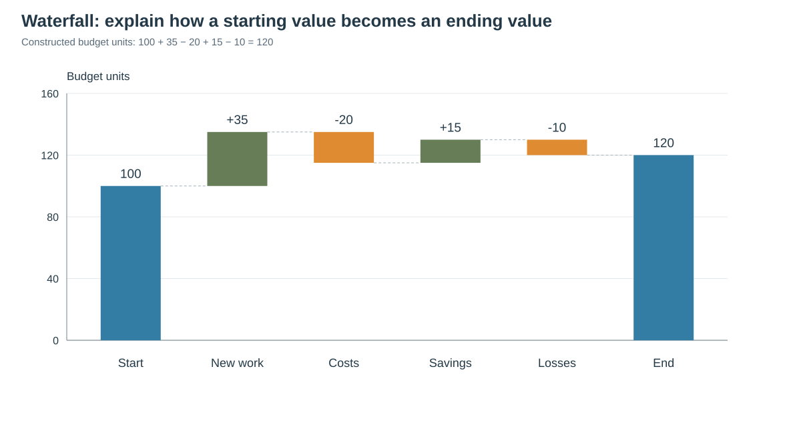

    

    <!-- SLIDE 60: 59 — Highlight Table and Heat Map — Values plus Color -->
    

      Targets, schedules and other chart forms
      <h2>59 &mdash; Highlight Table and Heat Map &mdash; Values plus Color</h2>

This example uses <strong>highlight table</strong> for a matrix with values and colored cells, and <strong>heat map</strong> for a color-coded matrix emphasizing the pattern.

The numeric labels help exact lookup; the color helps detect clusters. Choose a suitable palette, show its scale, and distinguish missing values from low values.

<strong>Terminology clarification:</strong> names vary across software. Identify the actual marks and encoding instead of relying only on the chart-menu label.

  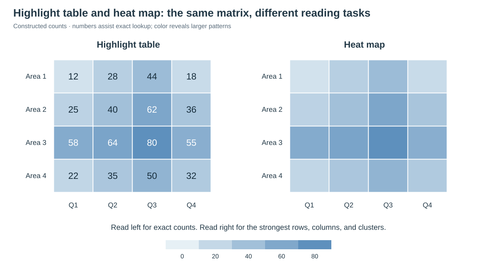

    

    <!-- SLIDE 61: 60 — Word Cloud — A Language Overview -->
    

      Targets, schedules and other chart forms
      <h2>60 &mdash; Word Cloud &mdash; A Language Overview</h2>

A word cloud emphasizes repeated terms through <strong>font size</strong>. This richer example contains 46 distinct terms; it illustrates a language overview rather than an exact ranking.

<strong>Inspect:</strong> Which topics stand out? Can you reliably tell whether “context” occurs more often than “design”? Word length and layout also affect prominence.

Before interpreting a real corpus, check tokenization, stop words, merged variants, and whose text is included. Use a ranked frequency chart for precise counts. <strong>This example uses illustrative word frequencies, not text collected from students.</strong>

  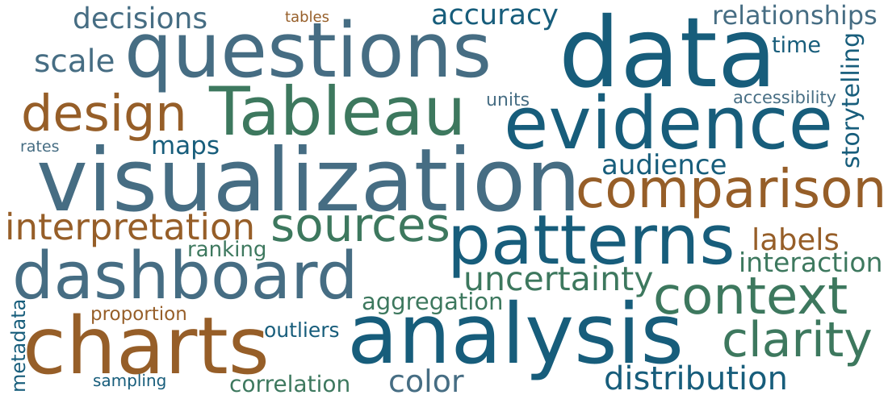

    

    <!-- SLIDE 62: 61 — Clock and Radial Graphs — A Research Example -->
    

      Targets, schedules and other chart forms
      <h2>61 &mdash; Clock and Radial Graphs &mdash; A Research Example</h2>

Clock graphs can arrange time or direction around a circle. The original research example below is a related <strong>radar chart</strong>, with a different variable on each spoke—not an hourly cycle.

<strong>How to read it:</strong> Choose one spoke, read its scale, then compare the four colored profiles. The legend identifies household, population, employment, and average-road-density measures. The values can be negative; the center is not an ordinary zero baseline.

<strong>Ask:</strong> Which relationships differ across the profiles? Reordering the spokes changes the polygon shapes, so do not interpret the enclosed area as a total.

  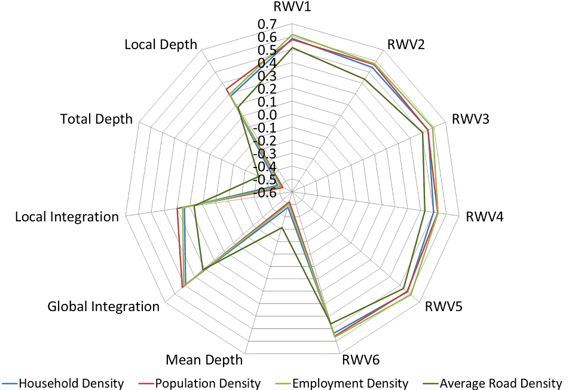

<em>Figure 9 (network-index correlations, Atlanta) from Wei, X., &amp; Yao, X. A. (2014). <a href="https://doi.org/10.1111/gean.12064">The Random Walk Value for Ranking Spatial Characteristics in Road Networks</a>. <em>Geographical Analysis, 46</em>(4), 411–434. DOI: 10.1111/gean.12064.</em>

    

    <!-- SLIDE 63: 62 — Sankey Diagram — Follow the Flow between Categories -->
    

      Targets, schedules and other chart forms
      <h2>62 &mdash; Sankey Diagram &mdash; Follow the Flow between Categories</h2>

A Sankey diagram connects quantities across stages. Link widths encode flow, and the relevant balance should reconcile.

In this illustration, 100 units of supply split into 60 units of useful energy and 40 units of losses. Separate pies would not show the connection as directly.

  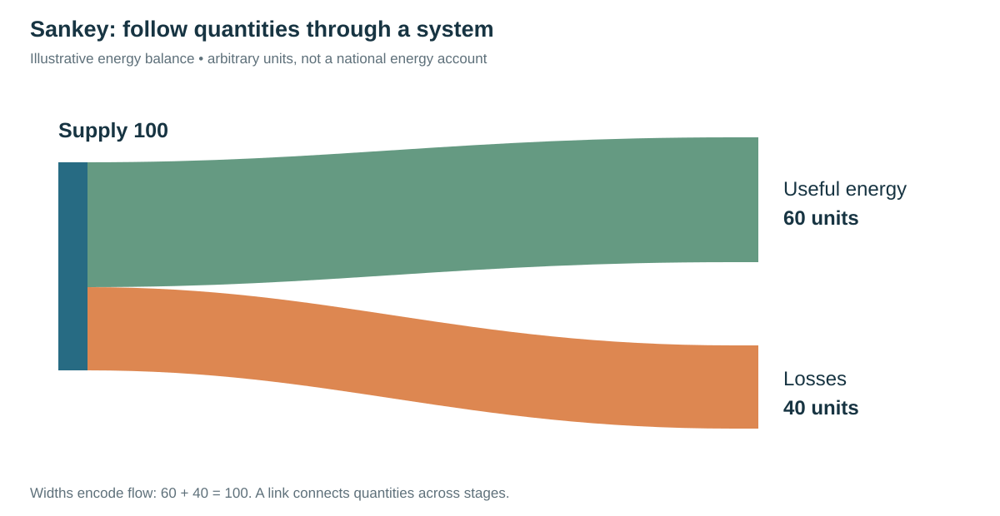

<em>Public real-data example: <a href="https://www.iea.org/data-and-statistics/data-tools/energy-sankey">International Energy Agency — Energy Sankey</a>.</em>

    

    <!-- SLIDE 64: 63 — Apply Both Readings before the Final Case -->
    

      Apply the readings: one integrated case
      <h2>63 &mdash; Apply Both Readings before the Final Case</h2>

Use the readings for two different decisions:

This four-step sequence is our classroom synthesis—not a verbatim list from either reading. Next, test it on a real graphic that combines several relationships.

  <table style="width: 100%; border-collapse: collapse; font-size: 0.95rem; line-height: 1.5; border: 1px solid #d0d7de; border-radius: 6px;">
    <thead>
      <tr style="background-color: #f6f8fa; border-bottom: 2px solid #d0d7de;">
        <th style="padding: 0.75rem 1rem; text-align: left; font-weight: 600; color: #1f2328;">Step</th>
        <th style="padding: 0.75rem 1rem; text-align: left; font-weight: 600; color: #1f2328;">Decision</th>
        <th style="padding: 0.75rem 1rem; text-align: left; font-weight: 600; color: #1f2328;">Basis</th>
      </tr>
    </thead>
    <tbody>
      <tr style="border-bottom: 1px solid #d0d7de;">
        <td style="padding: 0.75rem 1rem; color: #24292f; vertical-align: top;"><strong>1. Relationship</strong></td>
        <td style="padding: 0.75rem 1rem; color: #24292f; vertical-align: top;">Time series, ranking, distribution, correlation, or another featured relationship?</td>
        <td style="padding: 0.75rem 1rem; color: #24292f; vertical-align: top;">Few’s matrix</td>
      </tr>
      <tr style="border-bottom: 1px solid #d0d7de;" style="background-color: #fafbfc;">
        <td style="padding: 0.75rem 1rem; color: #24292f; vertical-align: top;"><strong>2. Encoding</strong></td>
        <td style="padding: 0.75rem 1rem; color: #24292f; vertical-align: top;">Which values must be compared by point position, line, bar length, or box?</td>
        <td style="padding: 0.75rem 1rem; color: #24292f; vertical-align: top;">Few’s matrix</td>
      </tr>
      <tr style="border-bottom: 1px solid #d0d7de;">
        <td style="padding: 0.75rem 1rem; color: #24292f; vertical-align: top;"><strong>3. Cleanup</strong></td>
        <td style="padding: 0.75rem 1rem; color: #24292f; vertical-align: top;">Can labels, order, grids, borders, and depth be improved without changing values?</td>
        <td style="padding: 0.75rem 1rem; color: #24292f; vertical-align: top;">Shaffer’s examples</td>
      </tr>
      <tr style="border-bottom: 1px solid #d0d7de;" style="background-color: #fafbfc;">
        <td style="padding: 0.75rem 1rem; color: #24292f; vertical-align: top;"><strong>4. Context</strong></td>
        <td style="padding: 0.75rem 1rem; color: #24292f; vertical-align: top;">Are units, reference, title, date and source still available?</td>
        <td style="padding: 0.75rem 1rem; color: #24292f; vertical-align: top;">Shaffer’s examples</td>
      </tr>
    </tbody>
  </table>

<em>Readings: Stephen Few, <a href="https://www.perceptualedge.com/articles/misc/Graph_Selection_Matrix.pdf">Graph Selection Matrix</a>; Jeffrey A. Shaffer, <a href="https://dataplusscience.com/files/Shaffer%204C%20-%20Clean%20Examples.pdf">“Clean” Examples</a>.</em>

    

    <!-- SLIDE 65: 64 — Final Graph Case — Minard’s Original Graphic -->
    

      Apply the readings: one integrated case
      <h2>64 &mdash; Final Graph Case &mdash; Minard’s Original Graphic</h2>

Read the full graphic before simplifying it. Locate the <strong>route</strong>, <strong>band width</strong>, <strong>direction</strong>, <strong>branches</strong>, and <strong>temperature with dates</strong>.

<strong>Discuss:</strong> Which encoding answers “where”? Which answers “how many”? How do the temperature labels connect to the return journey? The following video explains the graphic; no separate zoom activity is needed.

  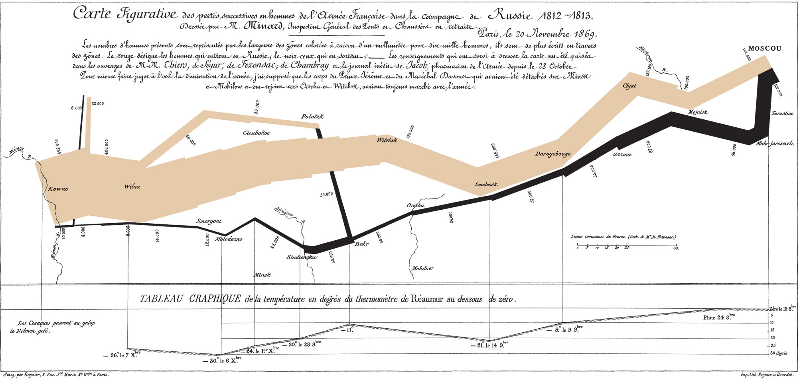

<em>Graphic: Charles Joseph Minard (1869), <a href="https://commons.wikimedia.org/wiki/File:Minard.png">public-domain original</a>.</em>

    

    <!-- SLIDE 66: 65 — Watch — Reading Minard with Numberphile -->
    

      Apply the readings: one integrated case
      <h2>65 &mdash; Watch &mdash; Reading Minard with Numberphile</h2>

James Grime explains how several kinds of information work together in Minard’s graphic. As you watch, identify the encodings rather than trying to memorize every historical detail.

<strong>After watching:</strong> What would be lost if we retained only the starting and ending quantities?

  <iframe class="youtube" src="https://www.youtube-nocookie.com/embed/3T7jMcstxY0?rel=0" title="The Greatest Ever Infographic — Numberphile" allow="accelerometer; autoplay; clipboard-write; encrypted-media; gyroscope; picture-in-picture; web-share" allowfullscreen></iframe>

  <a href="https://www.youtube.com/watch?v=3T7jMcstxY0" target="_blank" rel="noopener">Watch on YouTube</a>

<em>Video: Numberphile, <em>The Greatest Ever Infographic</em>, featuring James Grime. The title is the publisher’s appraisal, not an objective ranking of all graphics.</em>

    

    <!-- SLIDE 67: 66 — Final Comparison — What Two Endpoints Leave Out -->
    

      Apply the readings: one integrated case
      <h2>66 &mdash; Final Comparison &mdash; What Two Endpoints Leave Out</h2>

These two labeled endpoints make the scale of losses immediately apparent. They remove the route, the divisions and returns of groups, dates, and temperature.

Neither representation wins for every question. Compare a quick count question with a route-specific historical question.

  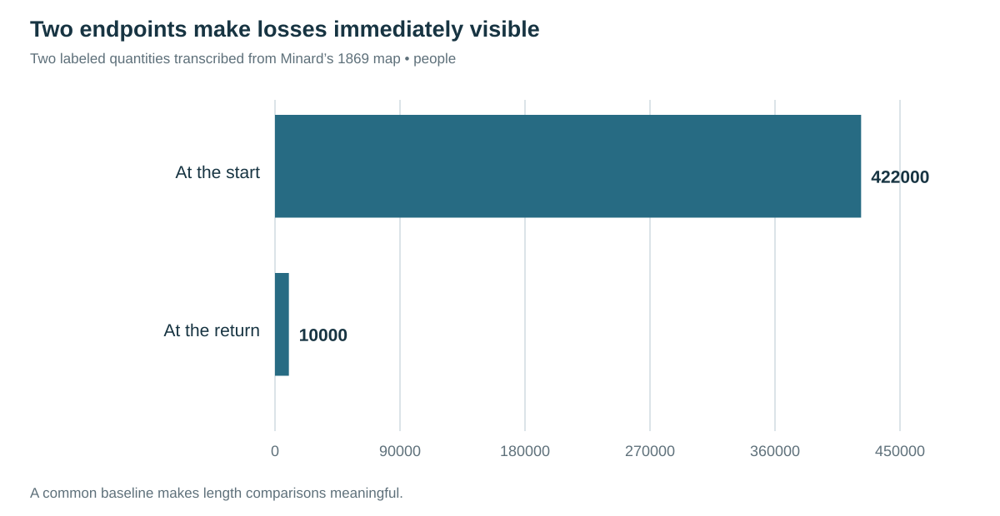

<em>Data: two quantities labeled in <a href="https://commons.wikimedia.org/wiki/File:Minard.png">Minard’s 1869 graphic</a>.</em>

    

    <!-- SLIDE 68: 67 — From Graphs to Business Intelligence -->
    

      From graphs to Tableau
      <h2>67 &mdash; From Graphs to Business Intelligence</h2>

Business intelligence brings data connection, visual analysis, dashboards, and sharing into a working environment.

<strong>Tableau</strong> and <strong>Microsoft Power BI</strong> are two major platforms. Both support building and sharing analytical reports; this course will use Tableau for the next sequence of labs.

The software does not choose the right question or verify a claim for you.

  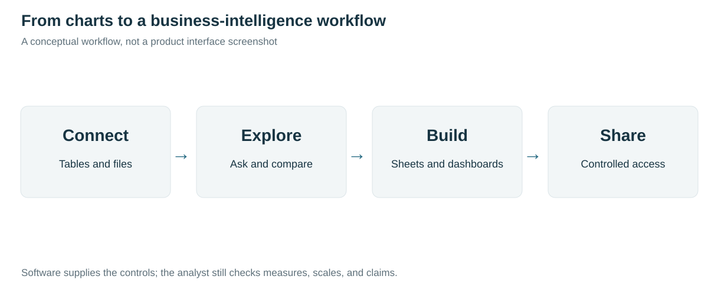

<em>Product references: <a href="https://www.tableau.com/why-tableau/what-is-tableau">Tableau</a>; <a href="https://learn.microsoft.com/en-us/power-bi/fundamentals/power-bi-overview">Microsoft Power BI</a>.</em>

    

    <!-- SLIDE 69: 68 — Tableau Cloud, Desktop and Public Are Different -->
    

      From graphs to Tableau
      <h2>68 &mdash; Tableau Cloud, Desktop and Public Are Different</h2>

<strong>Tableau Cloud</strong>, formerly Tableau Online, is the hosted site we will use. <strong>Tableau Desktop</strong> is an installed authoring application. <strong>Tableau Public</strong> is a free platform for learning, sharing, and building a public portfolio.

Public is not a student-only edition, and publishing to Public is not submitting to our course’s Cloud project.

  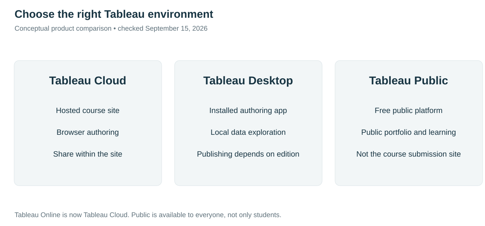

<em>Official product descriptions: <a href="https://www.tableau.com/products/cloud-bi">Cloud</a>, <a href="https://www.tableau.com/products/desktop">Desktop</a>, and <a href="https://www.tableau.com/blog/what-is-tableau-public">Public</a>.</em>

    

    <!-- SLIDE 70: 69 — Prep, Server and Next — Other Roles in the Product Family -->
    

      From graphs to Tableau
      <h2>69 &mdash; Prep, Server and Next &mdash; Other Roles in the Product Family</h2>

Product names describe different roles, not interchangeable places to submit an assignment.

  <table style="width: 100%; border-collapse: collapse; font-size: 0.95rem; line-height: 1.5; border: 1px solid #d0d7de; border-radius: 6px;">
    <thead>
      <tr style="background-color: #f6f8fa; border-bottom: 2px solid #d0d7de;">
        <th style="padding: 0.75rem 1rem; text-align: left; font-weight: 600; color: #1f2328;">Product</th>
        <th style="padding: 0.75rem 1rem; text-align: left; font-weight: 600; color: #1f2328;">Main role</th>
        <th style="padding: 0.75rem 1rem; text-align: left; font-weight: 600; color: #1f2328;">Where it fits in this course</th>
      </tr>
    </thead>
    <tbody>
      <tr style="border-bottom: 1px solid #d0d7de;">
        <td style="padding: 0.75rem 1rem; color: #24292f; vertical-align: top;"><strong>Tableau Prep</strong></td>
        <td style="padding: 0.75rem 1rem; color: #24292f; vertical-align: top;">Prepare, combine, and clean data</td>
        <td style="padding: 0.75rem 1rem; color: #24292f; vertical-align: top;">Data-preparation work comes later</td>
      </tr>
      <tr style="border-bottom: 1px solid #d0d7de;" style="background-color: #fafbfc;">
        <td style="padding: 0.75rem 1rem; color: #24292f; vertical-align: top;"><strong>Tableau Server</strong></td>
        <td style="padding: 0.75rem 1rem; color: #24292f; vertical-align: top;">Organization-managed analytics deployment</td>
        <td style="padding: 0.75rem 1rem; color: #24292f; vertical-align: top;">Not the hosted course site</td>
      </tr>
      <tr style="border-bottom: 1px solid #d0d7de;">
        <td style="padding: 0.75rem 1rem; color: #24292f; vertical-align: top;"><strong>Tableau Next</strong></td>
        <td style="padding: 0.75rem 1rem; color: #24292f; vertical-align: top;">Agentic analytics integrated with the Salesforce ecosystem</td>
        <td style="padding: 0.75rem 1rem; color: #24292f; vertical-align: top;">Context only; not required for this lab</td>
      </tr>
    </tbody>
  </table>

<em>Official references: <a href="https://www.tableau.com/products/tableau">Tableau platform</a>; <a href="https://www.tableau.com/products/prep">Tableau Prep</a>; <a href="https://www.tableau.com/blog/what-is-tableau-einstein">Tableau Next</a>.</em>

    

    <!-- SLIDE 71: 70 — What Can Students Use for Free? -->
    

      From graphs to Tableau
      <h2>70 &mdash; What Can Students Use for Free?</h2>

<strong>Edition names matter:</strong> Tableau also offers a <strong>Desktop Free Edition</strong> for local analysis. It is distinct from Public Edition and from licensed Professional Edition. Do not assume that every free desktop edition can publish to Cloud.

No software purchase or Desktop installation is required for this week’s browser lab.

  <table style="width: 100%; border-collapse: collapse; font-size: 0.95rem; line-height: 1.5; border: 1px solid #d0d7de; border-radius: 6px;">
    <thead>
      <tr style="background-color: #f6f8fa; border-bottom: 2px solid #d0d7de;">
        <th style="padding: 0.75rem 1rem; text-align: left; font-weight: 600; color: #1f2328;">Route</th>
        <th style="padding: 0.75rem 1rem; text-align: left; font-weight: 600; color: #1f2328;">What it provides</th>
        <th style="padding: 0.75rem 1rem; text-align: left; font-weight: 600; color: #1f2328;">What to remember</th>
      </tr>
    </thead>
    <tbody>
      <tr style="border-bottom: 1px solid #d0d7de;">
        <td style="padding: 0.75rem 1rem; color: #24292f; vertical-align: top;"><strong>Individual learning: Tableau Desktop Public Edition</strong></td>
        <td style="padding: 0.75rem 1rem; color: #24292f; vertical-align: top;">Free software for learning and publishing to Tableau Public</td>
        <td style="padding: 0.75rem 1rem; color: #24292f; vertical-align: top;">Not student-only. It cannot publish to our Tableau Cloud course project.</td>
      </tr>
      <tr style="border-bottom: 1px solid #d0d7de;" style="background-color: #fafbfc;">
        <td style="padding: 0.75rem 1rem; color: #24292f; vertical-align: top;"><strong>Instructor-requested Student Course License</strong></td>
        <td style="padding: 0.75rem 1rem; color: #24292f; vertical-align: top;">Tableau Desktop and Prep Builder for the course period</td>
        <td style="padding: 0.75rem 1rem; color: #24292f; vertical-align: top;">Requested by the instructor, not a guaranteed personal full-license entitlement.</td>
      </tr>
      <tr style="border-bottom: 1px solid #d0d7de;">
        <td style="padding: 0.75rem 1rem; color: #24292f; vertical-align: top;"><strong>Instructor-provided Tableau Cloud site</strong></td>
        <td style="padding: 0.75rem 1rem; color: #24292f; vertical-align: top;">Browser-based authoring and sharing in the course environment</td>
        <td style="padding: 0.75rem 1rem; color: #24292f; vertical-align: top;">This is our starting point; use the invitation and assigned project.</td>
      </tr>
    </tbody>
  </table>

<em>Current official references, checked September 15, 2026: <a href="https://www.tableau.com/academic/students">Tableau for Students</a>; <a href="https://www.tableau.com/academic/teaching">Tableau for Teaching</a>; <a href="https://help.tableau.com/current/pro/desktop/en-us/desktop_comparison.htm">Desktop edition comparison</a>.</em>

    

    <!-- SLIDE 72: 71 — In Class — Accept Your Tableau Invitation -->
    

      From graphs to Tableau
      <h2>71 &mdash; In Class &mdash; Accept Your Tableau Invitation</h2>

We will set up the course account together before beginning the browser lab.

Open the Tableau invitation in your <strong>JMU email account</strong> and click <strong>Sign In</strong>.

If Tableau asks you to create an account, use your <strong>James Madison University email address</strong> so the Tableau account matches the invitation. If you already have a Tableau account under that JMU email, sign in to it.

<strong>Do not create a second account with another email address just to get around an access problem.</strong>

  

    

    <!-- SLIDE 73: 72 — In Class — Choose One-Time Password Generator -->
    

      From graphs to Tableau
      <h2>72 &mdash; In Class &mdash; Choose One-Time Password Generator</h2>

When Tableau asks you to <strong>Register a Verification Method</strong>, choose the bottom option:

<strong>One-Time Password Generator</strong>

For this course setup, <strong>do not choose Salesforce Authenticator, Security Key, or Built-In Authenticator</strong>.

On the next screen, Tableau will show a QR code. Scan the QR code shown on <strong>your own screen</strong> with an authenticator app, then enter the generated code. The instructor recommends <strong>Okta Verify</strong>, which JMU already uses.

<strong>Security:</strong> the QR setup code and verification codes are private. Do not photograph, share, or post them. The course materials intentionally do not reproduce the live QR code.

  

    

    <!-- SLIDE 74: 73 — In Class — Enter the `fall2026` Course Project -->
    

      From graphs to Tableau
      <h2>73 &mdash; In Class &mdash; Enter the `fall2026` Course Project</h2>

After account setup, choose <strong>Explore</strong> and open <strong><code>fall2026</code></strong>.

In Tableau terminology, <code>fall2026</code> is a <strong>project</strong>. For this course, think of it as the shared class folder.

<strong>For Lab 5, create everything inside <code>fall2026</code>:</strong> the published data source, workbook, worksheets, and dashboard. Do <strong>not</strong> work in Personal Space for this assignment.

<strong>Next:</strong> <a href="../../assignments/lab-5/">Open Lab 5</a> for the complete screenshot-based workflow, three worksheets, one interactive dashboard, and the Lab 5 rubric.

  

    

    <!-- SLIDE 75: 74 — Watch — What Is Tableau? | Salesforce -->
    

      From graphs to Tableau
      <h2>74 &mdash; Watch &mdash; What Is Tableau? | Salesforce</h2>

Watch the <strong>official Salesforce overview of Tableau</strong>. Connect the chart choices in this lecture with a visual analytics workflow: bring in data, explore it, and communicate the result.

<strong>Watch for:</strong> how the tool connects an analytical question to a visual view, and how people use the result. Then use the preceding account/project screens to enter <strong>our course’s Tableau Cloud site</strong>.

  <iframe class="youtube" src="https://www.youtube-nocookie.com/embed/HlKCe_YKlPI?rel=0" title="What is Tableau? | Salesforce" allow="accelerometer; autoplay; clipboard-write; encrypted-media; gyroscope; picture-in-picture; web-share" allowfullscreen></iframe>

  <a href="https://www.youtube.com/watch?v=HlKCe_YKlPI" target="_blank" rel="noopener">Watch “What is Tableau? | Salesforce” on YouTube</a>

<em>Video: Salesforce, <em>What is Tableau?</em> The instructor-selected video is embedded directly from YouTube; internet access is required. It is an introduction, not a substitute for the lab.</em>

    

  

---
[Return to Course Home](../../) | [Go to Lab 5](../../assignments/lab-5/)
